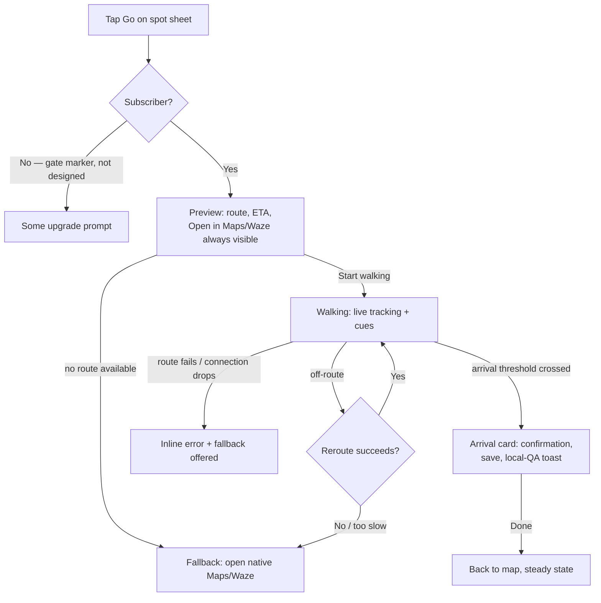
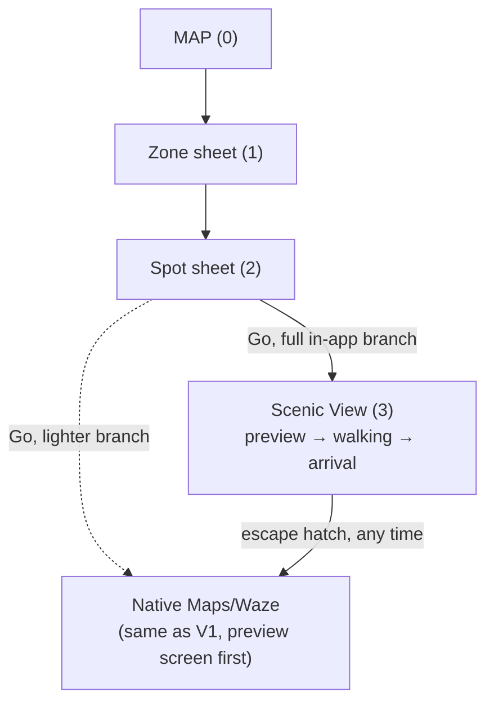
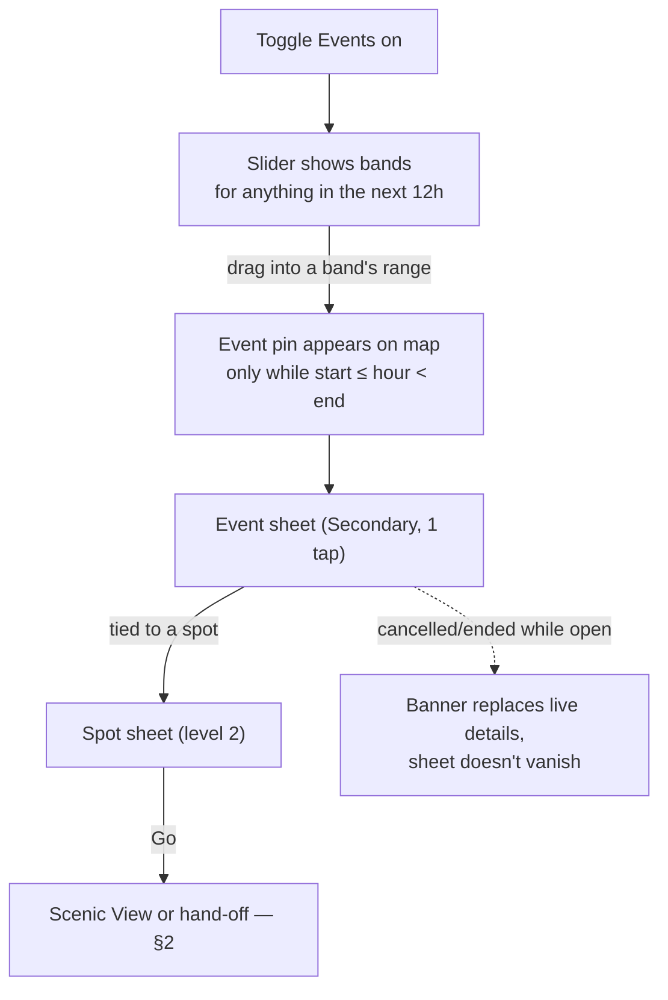

# Passenger Phase 2 — Scenic View & Live Events Flows

**Owner:** designer (drafted for Aviran)
**Date:** 2026-07-27
**Status:** Phase 2 — **not committed, not part of the launch build.** Scoping work done ahead of Phase 2 actually starting, so the structure doesn't have to be re-derived from scratch when it does. Nothing here authorizes building anything; per `CLAUDE.md`'s scope gate, Phase 2 is parked and a PRD still can't leave `spec` without quoting the strategy line that authorizes it.
**Source:** `strategy/decisions.md` #19 (Scenic View → Phase 2), #20 (Events → Phase 2, supersedes #14), #21 (both subscription-gated) + `strategy/passenger-strategy.md`'s Phase 2 section + `design/design-principles.md`.
**Relationship to other docs:** Companion to `design/ux-flows.md` (the V1 reference) and `design/map-rendering-spec.md` (V1's rendering detail) — deliberately **not** folded into either. `ux-flows.md` is what the scope gate depends on staying clean; this doc exists so Phase 2 candidates have somewhere to live without leaving hooks in the V1 doc. Where this doc changes something V1 currently states as settled (the depth rule, the "Go" hand-off), that's noted explicitly, and `ux-flows.md` itself is not edited to reflect it — V1 stays as specified until Phase 2 actually starts.
**Document type:** cross-feature flows reference, same as `ux-flows.md` — no PRD-traceability table (no PRD exists for either feature) and no high-fidelity mockup link. This doesn't go through `design-review` the way a committed feature spec would; it's scoping work for whenever Phase 2 gets picked up.

**Read this before anything else below:** both features are designed here **assuming access** — as if the subscription already exists and the viewer already has it. Decision #21 gates both behind a subscription that hasn't been designed yet: no paywall, no upgrade moment, no locked-state treatment exists anywhere in this product. **I am not inventing it.** Each section below marks the exact point where a gate would sit with a **[gate marker]** — that's a placeholder for whoever specs monetization, not a design.

---

## 1. The frame

Two Phase 2 candidates, both already decided to exist, neither built: **Scenic View** replaces V1's "Go" hand-off with in-app routing that favors interesting streets over the fastest path. **Live Events** adds a third data layer to the map — what's happening, not just how busy it is or how local it feels. Both ride on top of the V1 shell (the map, the slider, zone/spot sheets) rather than replacing any of it. Both are subscription-gated. Neither ships until Phase 1 proves retention.

---

## 2. Scenic View

### 2.1 What it replaces, and what survives

Scenic View replaces V1's "Go" hand-off — same tap, different destination. Today, tapping "Go" on a spot sheet hands off to native Maps/Waze and Passenger stops watching. With Scenic View, that same tap opens an in-app routing surface instead.

**The hand-off doesn't disappear — it survives as a permanent escape hatch, not just a fallback for errors.** A visible "Open in Maps/Waze instead" control stays available throughout Scenic View, from the very first preview screen through the entire walk. This is the same Poka-Yoke reasoning V1 already applies elsewhere in this product: a newly-built routing engine shouldn't ever trap someone with no way out, and the fastest way to lose someone's trust in a routing feature is to leave them stuck watching a spinner with no alternative. **[design call]** The escape hatch is always-present, not conditionally revealed on failure — a user who simply prefers native turn-by-turn shouldn't have to wait for Scenic View to break before getting it.

### 2.2 The depth question — not resolved here, designed so the difference is legible

The strategy flags this as unanswered and cost-sensitive, and it still is. Two real branches:

- **Full in-app turn-by-turn** — Passenger tracks the walk live, start to finish.
- **Route preview, then hand off** — Passenger shows a scenic route once, then hands the actual walking off to native Maps/Waze, same as V1 does today, just with a Passenger-branded preview screen first.

**I'm specifying the full in-app branch in detail below, and the lighter branch as an explicit delta (§2.6) — not because it's the recommended one, but because it's the branch that contains genuinely new interaction design.** The arrival moment the coordinator flagged as the most interesting part of this feature only exists if Passenger is still watching when the user gets there. Speccing the lighter branch in equal depth would mostly restate things V1 already does. Section 2.6 states precisely what collapses if that's the one that ships instead — this doc does not pick for Aviran, and the open question in §4 says so explicitly.

### 2.3 Hierarchy consequences — the depth rule goes back to 3

`ux-flows.md`'s depth rule is "2 levels, no more, while inside the app," and it says outright that keeping Scenic View out of V1 is what holds it there. That trade reverses the moment Scenic View ships:

**Map (0) → zone sheet (1) → spot sheet (2) → Scenic View (3).** Three levels, restated plainly rather than left as an implicit break in a doc that says two. Saved/Visited (1) → spot sheet (2) → Scenic View (3) reaches the same new ceiling by the shortcut route V1 already established. Search's place/keyword result (1) → spot sheet (2) → Scenic View (3) matches too.

**[design call]** Search's neighborhood-result path needs one clarification `ux-flows.md` left implicit. That doc says searching a neighborhood reaches the zone sheet "one level deeper" than a direct tap (level 2, not level 1) — but doesn't say what happens if the search sheet stays stacked underneath. I'm resolving this here since Scenic View is what exposes it: **selecting a neighborhood result replaces the search sheet with the zone sheet, rather than stacking under it** — the zone sheet presents as if freshly opened from the map (back to level 1), the same way tapping the zone shape directly would. Without this, a spot reached via search-then-zone-then-spot-then-Scenic-View would sit at level 4, one deeper than every other path into Scenic View, for no real reason. This keeps 3 the actual ceiling, not just the common-case ceiling.

Nothing about Scenic View's own internal states (previewing, walking, arrived — see §2.4) adds further depth. They're states of the one level-3 surface, not additional levels, the same way the local-QA toast isn't a navigational level in V1.

### 2.4 The journey — full in-app branch

**Entry:** tap "Go" on a spot sheet (level 2, however it was reached).

**[gate marker]** For a non-subscriber, this tap is where the gate sits — not designed here.

1. **Preview.** Scenic View opens full-screen: the proposed route on a map, favoring interesting/local streets over the fastest path, with distance and ETA, a "Start walking" control, and the permanent "Open in Maps/Waze instead" escape hatch from §2.1.
   - **Unhappy path — no scenic route available:** "Can't build a scenic route right now" plus the same direct fallback button, front and center — never a stall, never a dead end with no visible way out.
2. **Walking.** Live position tracking against the route, cues along the way favoring the same interesting streets from the preview. Progress updates as she moves.
   - **Unhappy path — she goes off-route:** Scenic View detects the deviation and offers to reroute — a brief, honest "Recalculating" state (Doherty threshold: a spinner past 400ms, not silence), not a silent hang. If rerouting can't resolve quickly, the fallback to native Maps/Waze is offered explicitly rather than leaving her stuck watching a spinner.
   - **Unhappy path — route fails mid-walk** (a routing-service error after the walk's already started): an inline banner — "Having trouble finding the way" — with the same direct fallback button, not a silent freeze.
   - **Unhappy path — connection drops in transit:** on-device GPS keeps working without a connection, so her position and the last-fetched route line keep rendering; live rerouting-if-off-route needs connectivity and won't work until she's back online — the banner says so rather than pretending to reroute.
   - **Unhappy path — location revoked mid-route** (rare, but possible via Settings mid-walk): live tracking stops immediately, with a plain message — "Location turned off — can't track your route anymore" — and a fallback to the static route or native Maps/Waze. Same honesty rule as everywhere else in this product: nothing pretends data is fresher or more available than it is.
3. **Arrival — the moment V1 doesn't have.** In V1, "Go" is an exit; Passenger has no idea what happens next until a backgrounded geofence notification arrives, if it arrives at all. Here, Passenger never stopped watching, so arrival is a designed, deterministic state rather than an absence. Crossing a proximity threshold near the destination transitions Scenic View from the live-walking UI into an **arrival card**: a plain confirmation ("You've made it — [Spot name]"), a save icon if she hasn't already saved the place, and a **Done** action that dismisses Scenic View entirely and returns to the map at steady state — this is where the level-3 surface actually unwinds, not partway.
   - **Connection to decision #24's local-QA toast, not a new mechanism:** because Passenger is already foregrounded and already knows she's arrived, the same three-word ask from V1 (Local / Mix / Tourist) can trigger immediately here instead of waiting on a backgrounded notification round-trip. This is the existing toast, triggered by a higher-confidence signal — not a second ask mechanism. Still one ask surface, still Tertiary, still optional.
4. **Outcome:** back at the map, steady state, with the visit already logged (same geofence-driven Visited population as V1) and a local-QA ask already offered or already answered.

### 2.5 The arrival card, one level deeper

Because this is the one genuinely new interaction surface in this feature, it's worth being explicit about what it is and isn't: it's a state of the Scenic View screen, not a new sheet and not a new depth level. It doesn't force a decision — "Done" is the only required action, save and the QA answer are both optional, consistent with every other Tertiary interaction in this product being skippable at zero cost.

### 2.6 The lighter branch — what changes if this is the one that ships

If Phase 2 chooses route-preview-then-handoff instead of full in-app turn-by-turn:

- **§2.4 step 1 (Preview) is the only step that survives as designed.** "Start walking" hands off to native Maps/Waze instead of starting an in-app walking state — functionally V1's existing hand-off, just with a Passenger-branded preview screen in front of it.
- **Step 2 (Walking) doesn't exist.** No in-app live tracking, no off-route detection, no in-app rerouting logic to build. The native app owns the entire walk, the same way it owns all of V1's routing today.
- **Step 3 (Arrival) collapses back to V1's mechanism exactly.** Passenger isn't watching during the walk, so there's no proximity-threshold detection to trigger an in-app arrival card. Arrival reverts to backgrounded geofencing plus decision #24's notification-and-toast — the same flow V1 already has, unchanged. **The arrival moment §2.4–2.5 spend the most effort on doesn't get built in this branch at all.**
- **Three of the five unhappy paths in §2.4 become moot** — off-route, mid-walk connection drop, and location-revoked-mid-route are all things that only matter if Passenger is tracking the walk. Only "no route available" (for the preview) still applies.
- **Build cost is dramatically lower** — no live routing engine, no rerouting logic, no in-app turn-by-turn UI or data source for it. This is the version the strategy's own risk section is describing when it calls Scenic View's cost "swinging a lot depending on depth."

### 2.7 Overlap with proximity intelligence — noted, not designed

Phase 2's other candidate, proximity intelligence (geofence-triggered arrival card, generated minimal UI), concerns the exact same in-transit territory as Scenic View's full-in-app branch — both need to know when someone's near a destination they were heading to. If both get built, they likely share the same underlying position-tracking and arrival-detection surface rather than two independent ones. This doc doesn't design proximity intelligence — it only flags that whichever of the two gets scoped first should probably absorb the groundwork for the other, a sequencing question for whoever picks up Phase 2, not a UX call.

### 2.8 Diagrams

---

## 3. Live Events

### 3.1 Placement

Already decided: **Primary tier, additive toggle.** It extends the base map's visualization rather than opening a new surface — the same reasoning `ux-flows.md` §8 already gives it. **[gate marker]** For a non-subscriber, whether the toggle appears locked, dimmed, or hidden entirely is monetization's call, not designed here.

### 3.2 The real design problem: time

Heat is a snapshot at the selected hour. Tag doesn't move with the slider at all. Events have a start time and an end time — neither model fits, and this is the actual design work, not the toggle itself.

**[design call] Two different renderings for two different questions — "where" and "when" don't share a surface.**

- **On the map (the "where"):** an event pin appears **only when the event is actually running at the hour the slider is currently on** — `start ≤ slider hour < end`. This matches how heat already works: the map shows what's true at the selected hour, not a forecast and not a memory. An event that hasn't started yet renders **nothing** on the map at "now" — showing it as if live would be the same kind of lie V1 already refuses to tell about stale data.
- **On the slider itself (the "when"):** each event renders as a **band** — a highlighted segment on the slider's track spanning from its start position to its end position along the now-to-+12h timeline. This is where "an event starting in 3 hours" actually becomes visible: as a band beginning at the +3h mark, visible immediately without dragging anything, even though the map at "now" shows nothing yet. Wanting to see *what* it is and *where* means dragging the slider into the band's range — at which point it becomes a real pin on the map, per the rule above.

This directly answers the three questions the coordinator posed: an event appears on the map only in the hours it's running; it shows as a band on the slider for the hours around that; and an event starting in 3 hours looks like nothing at all on the map at "now" — the band is what tells her it's coming.

### 3.3 How this avoids re-creating the tag-density problem

Aviran's pushback on tag density was specifically about a third kind of signal competing for space on an already-busy map surface. Events is exactly that risk, addressed directly rather than assumed away:

- **Events never render on spot pins.** A spot hosting an event doesn't get a modified pin — the event gets its own marker, on its own visual channel, never blended with heat's fill or tag's zone badge. Three layers, three channels, still never blended (design-principles.md §3).
- **Events pins get the same clustering rule as spot pins**, not an exemption on the assumption that events are naturally sparse. `map-rendering-spec.md`'s screen-distance-threshold clustering (neutral count badge, tap-to-zoom, never opens a sheet directly) applies to event markers the same way it applies to spot pins — this doc doesn't assume Tel Aviv never has a dense night of overlapping events.
- **Events are additive and off-able.** Unlike tag (always-on in V1, which is exactly what made the density problem unavoidable), Events is a toggle. A user who finds it distracting turns it off entirely — a release valve V1's tag layer never had, because tag was never optional.
- **Events use progressive disclosure by zoom, matching heat and tag's existing pattern.** At city-wide zoom, no individual event pins — only whatever aggregate signal is worth showing at that scale (a design detail for a future rendering spec, not invented here in depth, since Events isn't shipping). At neighborhood and close zoom, event pins render per the running-now rule in §3.2, clustering as needed.

### 3.4 The journey

**Entry:** the Events toggle, Primary chrome, once shipped and subscribed.

1. She toggles Events on. Nothing changes on the map yet if nothing's running at "now" — but bands appear on the slider for anything scheduled in the next 12 hours.
   - **Unhappy path — no events in view:** nothing renders, no forced empty state. Same as heat reading quiet at an hour with nothing relevant — absence is information, not an error.
2. She notices a band starting around +2h and drags the slider there. An event pin appears on the map at that location, distinct in shape from spot pins and zone badges.
3. She taps the event pin. An **event sheet** opens (new Secondary surface, 1 tap, same pattern as zone/spot sheets) — name, time window (framed relative to now: "starts in 2h," "ends in 40 min," "happening now"), and the venue it's tied to if there is one.
   - **Unhappy path — imprecise location:** if an event only has a fuzzy location (a neighborhood, not a specific spot), it renders as a zone-level indicator only — never a precise pin forced onto data that isn't precise. Same honesty rule as everywhere else.
4. If the event is tied to a specific spot, the sheet offers a way into that spot's own sheet (level 2, same as any other spot) — from there, "Go" behaves exactly as specified in §2, Scenic View or hand-off depending on which branch shipped.
   - **Unhappy path — event cancelled or ends while she's looking at it:** the event sheet updates live rather than leaving stale info displayed — a "This event has ended" or "cancelled" banner replaces the live details rather than the sheet silently vanishing mid-read.
   - **Unhappy path — offline:** the sheet shows whatever was last cached, with the same "last updated Xm ago, offline" label used everywhere else in this product — never invents freshness it doesn't have.

### 3.5 Diagram

---

## 4. Open questions for Aviran

1. **Scenic View depth — still unresolved, this doc doesn't pick.** Full in-app turn-by-turn (§2.4) has the richer arrival moment but the real routing-engine cost the strategy already flagged. Route-preview-then-handoff (§2.6) is dramatically cheaper and mostly reuses what V1 already built, at the cost of the arrival moment not existing at all. **My starting-point suggestion, not a decision:** ship the lighter branch first if Phase 2 needs to move fast, and treat the full in-app branch — arrival card included — as a second pass once demand justifies the routing-engine investment. That's a sequencing suggestion, not a recommendation to pick one permanently; the actual call is Aviran's.
2. **Scenic View and proximity intelligence — build order.** §2.7 notes they share in-transit surface. Which gets scoped first, and does the second one reuse the first's position-tracking and arrival-detection work, or get built independently?
3. **Event cancellation — does it push?** Decision #24 already established a precedent for a local notification in V1 (post-visit QA). If someone's already on their way to an event that gets cancelled, should Passenger proactively notify her, or is the passive "cancelled" banner in §3.4 enough? A real product call, not answered here.
4. **Exact arrival-proximity threshold for Scenic View's full-in-app branch** (§2.4, step 3) — how close counts as "arrived." A data/build question, the same shape as `ux-flows.md`'s open question about the local-QA notification's dwell-time threshold.
5. **Where exactly the subscription gate sits, visually, for both features** — locked-but-visible vs. hidden entirely, and what the upgrade moment looks like. Flagged at every **[gate marker]** above. Not designed here; needs its own spec before either feature can actually ship.
