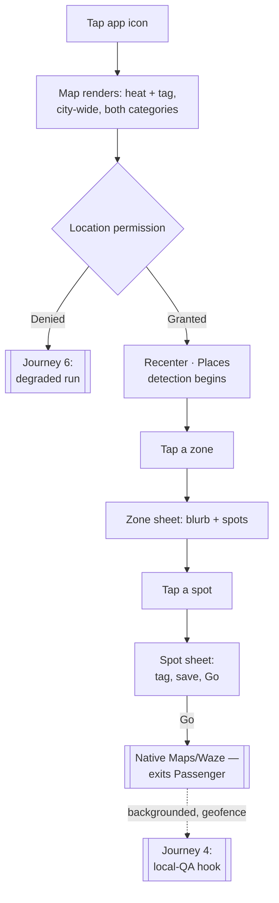
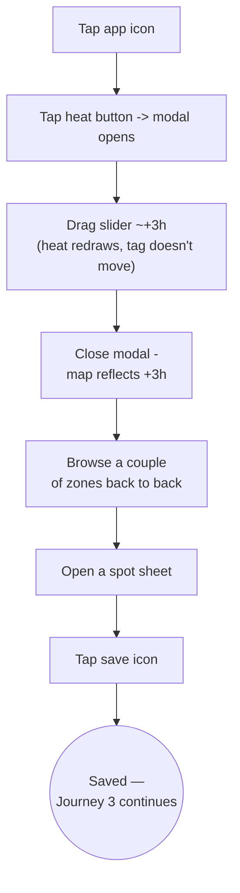
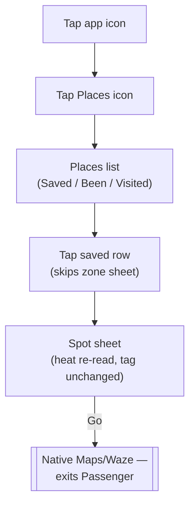
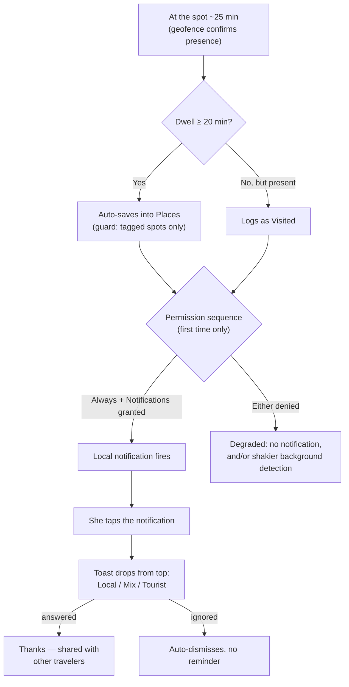
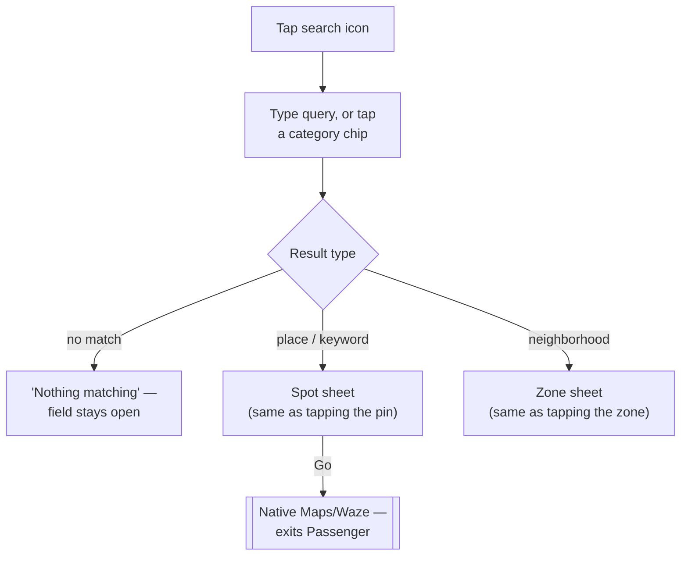
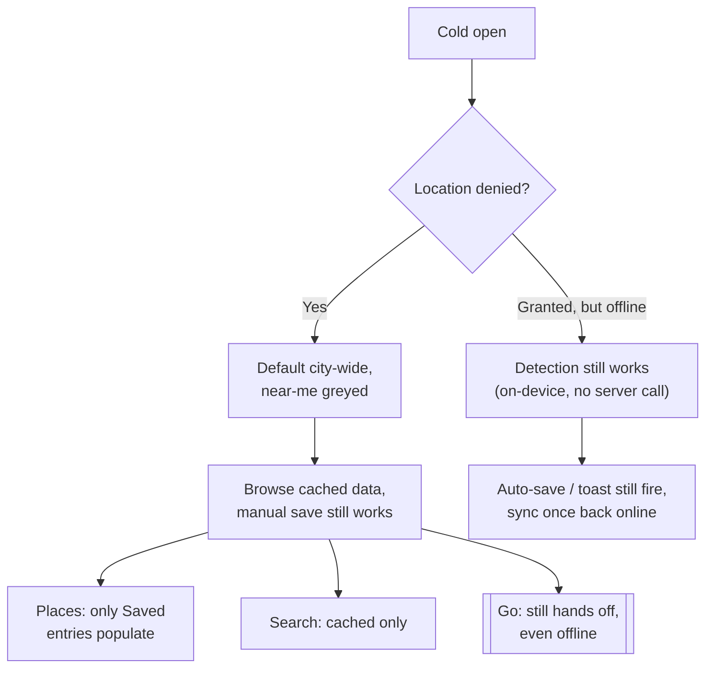
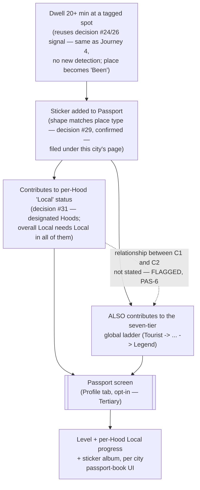
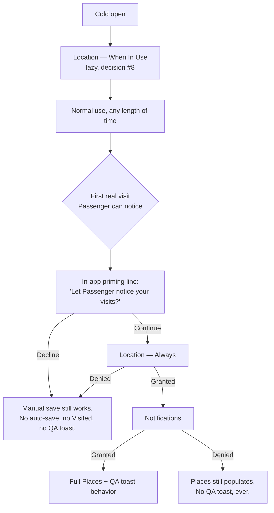
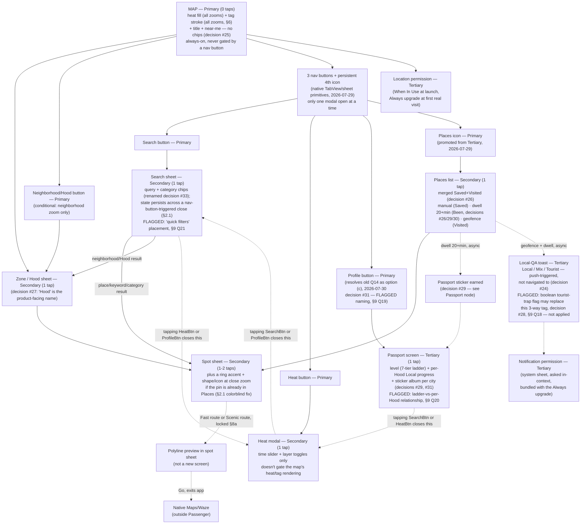

# Passenger V1 — UX Flows

**Owner:** designer (drafted for Aviran)
**Date:** 2026-07-30 (reconciled against the 2026-07-29 founders-meeting V1 scope lock — Hoods naming, Passport pulled forward, Been/Saved distinction, category rename; see §0 terminology note, §1, §2, §2.1, §4 Journey 7, §5, §7, §8, §9. Prior 2026-07-29 revision — nav/map/search/routing grilling + design-principles review — untouched except where this pass required it.)
**Status:** Draft — awaiting Aviran's read. **Routing preview and live events remain locked** from 2026-07-29 (§8a). **New as of 2026-07-30, confirmed:** Hoods terminology (decision #27), Been-place Passport stickers (decision #29), Saved/Been distinction (decision #30), Passport pulled forward into V1 with a real place in the nav model (decision #31), category rename (decision #33). **New as of 2026-07-30, explicitly NOT resolved — see §9 Q18–Q21, tracked on Linear `PAS-6`:** tourist-trap boolean vs. the three-way Local/Mix/Tourist tag (§6 rendering logic untouched pending this), "Profile tab" naming/scope, per-Hood Local status vs. the seven-tier ladder, and quick-filters chrome-vs-sheet placement. Still separately pending from 2026-07-29: the search-sheet layout recommendation (§2.1, §9) and the place-detail button-hierarchy fix (§8a) — neither touched by this pass.
**Source:** `strategy/passenger-strategy.md` (2026-07-30 founders-meeting reconciliation) + `strategy/decisions.md` (decisions 18–36, through 2026-07-30) + Aviran's 2026-07-29 live-chat decisions (`PROGRESS.md`, founder-direct) + Linear `PAS-8`/`PAS-6`
**Document type:** cross-feature UX flows reference. This is not a per-feature design spec — it doesn't carry a PRD-traceability table or a high-fidelity mockup link, because no PRD exists yet to trace against (`prds/INDEX.md` is empty). Once `product` writes the V1 PRDs this doc predicts, each gets its own spec under `design/<phase-slug>/` that does carry those.

---

## 0. Terminology note, 2026-07-30 (decision #27)

**"Hoods" is now the confirmed product-facing term** for what this document calls **"zone"** and **"neighborhood"** throughout — decision #12's neighborhood-plus-spot granularity is unchanged; only the external name is confirmed. "Zone"/"neighborhood" appears in every section below, every mermaid diagram, and both hierarchy tables (§2) — a word-for-word sweep of a 459-line doc this densely cross-referenced (mermaid node text, table cells, journey prose) risks breaking a diagram mid-edit for a purely cosmetic rename. Instead: **read every "zone" and "neighborhood" below as synonymous with "Hood."** Anything user-facing (screen copy, the neighborhood/Hood button's label, a Hood sheet's blurb) should say "Hood" when it ships; this doc's own internal working vocabulary stays "zone"/"neighborhood" until a dedicated terminology-sweep pass retires those terms for good. `design/map-rendering-spec.md` carries the same note rather than repeating this explanation.

---

## 1. The frame

Passenger is one map. You open the app and you're looking at Tel Aviv, right now — how packed everywhere is, and whether each place feels local or touristy. You drag a slider to see the next 12 hours, tap a Hood to read about it, tap a place and get handed off to Maps or Waze to actually walk there. You save places — sometimes on purpose, sometimes because you lingered somewhere long enough that it saved itself — and the app quietly remembers where you've actually been. Occasionally it asks you, in passing, whether a place felt local — because that's how the map gets smarter. There is no feed, nothing to scroll. (A private, single-user **"Passport"** stats screen — level, per-Hood Local progress, and a sticker album — is **pulled forward into V1, 2026-07-30** (decision #31), no longer a Phase 2/3 parked idea; see §2, §4 Journey 7, §8. It is still not an exception to "no feed, no scroll": nobody else ever sees it, no friend graph, no following, no social surface of any kind. **[FLAGGED, PAS-6]** Aviran's brief houses it under a tab he calls "Profile" — read here as the tab that surfaces Passport, not a reintroduction of accounts or a social profile, but that reading needs his explicit confirmation before a PRD cites it; see §9 Q19.) If you already know what you're after, search is one tap away — a sheet you open, not a box that's always staring back at you: a product whose whole pitch is "you don't need to ask" shouldn't put a question mark in front of you by default. Every screen is either the map, or something the map handed you.

**Addendum, 2026-07-29 — post-grilling + design-principles review.** The controls that reach off the map are **3 side-by-side nav buttons** (search, heat, and a third) plus a **persistent 4th icon** for saved places, separate from the 3. These are not a tab bar visually, but per the design review they should be **built on native TabView/sheet-presentation primitives, not custom-built from scratch**. Heat and localness rendering itself never moves behind a tap — the map always shows it, 0 taps, unchanged from §2 below. Tapping the **heat button** doesn't gate the layer; it opens a small modal holding only the 12h time slider and layer toggles, so "busy right now in one glance" stays true even though the slider control now lives one tap in. **Only one modal is ever open at a time** — tapping a different nav button closes whichever modal is open and opens the new one, never stacking — but each modal's own transient state (a half-typed search query, a mid-drag slider position) **persists across a close/reopen** rather than resetting. Saved places keep rendering as pins directly on the map; the 4th icon opens the full list. Full table/diagram detail: §2.1, §5, §8a.

**Addendum, 2026-07-30.** The third nav button, left undecided above as of 2026-07-29 (old §9 Q14), is now answered by the 2026-07-29 founders-meeting brief as **option (c): it houses Passport**, pulled forward from Phase 2 into V1 (decision #31) — see §2's new Primary row, §4 Journey 7 (promoted out of §8's parked list into the main journey set), §5, and §7's nav tree. This is a real scope reopening for the "3rd button" question, not this doc's own call — carried forward from Aviran's brief, flagged for his confirmation on the "Profile" naming specifically (§9 Q19), same as strategy.md.

---

## 2. The hierarchy

Four fields per component, per Aviran's ask — kept to a phrase each, not a paragraph: **what it is**, **Principle** (cite `design-principles.md` §, not re-derived taste), **UX intent** (the user goal), **Flow** (tier + tap cost from cold open, app icon = 0; folds in what used to be a separate Cost column).

### Primary — permanently on the map, unavoidable

Six things, one conditional: the map, heat, tag (zone granularity), the fading title, the slider, near-me — plus the neighborhood button, conditional. Category chips left this list last round (decision #25, moved to Secondary/search) — checked the rest of the doc, no stray mentions remain.

| Item | What it is | Principle | UX intent | Flow |
|---|---|---|---|---|
| The map | Tel Aviv, MapKit base layer | §1 Maslow precedence; §3 Sovereign posture | Answer "busy right now" in one glance | Primary · 0 taps |
| Heat layer | Crowd-density fill, stepped bands (decision #17) | §3 never color alone | Is it busy, before any tap | Primary · 0 taps |
| Tag layer | Tells the user if a place feels tourist or not — **Local · Mix · Tourist**, not a score | §3 never color alone; Tesler's Law | "Local or touristy" without asking | Primary · 0 taps. Rendering (§6) is a separate solution layer — Open Q12 |
| "Tel Aviv, right now" title | Fading ambient label, ~2s | §2 omit needless chrome; decision #8 | Orient, then get out of the way | Primary · 0 taps, cold-open only |
| Search button | Chrome icon, one of 3 side-by-side nav buttons; opens search sheet | §2 Fitts's Law | "I know what I want" reachable without leaving the map | Primary · 0 taps (visible) / 1 tap (opens) |
| Heat button | Chrome icon, one of 3 side-by-side nav buttons; opens the heat modal (time slider + layer toggles only — **doesn't gate the always-on heat/tag rendering above**, added 2026-07-29) | §2 Fitts's Law; §1 Maslow precedence (core "busy right now" read stays 0-tap even though this control sits behind one) | Preview later hours / toggle layers, without hiding the always-on read | Primary · 0 taps (visible) / 1 tap (opens) |
| Profile button (added 2026-07-30) | Chrome icon, the 3rd of the 3 side-by-side nav buttons — resolves the former "3rd button, TBD" question as option (c): opens the Profile tab housing **Passport** (decision #31). **[FLAGGED, PAS-6]** "Profile" naming/scope tension vs. the standing no-profiles gate — see §9 Q19 | §2 Fitts's Law | Reliable, always-visible door to a private stats/progression screen | Primary · 0 taps (visible) / 1 tap (opens) |
| Near-me button | Recenter, persistent icon | §2 Fitts's Law | One tap back to "where am I" | Primary · 0 taps / 1 tap |
| Neighborhood button (aka Hood button, decision #27) | Names the dominant zone; second door to the zone sheet | §2 Fitts's Law | Reliable target beats a loose polygon edge | Primary, **conditional** · 0 taps at neighborhood zoom only / 1 tap |
| Saved-places icon (4th icon) | Persistent icon, **separate from the 3 nav buttons** (added 2026-07-29); opens the full Places list. Saved pins still render directly on the map (decision #26) | §2 Fitts's Law | Reliable, always-visible door to the full list, distinct from browsing pins in place | Primary · 0 taps (visible) / 1 tap (opens) |

~~Category chips~~ — **moved to Secondary, inside search (decision #25)**, overriding my own earlier flagged call. Not re-argued here. **Categories renamed 2026-07-30 (decision #33):** "Food & drinks" → **"Eat & Drink"**; "Things to do" unchanged. **[FLAGGED, PAS-6]** The founders-meeting brief calls these **"quick filters"** — whether that means chips return to permanent map chrome (reversing decision #25) or stay sheet-internal under a new name isn't stated. Not resolved here, don't build against a guess — see §9 Q21.

### Secondary — invoked from the map

**Locked 2026-07-29 (§8a):** a route polyline (scenic vs. fast, for comparison) renders on the map as part of the spot-sheet flow, then "Go" hands off to native Maps/Waze for the actual walk. This is still not a separate in-app routing *screen* — the depth rule (§5) doesn't change.

| Item | What it is | Principle | UX intent | Flow |
|---|---|---|---|---|
| Zone sheet | Blurb + tagged spot list | Miller's Law (decision #12 bounds it); §3 Sovereign/Transient | Read a place without losing the map | Secondary · 1 tap, 3 doors → 1 destination |
| Spot sheet | Name, category, tag, save, Fast route, Scenic route (routing preview locked 2026-07-29, §8a) — **button hierarchy still pending, §8a**: currently three equal-weight buttons (anti-pattern); recommended fix is one filled primary (Fast route), one outline secondary (Scenic route), Save demoted to icon-only, awaiting Aviran's sign-off | Hick's Law; Von Restorff (one filled primary action, not three equal ones — design-review fix, pending) | One clear default action (go), with a real alternative and a lightweight save, not three equal choices | Secondary · 1–2 taps; polyline preview stays in-app, **only the actual turn-by-turn hand-off exits to native Maps/Waze** |
| Heat modal (added 2026-07-29) | Small modal opened by the heat button: 12h time slider + layer toggles only — not the heat/tag rendering itself, which stays on the map at 0 taps | §3 Thumb Zone; §2 Poka-Yoke | Preview later hours / toggle layers without leaving the map underneath, and without gating the always-on read | Secondary · 1 tap open / 1 drag; state (slider position) persists across close/reopen, doesn't reset |
| Search sheet | Query field + the two category chips (decision #25). **Layout pending sign-off, 2026-07-29:** original ask was a literal 50/50 top/bottom map/list split; design review flagged this as a real ergonomics problem (map lands in the worst thumb-reach zone, reinvents gesture affordances iOS users don't already know). **Recommended fix, needs Aviran's sign-off:** standard iOS sheet-over-full-map pattern (`.medium`/`.large` detents) instead — same effect (results next to a live map) via native affordances, map stays 100% interactive/reachable throughout, not a literal split. | Hick's Law (2 chips); Fogg B=MAT | Serve "I know what I want" without a standing question mark | Secondary · 1 tap; **transient state (in-progress query) now persists across a close/reopen** (2026-07-29 modal-exclusivity rule, §1 addendum) rather than dying with the sheet — supersedes this row's prior "dies with the sheet (§6)" framing |

### Tertiary — opt-in, low-frequency, doesn't block the core loop

| Item | What it is | Principle | UX intent | Flow |
|---|---|---|---|---|
| ~~Places (as Tertiary)~~ | **Promoted to Primary, 2026-07-29** — the merged Saved/Visited list now has a persistent 4th icon alongside the 3 main nav buttons (Aviran's decision), not a low-frequency opt-in surface. Full row moved to the Primary table above; the list's own contents (provenance labels, guard rules) are unchanged, only its access tier moved. | — | — | — |
| Local-QA answering | Post-visit toast (decision #24): notification → non-blocking toast, Local/Mix/Tourist | Von Restorff; Fogg B=MAT; §2 ask-once ethics | Real signal at the freshest moment, no obligation | Tertiary, push-triggered · 1 tap to open, 1 (or ignore) to answer |
| **Passport screen (added 2026-07-30, decision #31)** | Level (seven-tier ladder) + per-Hood "Local" progress + sticker album (decision #29), one page per city, opened via the new Profile button (§2 Primary table). Private, single-user, nobody else ever sees it | §1 Maslow precedence (Functional > Reliable > Usable > **Pleasurable** — this is the pleasurable-tier layer riding on top of the functional core, not itself core) | A personal record of real visits turned into a collectible; doesn't gate or block the map | Tertiary · 1 tap to open (Profile button), opt-in, low-frequency |
| Location permission | System sheet + in-app fallback copy | §2 ask-once ethics; decision #8 | Access without gating the map | Tertiary · 0 (auto) or 1 (near-me) |
| Settings-ish surfaces | None exist in V1 | Tesler's Law, by omission | n/a | n/a |

**My take on the field shape (Aviran asked directly, §3.1):** four is right, I wouldn't add a fifth. Cost folded into Flow rather than kept separate — say the word and I'll split it back out. Didn't add a states/accessibility column — that's per-feature-spec and rendering-spec territory (§6, `map-rendering-spec.md`), not this doc's job.

**Passport now has a real row, above — it's V1 scope, not a parked candidate.** Pulled forward 2026-07-30 (decision #31), reversing this table's prior "no row added, would land Tertiary if it ever shipped" placeholder — the tier call it was already carrying (Tertiary: opt-in, low-frequency, doesn't block the core loop) is confirmed for real now, not just a hypothetical. See §4 Journey 7 (promoted out of §8's parked list into the main V1 journey set) and §8. **[FLAGGED, PAS-6, not resolved here]** two open items this promotion surfaces rather than settles: (1) whether the housing "Profile" tab name reopens the standing no-profiles scope gate — §9 Q19; (2) how the new per-Hood "Local" status mechanic relates to the seven-tier ladder already in this row — §9 Q20.

### 2.1 Nav-model addendum, 2026-07-29 (grilling + design-principles review)

Four fixes locked this round, all folding into the tables above and carrying forward into whoever specs these next:

- **Sovereign, not Transient.** The 3(4)-button nav row and its modals (heat modal, search sheet, Places list) should be classified **Sovereign** in the design-principles.md framing — dense/efficient once learned, used dozens of times a session — rather than **Transient** (beginner-simplified, low-frequency). This changes how simplified the first-run version of these surfaces should be: don't over-explain controls a returning user will hit constantly. Flagged explicitly for whoever specs these next (designer, when this becomes a PRD/spec).
- **Colorblind-safe pin distinction.** Saved-place pins and search-result pins must be visually distinguished by **shape/icon, not color alone** — the existing ring-accent treatment for a Places-list pin (§6) needs a shape/icon component alongside it, not just a color/ring difference, so it reads correctly for colorblind users too.
- **Time slider accessibility (inside the heat modal, per this update):** needs (1) a visible numeral/label alongside any color coding on the slider track — not color-only; (2) a discrete, announceable VoiceOver step size, not a continuous-drag-only control that VoiceOver can't meaningfully narrate; (3) an explicit **"now" tick mark** on the track as a fixed visual anchor, so "how far forward am I looking" is always legible at a glance, not just inferable from thumb position.
- **Modal exclusivity + state persistence** (see §1 addendum): only one of {search sheet, heat modal, Places list, **and the new Profile tab (2026-07-30)**} is ever open at once; switching closes the old one and opens the new one; each modal's own in-progress state survives that switch (see §6's reconciliation for the one nuance around search's category filter).

**Additions, 2026-07-30 (founders-meeting reconciliation, decisions #27–36):**

- **Profile tab resolves the 3rd-button question.** The former "3rd button — TBD" placeholder (§9, old Q14) is now the **Profile button**, opening a tab that houses **Passport** (decision #31). Folds into the modal-exclusivity set above. **[FLAGGED, PAS-6]** whether "Profile" as a tab name reopens the standing no-profiles scope gate — §9 Q19.
- **Been-place stickers extend, don't replace, the existing dwell mechanic.** A place that dwell-triggers into "Been" status (decision #26's 20-minute auto-save, unchanged) now also earns a Passport sticker shaped to match the place type — coffee cup for a café, etc. (decision #29) — filed into that city's sticker album. No new detection: same signal Journey 4 already consumes, a second consequence of it. See §4 Journey 4 and Journey 7.
- **Saved vs. Been must read as different, not just be labeled differently.** Decision #30 requires manual "Saved" and dwell-triggered "Been" to stay visually/functionally distinct — this doc's existing provenance-label convention (a short word per Places-list row, §9 old Q11) already does that; renamed here from "Auto-saved" to **"Been"** to match the founders-meeting vocabulary (see §4 Journeys 3–4, §9 Q11).
- **Per-Hood "Local" status vs. the seven-tier ladder — not reconciled, flagged.** Decision #31 describes stamps accumulating toward "Local" status per designated Hood, with overall "Local" requiring it in every designated Hood — sitting alongside the seven-tier global ladder (Tourist→Legend) this doc's Journey 7 already details. Both are described as given in Journey 7; how they relate isn't stated anywhere in the founders-meeting brief. **[FLAGGED, PAS-6]** — §9 Q20.
- **Tourist-trap boolean vs. the three-way tag — flagged, §6/`map-rendering-spec.md` untouched.** Decision #28 proposes a boolean tourist-trap flag replacing decision #18's Local/Mix/Tourist tag that §6's entire rendering model is built on. **Not applied here** — the exact scope of "no local tags" isn't certain, and §6's stroke/zoom logic has already been through two real revisions; rewriting it against an unconfirmed reversal risks a third rewrite once Aviran actually answers. See §6's own flag and §9 Q18.
- **Quick filters — placement flagged, not decided.** Decision #33 renames the categories (see §2 above) but calls them "quick filters" without saying whether that returns chips to permanent map chrome (reversing decision #25) or keeps them sheet-internal under new copy. §9 Q21.

---

## 3. Primary flow — cold open to action

### First launch ever

1. **Tap the app icon.** No splash screen, no onboarding carousel (`BOARD.md` scope gate: "No onboarding — the app opens straight to the map plus location permission").
2. **Map renders immediately** — Tel Aviv, default city-wide center **[design call: exact default coordinate is a build detail, not a UX one]**, heat layer for "now," tag accents visible, both categories always shown together since there's no category filter outside the search sheet (decision #25), "Tel Aviv, right now" title fades in and out over ~2 seconds. **The time slider itself isn't on screen at cold open (2026-07-29 update)** — the map is always reading "now" until the heat modal is opened; opening it always shows the slider at "now" (leftmost) unless a prior session's mid-drag position was interrupted by a nav-button switch (§2.1, §6).
3. **Location permission prompts lazily** — the OS system sheet, not a custom in-app screen (decision #8: "no permission gate; lazy location"). It does not block map interaction.
   - **Granted:** map animates to the user's real location, a "you are here" marker appears, and Places-detection can begin — though only in a limited, foreground-favoring way at this permission level; the reliable background version needs the Always upgrade described below, not yet asked for at this point.
   - **Denied:** map stays at the default city-wide center — full treatment in Journey 6.
4. **User is free to explore** — pan, zoom (pinch-to-zoom never suppressed), drag the slider, tap a zone or a spot, open search if she wants to narrow by category or find something specific. This is the steady state almost every session lives in.

### Every subsequent launch

1. **Tap the app icon.** Map renders reflecting whatever permission state iOS already recorded — no re-prompt.
2. If previously granted: map opens already centered on current location, no animate-in beat. If previously denied: opens at the same default city-wide center as first run.
3. **Slider always resets to "now."** **[design call]** Persisting a stale "+3h" position from last session would misrepresent live data the moment the app reopens — "now" is only ever valid at the instant you look at it.
4. Same steady state as first-launch step 4.

### Permission sequence — three asks across a session, not one gate at launch

Decision #8 keeps cold open permission-gate-free — still true, still just the one lazy When-In-Use location prompt above. But V1 now has three distinct system permissions to eventually ask for, not one: **Location — When In Use** (cold open, unchanged), **Location — Always** (needed for dwell-based auto-save and for background geofence detection to actually fire — Visited/Places population likely needed this all along; decision #26 is what finally makes it explicit rather than hand-waved as generic "location permission"), and **Notifications** (decision #24, the post-visit toast). Asking for all three near launch would be a permissions gauntlet the strategy never signed up for. **Proposed sequence, flagged hard for confirmation in §9:**

1. **Cold open:** Location — When In Use only, exactly as specified above. Nothing else.
2. **First real visit** — the first time the app can tell she's dwelling somewhere or has just arrived (in practice, likely the first time she's foregrounded near a tagged spot, since When-In-Use alone can't reliably notice in the background): a single **in-app priming line** first — plain language, something like *"Let Passenger notice your visits, even when it's closed?"* — not a system dialog yet. If she continues, **two system prompts fire back to back**, both explained by that one line rather than arriving as unrelated interruptions: Location — Always, then Notifications.
3. **If she declines the priming line, or denies either system prompt:** no repeated asking, ever — same "ask once, respect the answer" rule as everything else in this doc. Manual saves keep working regardless (they never depended on any of this). Auto-save, geofence-detected Places entries, and the local-QA notification simply don't happen for her — degraded, not broken, and not re-prompted.

This turns three scattered asks into two moments — one at launch, one contextual pair later — rather than three separate interruptions spread across her first session. **[design call, flagged]** This is a proposal, not a confirmed sequence; see §9.

---

## 4. End-to-end journeys

Seven journeys as of 2026-07-30 (was six), chosen to partition V1's surface without duplicating it: two discovery contexts (tourist / resident, since they use the same map differently), one return-visit context, one feedback context, one search-first context, one whole-journey pass under degraded conditions, and — **promoted into V1 scope 2026-07-30, decision #31** — one Passport-progression context. Search earns its own journey rather than folding into an existing one — every other journey starts with *reading* the map (a zone, a slider drag, a saved list); search is the one path that starts with already knowing what you want and skips the reading entirely. It sits right before the degraded run: a normal alternate entry point, followed by the stress-test pass that touches everything that came before it, search included. Every V1 interaction appears in at least one journey below; where an unhappy path is specific to a single step, it's attached right there rather than pulled into a separate list.

**Journey 7, below, was a Phase 2/3 preview as of 2026-07-29 — that framing is now wrong.** The 2026-07-30 founders meeting pulled Passport forward into V1 outright (decision #31); Journey 7 is promoted here into the main journey set, out of §8's parked-features list. Real open items remain (§9 Q19–Q20, PAS-6) but the journey itself is committed V1 scope, not a preview of a maybe.

### Journey 1 — Just landed, knows nothing

*A tourist, first time opening the app, has just landed in Tel Aviv.*

1. Taps the app icon. Map renders immediately: Tel Aviv, default center, heat + tag on for "now," both categories always shown together (decision #25 — there's no category filter on the map itself anymore), "Tel Aviv, right now" title fading in and out.
2. A few seconds in, the OS location-permission sheet appears without blocking the map underneath. She taps **Allow** — map animates to her real location, a "you are here" marker appears, and Places-detection can begin in its limited, When-In-Use form (the reliable background version waits on the Always upgrade, §3). *(The denied branch gets its full walk-through in Journey 6, not repeated here.)*
3. She taps a zone near her hotel, both categories mixed together in the list that opens. A bottom sheet slides up with a hand-curated blurb and a scrollable list of tagged spots — short enough (decision #12's bounded curation) that she doesn't need to narrow it by category to scan it.
   - **Unhappy path:** if this zone has no curated data yet, the sheet reads "Nobody's mapped this corner of Tel Aviv yet" instead of an empty list — she keeps browsing, nothing broke.
   - **Note on decision #25's real cost:** if she *did* want to narrow to just "Things to do" before browsing, that's no longer a single tap — she'd have to open search first and select the category there (Journey 5's territory), which costs more than the old always-visible chip did. This journey shows the cheaper, unfiltered default path instead, since that's now genuinely the lower-cost way to browse casually.
4. She taps a spot in the list — a rooftop bar tagged **Local**, in a zone where heat is already climbing for this hour. Spot sheet opens: name, category, vibe tag, save icon, Fast route / Scenic route (routing preview, locked 2026-07-29, §8a).
5. She taps **Fast route**. A polyline draws on the map inside the spot sheet — a comparison preview, not a new screen. She taps **Go**; Passenger hands off to native Maps/Waze with the destination pre-filled — that's the actual exit from Passenger, not the preview step before it.
6. She walks there using Maps/Waze; Passenger is backgrounded. If the geofence monitor catches her arrival, Passenger fires a local notification — the local-QA ask from Journey 4 picks up from here, not repeated in this journey.
7. **Outcome:** standing in front of the bar. In-app cost: zone + spot + Go = 3 taps, plus whatever happens inside Maps/Waze — cheaper than before decision #25, precisely because there's no chip to tap on the way.

### Journey 2 — Home and bored, planning tonight

*A Tel Aviv resident, opening the app on a random Tuesday evening, deciding where to go later.*

1. Taps the app icon — not his first launch, so no permission re-prompt. Map opens centered on his current location, reading "now" as it always does.
2. **(2026-07-29 update)** He taps the heat button. A small modal opens holding the time slider and layer toggles. He drags the slider forward to roughly +3 hours. The heat layer on the map underneath redraws live as he drags; the tag layer doesn't move — a place's localness doesn't change because it's later. He closes the modal (or taps a different nav button); the map keeps showing +3h until he reopens the heat modal and drags again — closing the modal doesn't reset the slider back to "now."
   - **Unhappy path:** at +3h, one zone shows almost no heat at all — not an error, just real information (nothing relevant there at that hour), which is exactly what he needed to see.
3. He's not sure what he wants yet, so he doesn't bother with search or its category chips — both categories just show together by default, which is exactly what he wants right now.
4. He taps a couple of zones back to back, comparing blurbs and tags, swiping each sheet down to bounce to the next.
5. He finds a bar tagged **Mix** worth going to later, opens its spot sheet, and taps the save icon — it fills with a quick animation, an inline "Saved" confirmation appears, and he stays put.
   - **Unhappy path:** his connection drops right as he taps save — it still saves locally and syncs once he's back online; a save is too lightweight to gate on connectivity.
6. **Outcome:** a saved place and a plan for later — nothing to hand off to yet. Journey 3 picks up from here.

### Journey 3 — Coming back to something saved

*Same resident, a few hours later, ready to actually go.*

1. Opens the app, taps the **Places** icon — one icon now, not two (decision #26 merges Saved and Visited).
2. The Places list opens. The bar he saved in Journey 2 sits in it, labeled **Saved** — but it's not the only thing there anymore: whatever else the app has quietly logged (a lunch spot that dwelled its way in, somewhere he merely passed near) shows up in the same list, each row carrying its own short provenance word so a deliberate choice doesn't read as identical to something that saved itself. He taps the bar.
3. Tapping the row jumps straight to that spot's sheet, skipping the zone sheet entirely — he already chose this place.
4. The spot sheet re-reads current data: heat may have shifted since he saved it (different hour now); the vibe tag hasn't (tag doesn't move with time).
   - **Unhappy path:** if this saved spot has a gap in current-hour data, the sheet still opens with its static info (name, category, blurb), and the heat readout says "no live data right now" instead of blocking the sheet.
5. He taps **Fast route**, previews the polyline, then taps **Go** — same flow as Journey 1's updated hand-off.
6. **Outcome:** standing in front of the bar. Cost: Places icon + row + Go = 3 taps — unchanged by the merge for this specific path; shorter than Journey 1 on purpose, since re-finding a place you already chose shouldn't cost as much as discovering one.

### Journey 4 — Giving something back

*Either the tourist from Journey 1 or the resident from Journey 3, sometime after actually visiting a place.*

**Rewritten three times now — decision #24 changed how the ask arrives, decision #26 changed what else happens at the same moment, decision #29 (2026-07-30) adds a further consequence to that same moment.** The old version had her opening the Visited list out of curiosity and finding the ask embedded in a sheet. That's gone. There is no spot-sheet version of this ask anymore, in any form — one ask mechanism, not two, per Aviran's explicit call. I'm not quietly keeping a fallback for the case where the notification gets missed; the coverage this trades away is real and named explicitly in §9 rather than solved by bolting a second mechanism back on. **New, 2026-07-30:** the same dwell trigger that auto-saves a place now also earns a Passport sticker (decision #29) — extends this journey's existing mechanic, doesn't replace or complicate it; see step 1 and the outcome below, and Journey 7 for the full Passport treatment.

1. She's at the bar from Journey 1 for a while — say, 25 minutes, a drink and something to eat. Three things happen on the strength of that alone, all automatic: the geofence confirms she's actually there (not just passing by); because 25 minutes clears the dwell threshold, the bar **auto-saves itself into her Places list as "Been"** (renamed from "Auto-saved," 2026-07-30, decision #30) — a distinct state from a plain "visited" entry, which is what a shorter stop would have logged instead (§9 connects this threshold to the one below); and, new as of decision #29, a **Passport sticker shaped to match the bar's place type** drops into her Tel Aviv sticker album on the strength of that same signal — no separate check, no extra permission, the identical trigger doing one more thing.
   - **Guard, worth restating inline because it's load-bearing:** this only happens because the bar is already a tagged spot in Passenger's own places table. If she'd instead spent 25 minutes at her Airbnb or a friend's apartment, none of this fires — auto-save never touches an arbitrary coordinate, no matter how long anyone dwells there.
   - **(If she'd left after ten minutes instead)** the same geofence signal would have logged a plain **Visited** entry — present in the Places list, but without the more deliberate-feeling label auto-save or a manual save carries.
2. **Permission sequence, first time only** (§3): an in-app priming line, then two system prompts back to back — Location Always, then Notifications.
   - **Unhappy path (Always denied):** background detection degrades — Places may stop reliably picking up dwell/geofence signals while the app isn't open, though everything still works fine in the foreground. This is separate from the notification question below; denying Always doesn't by itself stop her from getting asked, it stops the app from reliably *noticing* in the first place.
   - **Unhappy path (Notifications denied):** no notification ever fires for her, for any future visit either. Places keeps populating regardless — that's location-driven, not notification-driven — but she never gets asked about any of it. This is a real coverage gap, not a small one; it's named directly in §9 rather than patched over with a second ask surface.
   - **[design call]** If Passenger happens to already be in the foreground at the exact moment the geofence fires (she's looking at the app when she arrives), the toast drops directly — there's no reason to route through a system notification she'd have to tap when she's already looking at the screen it would open.
3. She taps the notification. Passenger foregrounds (if it wasn't already) to whatever it was last showing — no deep link into the spot's own sheet, since the toast itself carries everything needed to answer. A toast drops from the **top** of the screen: "Does this feel like a local spot, or more of a tourist one?" — three tap targets, **Local / Mix / Tourist**, the same three words used everywhere else in the app. **Non-blocking, not modal:** it sits on top of whatever's underneath, dismissible by simply ignoring it, and auto-dismisses on its own after a few seconds if she doesn't touch it — consistent with every other "no modal, no interruption" moment in this doc, and with how an iOS banner already behaves.
4. She taps **Local**. The toast collapses into a one-line "Thanks — that's shared with other travelers" and disappears.
   - **Unhappy path (offline):** unlike the old embedded version, the toast still appears — it's three fixed words and a place name already known on-device, nothing about showing it needs a live connection. Her answer queues locally and syncs once she's back online, the same pattern already established for saving a place offline (Journey 2) rather than the old "don't render it at all" rule, which only made sense when the ask needed live spot data alongside it.
   - **Unhappy path (ignored):** she swipes the notification away, or lets the toast auto-dismiss. Nothing else happens — no re-prompt, no reminder, no second chance for this visit.
   - **Unhappy path (already answered):** if she's already answered for this spot, no notification fires for it a second time.
5. **Outcome:** one data point fed back into the localness pipeline, and the bar sits in her Places list labeled **Been** (renamed from "Auto-saved," 2026-07-30, to match the founders-meeting vocabulary — same mechanic, decision #26, unchanged 20-minute threshold) — at zero extra cost beyond a tap she was already going to make on a notification that arrived on its own. **New, 2026-07-30 (decision #29):** this same dwell trigger now also drops a sticker into her Passport, shaped to match the bar's place type, filed under Tel Aviv's page in the sticker album — see Journey 7, which this moment feeds directly.

### Journey 5 — I already know what I'm looking for

*A resident whose friend just texted "go to Port Said" — or anyone chasing a specific craving, not interested in browsing.*

1. Taps the search icon in map chrome. A sheet opens over the map with a single text field, plus the two category chips (**Eat & Drink** / Things to do — renamed 2026-07-30, decision #33, was "Food & drinks" / "Things to do") — the only place either now lives, per decision #25 **as it stood before the 2026-07-30 "quick filters" brief; whether that's still true is flagged, not settled — see §2 and §9 Q21.** No default suggestions needed to start.
2. Types "Port Said." Matches appear as she types. The same field matches three kinds of things: place names (this one), keywords ("hummus," "rooftop bar"), and neighborhoods ("Florentin"). Tapping a category chip instead of typing does the same thing a text query does — produces a result set that dims the map down to matching pins/zones, just scoped by category instead of by text.
   - **Unhappy path (no results):** "Nothing matching 'Port Said' right now" and the field stays open and editable — same empty-state convention used everywhere else (a line, not a dead end).
3. She taps the place-name result. The search sheet transitions directly into that spot's sheet — name, category, vibe tag, save icon, Fast route / Scenic route. The tag and heat shown reflect the current slider hour, exactly as if she'd tapped the pin on the map; search filters into the same live data, it doesn't invent a separate result-only view.
   - **Unhappy path (result exists, no data at this hour):** heat reads "no live data right now" — the same treatment as a saved place with a data gap (Journey 3). Search doesn't get its own rule for this.
4. She taps **Fast route**, previews the polyline, then taps **Go** — same routing-preview flow as every other spot sheet (§8a). Search doesn't create a second kind of exit.
5. **Alternate ending — a neighborhood result:** if she'd typed "Florentin" instead, selecting it pans the map there and opens that zone's sheet — the same blurb-plus-spot-list surface as tapping the zone directly, just reached from a query instead of a glance.
   - **Unhappy path (neighborhood has no curated blurb yet):** same empty state as tapping an under-curated zone from the map ("Nobody's mapped this corner of Tel Aviv yet") — search surfaces the zone, it doesn't invent content for it.
6. **Unhappy path (offline):** search runs against whatever's already cached locally — matches are limited to that, and anything opened from a result carries the same "last updated Xm ago, offline" label used everywhere else.
7. **Outcome:** at the spot sheet (or zone sheet) in 2 taps from cold open — search icon plus one result — cheaper than either discovery journey, because there was no browsing to do.

### Journey 6 — The degraded run

*Anyone, location denied and/or offline for the whole session.*

1. Cold open with location denied (or offline entirely). Map renders at the default Tel Aviv city-wide center — no recenter, no "you are here" marker.
2. The near-me button stays visible but greyed. Tapping it doesn't re-trigger the system permission dialog (iOS won't, once denied) — it shows inline copy pointing to Settings instead.
3. She browses anyway — the map is fully usable without location, just not personalized to where she's standing. She taps a zone; if the network is also down, the sheet shows the last cached blurb/spot list with a "last updated Xm ago, offline" label rather than failing blank.
4. She taps a spot and **saves it manually** — completes locally, syncs once she's back online. Unaffected by location being denied: a manual save was never a location feature to begin with, and decision #26 doesn't change that.
5. She checks the **Places** list. The place she just manually saved is sitting right there, labeled **Saved** — but that's all that's in it, and all that ever will be without location: auto-save and geofence-detected visits both depend on the exact signal Visited always needed, so with location denied, two of the list's three feed paths stay permanently empty (explainer state: "Turn on location to build this automatically," Settings deep-link). The same location gap explains why the Journey 4 notification never fires either — nothing to detect, nothing to auto-save, nothing to ask about.
6. **If location was granted for part of this session but she's offline** (the "and/or" half of this journey), a visit can still be detected, a spot can still auto-save, and a notification can still fire — geofencing, dwell detection, and local notifications are all on-device, not server calls. The toast still drops when she opens it; answering queues locally and syncs once she's back online, same as the save flow in step 4.
7. She taps the search icon anyway — location denial doesn't touch it (search was never location-scoped to begin with), but offline shrinks it to whatever's cached, same as Journey 5's offline path.
8. She taps **Fast route**, then **Go**, anyway. The final hand-off to native Maps/Waze still works even offline — it's just handing coordinates to another app. *(Whether the polyline preview itself needs connectivity to compute the route isn't specified anywhere in this doc — a real gap for `architect`/`ios-developer` to close, not answered here.)*
9. **Outcome:** she can still browse, search, read blurbs and tags, manually save places, and get routed out to a destination — manual save is the one Places feed path that never depends on location at all. If location was denied outright, she loses the other two feed paths and any chance to answer a local-QA question, since nothing was ever detected to ask about — but pure offline with location granted doesn't cost her any of that; everything still happens, it just syncs late. Nothing crashes and nothing lies to her about data being fresher than it is — that's the actual bar here, not full feature parity.

### Journey 7 — Earning a Passport sticker *(V1 scope, 2026-07-30 — decision #31 pulls Passport forward from Phase 2. Was framed as a Phase 2/3 preview as of 2026-07-29; that framing no longer applies.)*

*Either traveler from the journeys above, sometime after Journey 4's post-visit moment. Two open items remain, flagged rather than guessed at below — see §9 Q19–Q20 (Linear `PAS-6`).*

1. She clears the same genuine-presence signal Journey 4 already walks through — geofence-verified 20+ minute dwell at a locally-recommended, already-tagged spot, the same threshold that makes the place "Been" in her Places list (decision #26, §4 Journey 4). **No new detection**: this is a second consumer of an existing signal, not a separate check. Anti-gaming comes free from the reuse — a sticker requires the same real-presence bar as the local-QA ask, never just opening the app. A plain geofence-detected visit that never clears the dwell threshold (logged as "Visited," not "Been," §4 Journey 4) does **not** earn a sticker — only "Been" places do, per decision #29's wording.
   - **Whether this fires alongside Journey 4's local-QA toast, or as a separate moment, is still unresolved** — this doc's one remaining UX-only open item on the feature, unchanged by the V1 promotion. See §9 Q13.
2. A **sticker for that place is added to her Passport, shaped to match the place type** — a coffee cup for a café, and so on. **Settled, 2026-07-30 (decision #29):** this was an open "per-place or per-category, shape TBD" question as of 2026-07-28; the founders meeting confirms it as per-place, matching place type, no longer TBD. Filed into a **per-city sticker album** — Tel Aviv's page fills in as she collects, a second city (whenever one ships) gets its own page.
3. Her sticker count contributes toward progression on **two mechanics described in the founders-meeting brief, not reconciled with each other here:**
   - **Per-Hood "Local" status (decision #31):** stamps accumulate toward "Local" status within a set of Hoods Passenger designates; overall "Local" status requires reaching Local in *every* designated Hood, not just one.
   - **The existing seven-tier global ladder** (unchanged from the prior draft of this journey): **Tourist** (default) → **Wanderer** → **Regular** → **Local** → **Insider** → **Native** → **Legend**, thresholds illustrative only, TBD.
   - **[FLAGGED, PAS-6 — not reconciled here, per this doc's own instruction not to guess.]** Does the seven-tier ladder still exist as an overall meta-status built from per-Hood progress, does the per-Hood mechanic replace it outright, or do the two coexist independently? Not stated anywhere in the brief. Both are described above as given; treat them as two mechanics on record, not one resolved system. **[open, unchanged]** Whether a level-up (on either mechanic) gets any in-the-moment surfacing or stays silent until she next opens Passport is still undesigned.
4. **Later, opt-in:** she taps the **Profile button** (§2, §5) into the **Passport screen** — a private, single-user Tertiary surface. She sees her current global-ladder level, her per-Hood Local progress, and her sticker album for this city, passport-book UI. Nobody else ever sees this screen — no friend graph, no following, no social surface of any kind. **[FLAGGED, PAS-6]** the tab housing this screen is called "Profile" in Aviran's brief — read here as the tab that surfaces Passport, not a reintroduction of accounts; needs his explicit confirmation (§9 Q19).
   - **Not designed here:** the Legend tier's floated "submit your own recommendations" unlock — strategy.md flags it as an open call (new user-write surface, moderation/abuse questions unresolved), not an assumed inclusion.
5. **Outcome:** a personal, private record of real visits turned into a collectible and a progression status — same underlying signal Journey 4 already uses, at zero extra detection cost. **This journey is now committed V1 scope** (decision #31), not a preview of a parked candidate — but two real mechanics questions (step 3's flag) and the naming tension (step 4's flag) stay open pending Aviran's confirmation on `PAS-6`; nothing here should be read as resolving either.

---

## 5. Navigation model

No nav bar, no tab bar, no feed — but as of 2026-07-29, the off-map controls are explicitly **3 side-by-side nav buttons + a persistent 4th icon**, not a loose scatter of chrome, and per the design review they're built on **native TabView/sheet-presentation primitives**, not custom components. Four surface types:

- **Map chrome** — always on screen, never dismissed: heat/tag layers (always-on rendering, never gated by a button — 2026-07-29), fading title, near-me button, the neighborhood/Hood button (conditional, §6, decision #27), and **the 3 nav-button icons themselves** (search, heat, **Profile — resolved 2026-07-30, decision #31**) **plus the persistent 4th Places icon**. Only the icons live here permanently; what they open is one of the surfaces below. Category chips don't belong to this list (decision #25 — they live inside the search sheet, **though "quick filters" placement is flagged open again, §9 Q21**).
- **Modals/sheets, opened by the nav row** — partial-height, swipe-down or tap-outside to dismiss, **or auto-closed when a different nav button is tapped (2026-07-29 — only one open at a time, no stacking)**: the **heat modal** (time slider + layer toggles only, new 2026-07-29), the **search sheet** (query + category chips), the **Places list** (merged Saved/Visited, decision #26 — promoted from a floating Tertiary icon to one of the persistent 4 as of 2026-07-29, §2), and — **new, 2026-07-30** — the **Passport screen** opened by the Profile button (decision #31; **[FLAGGED, PAS-6]** "Profile" naming, §9 Q19). Each of these four retains its own in-progress state across a nav-button-triggered close/reopen (§2.1); the zone sheet and spot sheet, reached by tapping *into* the map rather than a nav button, aren't part of this exclusivity rule — they still dismiss the ordinary way (swipe down / tap outside) and don't compete with the nav row for "only one open" status. The Passport screen sits at the same depth as the heat modal and search sheet — one tap from the map — and doesn't interact with the zone/spot depth rule below at all.
- **Zone sheet / spot sheet** — partial-height, swipe-down or tap-outside to dismiss, reached by tapping the map itself (a zone, the neighborhood button, or a pin) rather than a nav button.
- **The local-QA toast** — a new category, not a sheet. Top-anchored, non-blocking, and — unlike everything else in this list — never invoked by the user; it arrives on its own, dropped in response to a system notification tap (decision #24), and dismisses on its own too, either on answer or after a few seconds of being ignored. It doesn't sit "on top of the map" the way a sheet does — it can appear over whatever the app is currently showing, since it doesn't require any particular screen underneath it. See Journey 4.

**The zone sheet now has three doors, one destination.** Tapping a zone shape, tapping the neighborhood button, and selecting a neighborhood result from search all open the exact same zone sheet. None of them is a different surface or changes what depth costs — they're three ways of naming the same 1-tap trip, which is the point: the polygon tap was always there but easy to miss or mis-hit, so the button and search give it two more reliable front doors without inventing a second destination.

**"Go" splits into Fast route / Scenic route, locked 2026-07-29 (§8a).** Tapping either draws a polyline preview *inside* the spot sheet's own space — not a new surface/level (see depth rule below) — and the actual exit to native Maps/Waze only happens on a second, explicit tap. Returning to Passenger afterward (backgrounding/foregrounding) drops the user back wherever iOS left off — typically the spot sheet or the map — Passenger doesn't reconstruct any state for this beyond the polyline preview itself.

**Depth rule: 2 levels, no more, while inside the app.** Map (0) → zone sheet (1) → spot sheet (2) is the deepest path that stays inside Passenger. Search holds at the same ceiling, but gets there two different ways depending on the result type — worth confirming rather than assuming, since it isn't the same shortcut in both directions:
- **Search (1) → spot sheet (2)**, for a place-name or keyword result, matches the Places pattern exactly: it skips the zone-tap step because the user already named what they want, whether by picking from a list (Places) or typing a query (search).
- **Search (1) → zone sheet (2)**, for a neighborhood result, isn't a shortcut at all — it reaches the *same* zone sheet a direct map tap would reach at level 1, just one level deeper, because the query itself occupies level 1 first. Either way, 2 stays the ceiling.

Nothing in V1 needs a third in-app level — the one feature that would have required it, a full in-app turn-by-turn navigation screen, stays Phase 2 (§8a) even with the routing-preview change locked, since the preview renders as a polyline *inside* the existing spot sheet rather than opening a new screen — and keeping full in-app turn-by-turn out of V1 is exactly what holds this rule at 2 instead of 3. Dismissing any sheet always returns exactly one level up.

The local-QA toast (decision #24) sits outside this rule entirely, not as an exception to track but because it was never a navigational level to begin with — it isn't reached by descending from anywhere, and dismissing it doesn't return "up" to a prior screen, since it never displaced one.

---

## 6. State & density of the map

**Per note 2:** the requirement is plain — the user can tell tourist-vs-not, via Local/Mix/Tourist. Everything below is *my proposed solution* to that requirement, already through one feedback loop with Aviran (badge → stroke). Left as stated fact, not reopened as a question, since the rest of the doc is written against it — flagged in Open Q12 in case that reading is wrong.

**[FLAGGED, 2026-07-30, PAS-6 — not applied below, rendering logic untouched.]** The 2026-07-29 founders-meeting brief proposes a boolean tourist-trap flag (decision #28) that may replace the three-way **Local · Mix · Tourist** tag this entire section is built on. Whether "no local tags" means the graduated tag disappears entirely, or something narrower survives, isn't certain from the brief — and this section's stroke/zoom rendering rule has already been through two real revisions with Aviran, each one closing a real gap the last one opened (badge → stroke → channel fix). Rewriting it against an unconfirmed reversal risks a third rewrite once he actually answers, so **everything below still describes the locked three-tag model, unchanged.** `design/map-rendering-spec.md` carries the identical flag rather than a duplicate explanation. See §9 Q18.

**Revised this round.** Aviran's pushback, verbatim: *"how do you show tag layer on every location on the map? its gonna be too much information on one layer."* He was right — the previous version of this section badged every close-zoom pin, then stacked a warning badge on top of that. Worst case (Florentin at 8pm, dozens of pins) was heat fill plus a tag badge plus sometimes a warning badge, once per pin, all at once. That doesn't survive contact with a real dense neighborhood. Rewritten below around one governing fix: **tag gets the same progressive disclosure heat already has, instead of trying to render at every zoom simultaneously.**

**Revised again this round — the fix over-corrected, and the contradiction it created had to go.** Moving tag to neighborhood-zoom-only badges solved the density problem, but it left tag with zero rendering at city-wide zoom — the zoom cold open actually shows — while §2 kept claiming tag was "on by default, the first thing you see," 0 taps. Aviran caught it: that made cold open heat-only, which is the half of this product anyone already gets from Google Maps. The fix is a channel change, not a placement change — heat keeps the fill, tag moves to the zone's **outline stroke**, a channel nothing else was using. Full rendering detail lives in `design/map-rendering-spec.md`; this section states the resulting rule.

**Zoom levels, and where each layer actually lives:**

- **City-wide** — heat as neighborhood-scale blobs. **Tag now renders here too** — as a zone outline stroke, but only on **Local** zones; Mix and Tourist stay unstroked. No word labels yet (too fine to read at this scale), no pins.
- **Neighborhood** — zone boundaries visible, heat as zone-level stepped-band fill. Outline stroke on **Local or Tourist** zones (Mix still unstroked), **plus a word label** at the centroid spelling out the tag — the only zoom where the word appears. Still no spot pins.
- **Close** — individual spot pins appear. The zone's outline stroke persists at whatever boundary is still in view (no label at this zoom). **Pins themselves still carry no tag signal at all** — heat continues exactly as it rendered at neighborhood zoom, and pins exist only to mark a location and its category, plus a ring accent for anything already in the viewer's Places list (§6, decision #26). Tapping a pin opens the spot sheet, where the vibe tag renders as what it always was underneath the map: a word in a sheet, not a decoration competing with dozens of others for the same screen.

**[design call, mine]** Whether spot pins should carry tag at all, at any zoom, was left open for me to decide. I'm calling it **no, never** — not "no badge, but yes to a tag-colored pin shape instead." Aviran's complaint was about density of *signal*, not just density of *objects*: even a pin whose own shape and fill encode tag (no separate badge riding beside it) still asks the eye to individually parse every pin in a crowded block one at a time. The only fix that actually survives Florentin at 8pm is moving spot-level tag off the map surface entirely, onto the zone sheet's list, where it's a word read one row at a time instead of a field scanned all at once spatially. Decision #12 still keeps spot-level localness *data* — this only changes where it *renders*. If a future pass wants tag-per-pin back (e.g., a "show only Local spots" close-zoom mode as a deliberate feature), that's a new decision to make then, not a default to fall back into.

**[design call, mine]** Why city-wide only strokes Local, not Tourist too: extends the existing Mix-is-silent discipline one level further rather than carving out an exception. A handful of green pockets across the whole city is a glance; a fully outlined city in two colors is a map you have to parse. It also lines up with what "busy" even means at that scale — heat itself is only coarse blobs at city-wide, not the zone-level precision the busy+Tourist warning needs, so that warning has no coherent city-wide granularity to begin with. City-wide becomes a map of where to trust, matching the north star's actual question, not a map of every liability too.

**Slider hours:** unchanged by any of this — heat is the only time-variant layer, tag isn't, so a zone's tag stroke never moves when the slider does, regardless of which granularity it's currently rendering at. **Where the slider control itself lives changed 2026-07-29** (§2.1, §5): it's now inside the heat modal rather than always visible on the map, but the rendering rules in this section apply identically regardless of which hour the modal last set.

**Mix renders nothing — no stroke, no label — at any granularity.** With three tags, Mix is the unmarked middle and almost certainly the most common single value — marking it would be pure clutter carrying zero information. A zone gets a stroke only for Local or Tourist; a blank zone reads as Mix. **[design call]** A zone with no curated data yet also renders blank, identically — the map surface doesn't try to distinguish "confidently Mix" from "not yet rated," and that's an accepted trade-off, not an oversight: tapping in always resolves which one it is, the same way every other empty state in this doc already resolves "no data here" on contact rather than pre-announcing it on the map.

**The packed + touristy trap — replace, don't stack.** A zone that's simultaneously busy and Tourist-tagged doesn't get two decorations — it gets **one stroke treatment, in a distinct warning form, replacing the plain Tourist stroke outright** (and the label reflects it, at neighborhood zoom). Never two elements competing for the same handful of square millimeters (design-principles.md §2, Von Restorff: only one "special" element per view). Busy + **Local** still never gets a warning treatment of any kind — the absence of a warning stays legible precisely because the warning exists for the other case, and that logic survives the move to zone granularity unchanged. The "very local but temporarily busy" case holds too: heat is time-variant, tag isn't, so a Local-tagged zone spiking busy at 9pm reads as "busy AND local," never as evidence it turned touristy.

**Personal places on the map (decision #26).** A place already in the viewer's Places list gets a ring accent on its pin at close zoom — binary (yours or not), not a three-way encoding of manual/auto/visited the way the list itself shows; that nuance stays list-only, on purpose, so the map doesn't reopen the exact density mistake tag-per-pin was. This is safe at a scale tag-per-pin never was because it's bounded by one person's own history, not by the city's spot count — full reasoning and the exact rendering rule are in `design/map-rendering-spec.md` §6.

**Colorblind-safe update, 2026-07-29 (§2.1):** a ring accent alone is a color/stroke difference, not a shape difference — it must not be the *only* signal distinguishing a saved-places pin from an ordinary search-result pin. `map-rendering-spec.md` §6 needs a shape/icon component added to the ring treatment (not decided here — a rendering-spec-level call), so the distinction survives for colorblind users, not just sighted ones reading a ring as "highlighted."

**Pin clustering, pin anatomy, and the exact accessibility labels for all of this** are specified in the companion doc, not here — that level of rendering detail would bloat a flows document: [`design/map-rendering-spec.md`](./map-rendering-spec.md). What belongs in *this* doc is the structural fact that governs it: the busy+Tourist warning and the Mix-is-silent rule both live at the zone's stroke, not spot pins, which is what makes the rendering spec's job (clustering dozens of untagged pins, plus the odd personal one) simpler than the version of this problem the previous draft left behind.

**Search results and the map — a real design call, unaffected by the tag-density fix above.** Decision #23 settles that results carry heat/tag and honor the slider hour, but not what the map itself does visually while the search sheet is open. **[design call]** While results are showing (from a typed query or a tapped category chip — decision #25 makes these the same mechanic, see §2), the map underneath dims everything except the matching pins or zones — search filters what's visually prominent, not just what's technically attached to each result row, so "search filters the map, it doesn't bypass it" is true on screen, not only in the data. This is temporary: the moment a result is selected and the destination sheet opens, the dimming clears and the full unfiltered heat/tag view returns underneath.

**What a category selection does once the search sheet closes — resolving the old open question about category filtering, now that chips live only in search.** **[design call, partially superseded 2026-07-29 — see reconciliation below]** A category selection is scoped to that search session only. Dismissing the search sheet by completing the flow (tapping a result) or manually swiping it away always drops the filter and returns the map to its full, unfiltered heat/tag view, both categories mixed — it never persists as a standing map-level filter. Reasoning: with chips no longer on the map, there's nowhere left to *show* that a filter is silently still active — a persisted-but-invisible filter is exactly the kind of hidden state a map whose whole premise is "legible at a glance" can't afford (design-principles.md's Sovereign/Transient framing: the map is Sovereign and must stay fully legible on its own; the search sheet is Transient, and its effects should die with it).

**Reconciliation, 2026-07-29 [design call, mine]:** Aviran's new nav-model decision says each modal's transient state — "e.g. in-progress search text" — must persist across a close/reopen rather than be destroyed, specifically for the case where **tapping a different nav button** force-closes the modal (no stacking, only one open at a time). That's a different close vector than the one this paragraph was written against (finishing the search or manually dismissing it), so I'm reading the two rules as compatible rather than contradictory: an **interrupted** search (query typed, then heat or the 4th icon gets tapped) keeps its query text *and* its category selection when the user comes back to search — nothing typed should vanish just because another nav button was tapped. A **completed or manually-dismissed** search still resets on its own terms, per the paragraph above. Every fresh search-sheet open still starts with both categories active by default unless it's resuming an interrupted session. Flagged for Aviran to confirm rather than asserted as settled — this is my own reconciliation of two decisions made in different sessions, not a call he made explicitly either way.

---

## 7. Flow diagrams

Per-journey diagrams now live inline in §4, next to each journey's plain-text walkthrough — not repeated here. The two below are structural, not journey-specific: the permission *policy* (§3) and the full navigation tree (§5).

### Permission sequence (§3) — two moments, not three scattered asks

### Hierarchy / navigation tree

**Updated 2026-07-29, then 2026-07-30** to reflect the 3(4)-button nav model: heat/tag rendering stays always-on (unchanged); the time slider moved off the map into a heat-button modal; Places moved from a floating Tertiary icon to the persistent 4th icon; only one of {search sheet, heat modal, Places list, **Profile/Passport screen**} is ever open at once (dashed "closes" edges below). **The former 3rd-button placeholder (old §9 Q14) is now the Profile button, opening Passport (decision #31) — [FLAGGED, PAS-6] "Profile" naming, §9 Q19.**

---

## 8. Where the parked features slot in

**Superseded 2026-07-29 — Scenic View (as routing preview) and Live Events are now V1 scope, not Phase 2.** Aviran reviewed and applied the redline directly to `strategy/passenger-strategy.md` (lines 36, 42, 98, 115–116, 139, plus the Phase 2 candidate write-ups, Key risks, and Open questions). §8a below is the locked V1 description; only the place-detail button-hierarchy fix remains an unconfirmed design-review recommendation, not yet signed off.

### 8a. Locked V1 scope, 2026-07-29 — routing preview + live events

- **Routing preview — locked.** Not full in-app turn-by-turn — the app draws the route as a **polyline on the map for comparison** (scenic vs. fast), then "Go" hands off to native Maps/Waze for the actual walk. No in-app voice/rerouting. Free in V1, no paywall (monetize later if at all — Scenic View is no longer subscription-gated per `strategy/passenger-strategy.md`'s Business model section, updated 2026-07-29). Doesn't add an in-app navigational level (§5's depth rule stays at 2) since the polyline renders inside the existing spot sheet, not a new screen.
  - **Still pending, separate from the scope decision above:** the place-detail hierarchy fix flagged by design review — the spot sheet's Save/Scenic/Fast trio currently reads as three equal-weight buttons with no hierarchy (an anti-pattern). Recommended fix: **one filled primary** (Fast route, effectively today's "Go"), **one outline secondary** (Scenic route), **Save demoted to an icon-only bookmark/heart**. This is design taste, not a strategy call — Aviran hasn't signed off on it yet, so §2's table still shows both framings.
- **Live events layer — locked, and launch-blocking.** A live events overlay ships in V1 alongside heat + tag (third Primary-tier map layer). `strategy/passenger-strategy.md` now states this explicitly, and it's **launch-blocking**: V1 does not ship until `data-engineer` has a working live-events ingestion pipeline (scoping ticket PAS-5). Genuine timeline/dependency risk, tracked in `strategy/passenger-strategy.md`'s Key risks section and on the Linear ticket, not just a UX note.

### Phase 2 scope that remains (strategy.md, updated 2026-07-29)

What's left as a Phase 2 candidate for each is narrower than before: Scenic View's Phase 2 slice is now only "does the V1 preview ever grow into full in-app turn-by-turn navigation" (gating undecided); Live Events' Phase 2 slice is only a further monetization/business layer (ticketing, promoter placement) on top of the overlay that already shipped in V1. Full end-to-end flows for both, worked out ahead of time so the structure doesn't need to be re-derived when Phase 2 actually starts, live in [`design/phase-2-flows.md`](./phase-2-flows.md) — kept as a separate doc on purpose, not folded in here, since this doc is what the scope gate depends on staying clean. **That doc still describes the old, wider Phase 2 scope for both features and needs its own pass to reflect the narrower Phase 2 slice above — flagging, not fixing here.**

- **Scenic View, full in-app turn-by-turn (Phase 2 candidate only — the lighter-weight preview is now V1, §8a).** V1 ships the polyline-preview version locked 2026-07-29; this bullet is only the *further* question of whether that preview ever grows into a full-screen in-app routing surface with turn-by-turn guidance. That would be a bigger change than the preview — it changes what leaving the spot sheet *means* (the preview still exits to native Maps/Waze for the actual walk; a full in-app surface wouldn't), reopens what "you've arrived" looks like since the app would now be watching during transit, and pushes the depth rule to 3 levels (map → zone → spot → routing screen) instead of 2. Worth scoping alongside Phase 2's proximity intelligence (arrival card) — both concern the in-transit experience and would likely share build surface.
  - The open question about depth (full in-app turn-by-turn vs. staying at a preview-then-handoff forever) still applies whenever Phase 2 gets scoped — no longer a V1 blocker, flagged here for whoever picks up Phase 2 (§9 Q16).
- **Live Events, business/monetization layer (Phase 2 candidate only — the base overlay is now V1, §8a).** V1 ships the live events map overlay itself, locked 2026-07-29 and launch-blocked on the data-engineer ingestion pipeline (PAS-5). This bullet is only the *further* question of whether Events ever grows a business side — ticketing commission, promoter placement — which would be B2B-shaped monetization and conflicts with the standing "no business-facing monetization" line. Needs an explicit call if it comes up, not an assumed exception.

- ~~**Stamp collection & status levels — "Passport" screen (Phase 2)**~~ — **pulled forward into V1, 2026-07-30, founders meeting (decision #31).** No longer a Phase 2 candidate: it's now a committed V1 journey with a real nav-model entry point, not a parked idea awaiting a placement call. Moved to §2's hierarchy tables (new Primary "Profile button" row, new Tertiary "Passport screen" row) and §4 **Journey 7**, promoted out of this parked-features list into the main V1 journey set — same treatment as the "Auto-saved places" and "Points system" rows below, which made the same move a phase earlier. Left here, struck through, as a marker per this doc's own convention, not deleted silently. **New since the Phase 2 write-up this replaces:** a Passport sticker matching place type per "Been" place (decision #29) and a per-Hood "Local" status mechanic (decision #31) layered on top of the seven-tier ladder this bullet used to describe alone — relationship between the two **not reconciled, flagged PAS-6** (§4 Journey 7, §9 Q20). "Profile" tab naming also flagged, same ticket (§9 Q19). Legend's floated "submit your own recommendations" unlock is still **not designed** — open call per strategy.md, unchanged by the promotion.
- **Proximity intelligence + arrival card (Phase 2):** a new **Secondary** surface, automatically triggered (geofence) rather than tap-invoked — a time-triggered variant of the spot sheet appearing when the user is already en route. Extends the spot sheet; doesn't displace it.
- **AI local guide persona, audio-first, personalization (Phase 3):** a different product mode on the same engine, not a sheet off the map. Would need its own **Primary-adjacent entry point** — a real structural change, not an addition. Flag clearly if Phase 3 ever gets scoped: it's the one candidate that breaks V1's "single primary surface" simplicity rather than extending it.
- **Shake-to-decide (Phase 3):** a gesture-triggered **Secondary** action, roughly parallel to the spot sheet — a random-suggestion overlay triggered by a device gesture instead of a tap. Purely additive.
- ~~**Auto-saved places (Phase 3)**~~ — **pulled forward into V1 by decision #26.** No longer parked: it's one of the three feed paths into the merged Places list (§2 Tertiary, Journey 4). Left here only as a marker that this row used to exist — removing it silently would make this doc's own history harder to audit than leaving a strikethrough.
- ~~**Points system (Phase 3)**~~ — **unified into the Phase 2 stamp collection & status levels bullet, above** (Aviran, 2026-07-28). Not a separate Phase 3 item; same mechanic, moved up a phase. Left here only as a marker that this row used to exist — removing it silently would make this doc's own history harder to audit than leaving a strikethrough. The re-tiering question this row used to raise (once real incentive exists behind the local-QA ask, does the toast in Journey 4 deserve more visual weight than a quiet, ignorable one) still applies once Phase 2 scopes the stamp system — worth reconsidering at that point, not before.

---

## 9. Open UX questions for Aviran

1. **Local-QA notification cadence — revisited for a push mechanic, where the tolerance is much lower than it was for an embedded card.** My old recommendation ("roughly once per session") doesn't translate — a notification isn't session-bound, and firing one on every single detected visit will burn goodwill fast. **Recommendation:** cap at one local-QA notification per day, full stop, regardless of how many visits are detected that day, and only trigger it for visits that clear a minimum dwell-time threshold (someone who passed by isn't someone who visited). Decision #26 now gives auto-save an explicit number — 20 minutes — for a related-but-not-identical purpose (worth saving vs. worth asking about). **Refined recommendation:** default to reusing the same 20-minute threshold for both rather than maintaining two separate numbers with no obvious reason to differ; Q9 below is where to push back if asking should have a stricter bar than saving.
2. **Lazy location permission — exact trigger mechanism.** Decision #8 says "lazy," but not whether that means an automatic system prompt shortly after the map first renders, or only on the user's first tap of "near me." **Recommendation:** auto-prompt once, softly, a couple of seconds after the map first renders — gets Places-tracking started (in its limited When-In-Use form) as early as possible without blocking the first look at the map.
3. **Does the time slider ever look backward?** Taken here as strictly forward-only, "now → +12 hours." Worth confirming there's no case for showing "an hour ago" for context before this is locked into the build.
4. **Background-location reliability — now load-bearing for three things, not one, and it needs the "Always" authorization level specifically, not "When In Use."** Places population (manual aside), the dwell-based auto-save trigger, and the local-QA notification all depend on the geofence/dwell monitor running while Passenger is backgrounded — the user is inside Maps/Waze, or just has the app closed, at the exact moment any of these needs to fire. Does iOS reliably keep Always-level background location running through a Maps/Waze hand-off and the walk that follows, or does backgrounding risk losing the signal all three features depend on? **Recommendation:** confirm this with the architect before treating any of Places' automatic paths (decision #26), the notification trigger (decision #24), or the old Visited-only design (decision #16, now superseded) as settled — if Always-level tracking is shaky in practice, all three need a fallback conversation, not just one of them.
5. **Does the computed busy + Tourist warning stroke (§6, zone-level) need its own VoiceOver label?** It's a display-time computation, not a stored tag, so it won't inherit whatever label the plain Tourist stroke already carries. **Recommendation:** give it an explicit label ("busy and touristy — worth a second look") rather than relying on VoiceOver to read heat and tag separately and expecting the combination to be inferred. This now has a second, sharper edge to it: §6's Mix-is-silent rule means a sighted user reads "no stroke" as Mix, but VoiceOver can't read an absence — full detail and resolution in `design/map-rendering-spec.md`'s accessibility section, kept coherent with this question rather than answered twice.
6. **Does the search sheet keep recent searches?** There's no account and no persistence story anywhere else in V1 — the time slider itself resets to "now" every launch on purpose, and (per §6's 2026-07-29 reconciliation) a *completed or manually-dismissed* search's category selection still resets, though an *interrupted* one (closed by switching nav buttons) now persists. **Recommendation:** default to no persisted history across app launches, matching that pattern; a session-only recent list (cleared on relaunch) is a reasonable middle ground if a completely blank field on every open feels too cold, but that's worth Aviran's read since locals searching the same handful of things repeatedly is a real, recurring use case this would help.
7. **What does the neighborhood button do when the viewport straddles two zones roughly evenly** — at the boundary between Florentin and Neve Tzedek, say, with no single dominant neighborhood in view? **Recommendation:** don't guess at a winner. Hide the button entirely below some clear-dominance threshold (e.g., one zone needs to cover meaningfully more than half the visible viewport) rather than risk sending someone into the wrong neighborhood's sheet with false confidence — tapping either zone shape directly still works regardless, so nothing is lost by having the button stay quiet in the ambiguous case.
8. **Notification-permission-denied is a real, named coverage gap, not a small one.** With no spot-sheet fallback (decision #24 replaces, doesn't supplement), a user who denies notification permission — or who consistently ignores/dismisses the notification — never gets asked about any visit, ever, in V1. This directly compounds the strategy's own named risk ("V1 has to get real signal on goodwill alone... if that doesn't produce enough answers, the algorithm has nothing to check itself against"). **Recommendation:** accept this trade for now — a second ask mechanism to plug the gap reintroduces exactly the complexity decision #24 just removed — but track the notification opt-in rate as a real launch metric, not an afterthought; if it's low, that's a signal to revisit this doc, not just a data point to note.
9. **Whether the local-QA notification should reuse decision #26's 20-minute auto-save threshold, or needs its own.** Q1's refined recommendation defaults to reusing it. The case for a separate, stricter number: a push notification is a bigger interruption than quietly adding a row to a list, so "worth asking about" could reasonably demand more than "worth saving." Needs data-engineer/architect input either way, not a pure UX call.
10. **Permission sequence — flagged hard, per the instruction that came with decision #26.** V1 now needs three system permissions (Location When-In-Use, Location Always, Notifications) for a product whose decision #8 explicitly rules out a permission gate at launch. §3 proposes a concrete ordering — one prompt at cold open, then a single in-app priming line before Always and Notifications fire back to back at the first real visit — but it's a proposal, not a confirmed sequence. **Recommendation:** confirm the proposed ordering, or replace it, before this becomes a build spec; don't let three unordered permission asks reach `ios-developer` by default.
11. **The merged Places list's name and provenance display — recorded open on decision #26, and I'm proposing rather than leaving blank.** Name: **"Places."** Provenance: a short word per row — **Saved / Been / Visited** (relabeled 2026-07-30: "Auto-saved" → "Been," per the founders-meeting vocabulary and decision #30's explicit visual/functional-distinction requirement between manual "Saved" and dwell-triggered "Been" — same underlying mechanic and threshold, name only) — with manual save always winning the displayed label if it ever applies to a place, Been next, plain Visited last, so a place never shows two conflicting explanations for why it's in the list. This proposal still holds under the new Been/Saved framing — decision #30 asks for a visual/functional distinction, which a distinct provenance word per row already provides; nothing here needed restructuring, only the word. **Recommendation:** confirm both, or overrule either — everything in §2, §4 (Journeys 3–4, 7), and `design/map-rendering-spec.md` §6 is written against this proposal, so a change here is a find-and-replace, not a redesign.
12. **Does note 2 ("don't write solutions") reach past §2's tag-layer line into §6's rendering solution too?** Fixed the literal flagged text in §2 (plain requirement now, not "Localness accent"). Left §6's stroke/zoom solution as stated fact, not reopened — it already passed one feedback loop, and the nav model, both diagrams, and all six journeys are written against it. **Recommendation:** treat §6 as settled unless told otherwise; confirm which reading was intended.
13. **Stamp collection / Passport (§8, Journey 7) — pulled forward into V1 2026-07-30 (decision #31); this question list now reflects that.** Still parked in `strategy/passenger-strategy.md`'s own Open questions, not re-litigated here: per-city flavor names for the tier ladder (explicitly deferred cosmetic idea, not level-logic). Full text lives in strategy.md per the doc-ladder rule — not restated here. (Naming and the points-system unification were resolved 2026-07-28, both in strategy.md, both noted at §8 above.) **The one remaining UX-only open item carried over from the Phase 2 draft, unresolved by the V1 promotion:** whether a stamp/sticker or level-up fires alongside Journey 4's local-QA toast or as a separate moment, and whether a level-up gets any in-the-moment surfacing at all — see Journey 7 step 1 (§4). **New items surfaced by the promotion itself, not on this list before — see Q19–Q20 below and Linear `PAS-6`:** the "Profile" tab naming/scope tension, and how the new per-Hood "Local" status mechanic relates to the seven-tier ladder this question used to describe alone.

14. **The 3rd nav button — resolved 2026-07-30, but with a naming flag attached (was genuinely undecided as of 2026-07-29).** Three options were on the table: **(a)** drop it; **(b)** device-local settings only; **(c)** fully reopen V1 scope for accounts + the existing "Passport" Phase-2 concept. The 2026-07-29 founders-meeting brief answers this as **option (c)** — Passport is pulled forward into V1 and lives under this button (decision #31, §1, §2, §5, §7). This resolves the *button* question; it does **not** resolve whether the housing tab's "Profile" name is safe against the standing no-profiles scope gate — that's carried forward as its own open item, Q19 below, per PAS-6.
15. **Search-sheet layout — needs an explicit yes/no, not just a recommendation on file.** §2's Search sheet row and §2.1 both carry the design-review recommendation (sheet-over-full-map with `.medium`/`.large` detents, replacing the original literal 50/50 top/bottom split) as **pending**, not locked. Every journey and diagram in this doc that touches search (Journey 5, §7's nav tree) is written generically enough to hold either way, but `ios-developer` shouldn't build against either interpretation until Aviran confirms the fix rather than the original literal-split ask.
16. **Place-detail button hierarchy (§8a) — routing preview itself is now locked; the hierarchy fix is the one part still open.** Routing preview (Fast route + Scenic route, polyline comparison) was signed off and applied to `strategy/passenger-strategy.md` 2026-07-29. What's still unconfirmed is only the Save/Scenic/Fast visual hierarchy (one filled primary, one outline secondary, Save demoted to icon) — a design-review recommendation, not yet a yes from Aviran. Needs its own explicit sign-off, separate from the scope question it was originally bundled with.
17. **§6's persistence reconciliation (interrupted vs. completed/dismissed search) is my own interpretive call, not something Aviran specified directly.** He said modal transient state "should persist across a close/reopen" using in-progress search text as the example; this doc reads that as scoped to nav-button-triggered interruption specifically, leaving the original "resets when you finish or manually dismiss" rule intact for those cases. **Recommendation:** confirm this reading, or say the persistence rule should be broader (e.g., category selection also survives a completed search, not just an interrupted one).

**New, 2026-07-30 — from the founders-meeting reconciliation (`PAS-8`). None of Q18–Q21 are resolved here; each links up to `strategy/passenger-strategy.md`'s own Open questions (per this doc's doc-ladder convention) rather than restating that text, and all four are tracked on Linear `PAS-6` pending Aviran's explicit confirmation. Do not build against a guessed answer to any of them.**

18. **Tourist-trap boolean (decision #28) vs. the three-way Local/Mix/Tourist tag (decision #18) this doc's §6 and `map-rendering-spec.md` are entirely built on.** Full framing lives in strategy.md's Open questions item 1 — not restated here. **Explicitly not applied to this doc:** §6's stroke/zoom rendering logic is unchanged, flagged rather than rewritten, because it's real working logic that's already been through two revisions and rewriting it against an unconfirmed reversal risks a third rewrite once Aviran actually answers. See §6's own flag.
19. **"Profile tab" naming/scope for Passport.** Full framing lives in strategy.md's Open questions item 4 — not restated here. This doc reads "Profile" as the tab housing the already-confirmed, private, non-social **"Passport"** screen (2026-07-28 naming decision), not a reintroduction of accounts or a social profile — but that reading needs Aviran's explicit confirmation before a PRD cites §2's Profile-button row, §4 Journey 7, §5, or §7's nav tree. Collides directly with the standing no-profiles scope gate (`CLAUDE.md`, `BOARD.md`) if read the other way.
20. **Passport's per-Hood "Local" status (decision #31) vs. the existing seven-tier global ladder (Tourist→Legend) this doc's Journey 7 already details.** Full framing lives in strategy.md's Open questions item 5 — not restated here. Not reconciled in this doc either: Journey 7 (§4) describes both mechanics as given, side by side, without inventing a relationship between them. Whether the ladder is a meta-status derived from per-Hood progress, is replaced outright by the per-Hood mechanic, or the two coexist independently isn't stated anywhere in the founders-meeting brief.
21. **"Quick filters" placement (decision #33) — chrome-level or still sheet-internal.** Full framing lives in strategy.md's Open questions item 6 — not restated here. Whether this reverses decision #25 (which this doc's §2/§5 currently document at length as chips-moved-into-the-search-sheet) or just renames the sheet-internal chips isn't stated. §2's category-chip note and §5's map-chrome bullet both carry this flag; nothing in either should be read as assuming chips are returning to the map.
