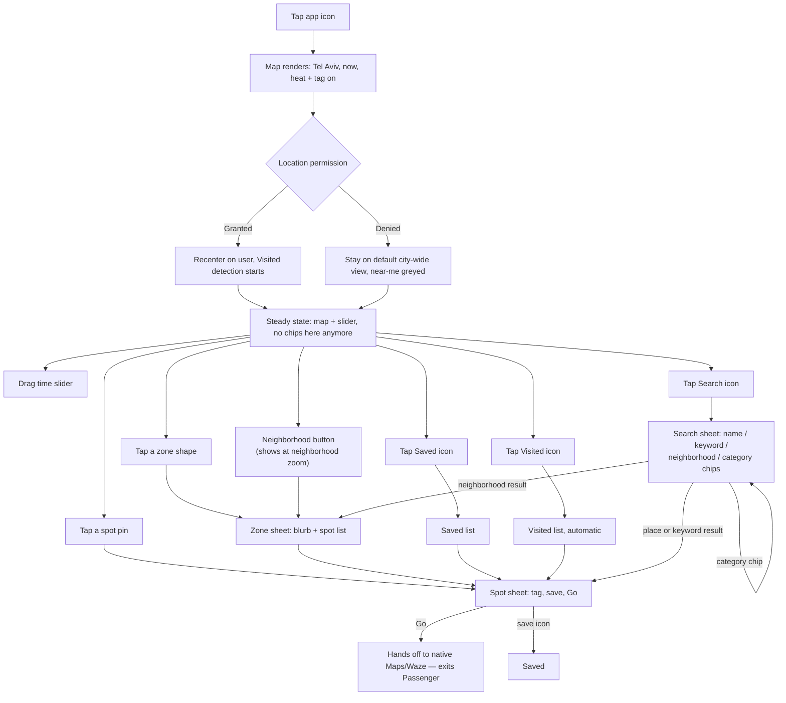
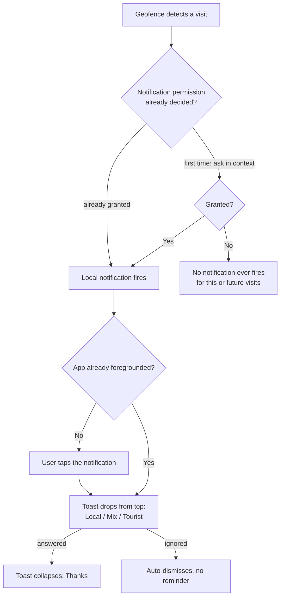
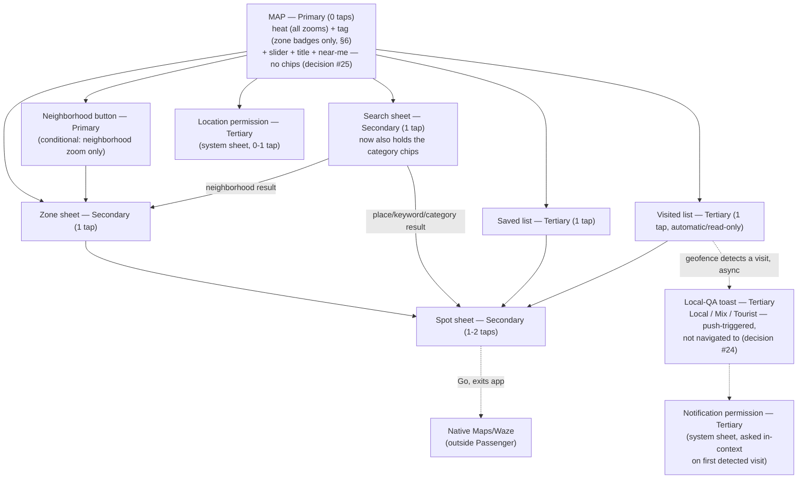

# Passenger V1 — UX Flows

**Owner:** designer (drafted for Aviran)
**Date:** 2026-07-27
**Status:** Draft — awaiting Aviran's read
**Source:** `strategy/passenger-strategy.md` (2026-07-27) + `strategy/decisions.md` (decisions 18–25, 2026-07-27)
**Document type:** cross-feature UX flows reference. This is not a per-feature design spec — it doesn't carry a PRD-traceability table or a high-fidelity mockup link, because no PRD exists yet to trace against (`prds/INDEX.md` is empty). Once `product` writes the six V1 PRDs this doc predicts, each gets its own spec under `design/<phase-slug>/` that does carry those.

---

## 1. The frame

Passenger is one map. You open the app and you're looking at Tel Aviv, right now — how packed everywhere is, and whether each place feels local or touristy. You drag a slider to see the next 12 hours, tap a neighborhood to read about it, tap a place and get handed off to Maps or Waze to actually walk there. You save places, and the app quietly remembers where you've actually been. Occasionally it asks you, in passing, whether a place felt local — because that's how the map gets smarter. There is no feed, no profile, nothing to scroll. If you already know what you're after, search is one tap away — a sheet you open, not a box that's always staring back at you: a product whose whole pitch is "you don't need to ask" shouldn't put a question mark in front of you by default. Every screen is either the map, or something the map handed you.

---

## 2. The hierarchy

**Cost is measured in taps from cold open** (app icon tap = 0).

### Primary — permanently on the map, unavoidable

**This list is short, and got shorter again this round.** Category chips (decision #25, overriding my own earlier flagged call — see Secondary below) are the second thing to leave permanent map chrome after spot-level tag badges left it last round. What's actually left, permanently, on the map: the map itself, heat, tag (at zone granularity only), the fading title, the slider, and the near-me button — plus the neighborhood button, conditionally. Six things, one of them conditional. That's it.

| Item | What it is | Why Primary | Cost |
|---|---|---|---|
| The map | Tel Aviv, MapKit, always the base layer | It's the whole product — strategy: "one map, and the whole product lives on it" | 0 |
| Heat layer | Crowd-density fill, stepped bands (no gradients — decision #17) | On by default, the first thing you see | 0 |
| Tag layer | Localness accent, three plain-language values: **Local · Mix · Tourist** | On by default, orthogonal to heat, never blended. Heat + tag is the entire V1 map — two layers, exactly as the north star describes. **Renders at whatever granularity is legible per zoom, not everywhere at once — see §6, revised after Aviran's pushback on badge density.** | 0 |
| "Tel Aviv, right now" title | Fading ambient label on cold open | Decision #8, verbatim | 0 |
| Time slider | Now → +12h control, bottom-third (thumb zone) | **My call, flagged.** Permanently visible, never dismissed, reshapes the primary view — Primary-chrome behavior, not a sheet you invoke. | 0 to see, 1 drag to change |
| Location/"near me" button | Recenter affordance | Persistent icon, part of map chrome | 0 to see, 1 tap to use |
| Neighborhood button ("See all of [Neighborhood]") | Explicit, Bump-inspired affordance naming the dominant zone in view; a second, more reliable door into the same zone sheet a polygon tap already opens | **My call, flagged.** Map-surface chrome, not a sheet, so it belongs with Primary by construction — but it's the first *conditional* Primary item in this doc: visible only at neighborhood zoom, when one zone dominates the viewport, not from anywhere the way the slider or near-me button are. It exists because a loosely-bounded polygon is an unreliable, hard-to-discover tap target (Fitts's Law: a big, unambiguous target beats an edge you have to find) — tapping the zone shape still works, this is a second door to the same place. | 0 to see at neighborhood zoom, 1 tap to use |

~~Category chips (Food & drinks / Things to do)~~ — **moved to Secondary, inside the search sheet (decision #25).** This directly overrides my own earlier call, flagged twice, that chips belonged in Primary chrome. Aviran's override, not re-argued here — see the Secondary table below for where they live now and what changes.

### Secondary — invoked from the map

Lighter than it might otherwise be: V1 hands off to native Maps/Waze at the moment of "go," rather than building its own routing screen, so there is no in-app takeover surface to place here. Three items now, not two — search (decision #23) joins zone sheet and spot sheet.

| Item | What it is | Why Secondary | Cost |
|---|---|---|---|
| Zone sheet | Neighborhood blurb + tagged spot list | Requires a tap on a zone shape *or* the neighborhood button when one's showing — two doors, same destination; bottom sheet, map stays visible behind it | 1 tap |
| Spot sheet | Name, category, vibe tag, save icon, "Go" button | One level under a zone sheet, or reachable directly from a close-zoom map pin. **"Go" hands off to native Maps/Waze — an exit from Passenger, not a screen inside it.** | 1–2 taps |
| Search sheet | Query field matching place names, keywords, and neighborhoods, **plus the two category chips (Food & drinks / Things to do) — the only place either now lives (decision #25)**; opened from an icon in map chrome | **Secondary, not Primary — Aviran's explicit call, and the reasoning matters:** a permanent search bar sitting in front of a product whose whole pitch is "you don't need to ask" undercuts that pitch. One tap away, gone when you're done, keeps the map itself as the thing you look at rather than a results page waiting for a query. Folding the category chips in here is the same reasoning applied a second time: one fewer permanent control competing for space on the map. | 1 tap |

### Tertiary — opt-in, low-frequency, doesn't block the core loop

| Item | What it is | Why Tertiary | Cost |
|---|---|---|---|
| Saved places | List of places you bookmarked | Deliberately sought out, not part of the glance-and-go loop | 1 tap (floating icon) |
| Visited places | List of places the app detected you near | Same reasoning; also read-only in V1 — see Journey 4 | 1 tap (floating icon) |
| Local-QA answering | **Rewritten for decision #24, not patched.** A post-visit toast, not an embedded card: the geofence detects a visit, a local notification fires while Passenger is backgrounded, opening it drops a non-blocking toast from the top of the screen — same three words, Local / Mix / Tourist | **Still Tertiary, but the reasoning changed underneath it.** It used to be Tertiary because it rendered inside a Secondary surface with no primary value to the answerer. It no longer renders inside anything — it's an unprompted interruption that arrives on its own. It stays Tertiary anyway, now purely on importance-to-the-user grounds: still pure goodwill, still skippable by ignoring the notification entirely, still no incentive layer until Phase 3's points system. Tiering by consequence-to-the-user rather than by delivery mechanism is the more durable rule anyway — see Journey 4 for the full flow, and §9 for the two real costs (a second permission prompt, and V1's first notification) this trades in. | Doesn't have a cold-open tap cost the way everything else in this table does — it's the first push-triggered surface in this doc, arriving independent of anything the user navigates to. Once it fires: 1 tap to open the notification, 1 tap (or ignore) to answer. |
| Location permission | System permission sheet + in-app fallback copy if denied | One-time, OS-owned, not app chrome | 0 (auto-triggered) or 1 (via "near me") |
| Settings-ish surfaces | — | **None exist in V1.** No account, no preferences, no toggles beyond what's already Primary chrome. | n/a |

---

## 3. Primary flow — cold open to action

### First launch ever

1. **Tap the app icon.** No splash screen, no onboarding carousel (`BOARD.md` scope gate: "No onboarding — the app opens straight to the map plus location permission").
2. **Map renders immediately** — Tel Aviv, default city-wide center **[design call: exact default coordinate is a build detail, not a UX one]**, heat layer for "now," tag accents visible, both categories always shown together since there's no category filter outside the search sheet (decision #25), slider at "now" (leftmost), "Tel Aviv, right now" title fades in and out over ~2 seconds.
3. **Location permission prompts lazily** — the OS system sheet, not a custom in-app screen (decision #8: "no permission gate; lazy location"). It does not block map interaction.
   - **Granted:** map animates to the user's real location, a "you are here" marker appears, background Visited-detection starts silently (decision #16).
   - **Denied:** map stays at the default city-wide center — full treatment in Journey 6.
4. **User is free to explore** — pan, zoom (pinch-to-zoom never suppressed), drag the slider, tap a zone or a spot, open search if she wants to narrow by category or find something specific. This is the steady state almost every session lives in.

### Every subsequent launch

1. **Tap the app icon.** Map renders reflecting whatever permission state iOS already recorded — no re-prompt.
2. If previously granted: map opens already centered on current location, no animate-in beat. If previously denied: opens at the same default city-wide center as first run.
3. **Slider always resets to "now."** **[design call]** Persisting a stale "+3h" position from last session would misrepresent live data the moment the app reopens — "now" is only ever valid at the instant you look at it.
4. Same steady state as first-launch step 4.

---

## 4. End-to-end journeys

Six journeys, chosen to partition V1's surface without duplicating it: two discovery contexts (tourist / resident, since they use the same map differently), one return-visit context, one feedback context, one search-first context, and one whole-journey pass under degraded conditions. Search earns its own journey rather than folding into an existing one — every other journey starts with *reading* the map (a zone, a slider drag, a saved list); search is the one path that starts with already knowing what you want and skips the reading entirely. It sits right before the degraded run: a normal alternate entry point, followed by the stress-test pass that touches everything that came before it, search included. Every V1 interaction appears in at least one journey below; where an unhappy path is specific to a single step, it's attached right there rather than pulled into a separate list.

### Journey 1 — Just landed, knows nothing

*A tourist, first time opening the app, has just landed in Tel Aviv.*

1. Taps the app icon. Map renders immediately: Tel Aviv, default center, heat + tag on for "now," both categories always shown together (decision #25 — there's no category filter on the map itself anymore), "Tel Aviv, right now" title fading in and out.
2. A few seconds in, the OS location-permission sheet appears without blocking the map underneath. She taps **Allow** — map animates to her real location, a "you are here" marker appears, Visited-detection starts silently in the background. *(The denied branch gets its full walk-through in Journey 6, not repeated here.)*
3. She taps a zone near her hotel, both categories mixed together in the list that opens. A bottom sheet slides up with a hand-curated blurb and a scrollable list of tagged spots — short enough (decision #12's bounded curation) that she doesn't need to narrow it by category to scan it.
   - **Unhappy path:** if this zone has no curated data yet, the sheet reads "Nobody's mapped this corner of Tel Aviv yet" instead of an empty list — she keeps browsing, nothing broke.
   - **Note on decision #25's real cost:** if she *did* want to narrow to just "Things to do" before browsing, that's no longer a single tap — she'd have to open search first and select the category there (Journey 5's territory), which costs more than the old always-visible chip did. This journey shows the cheaper, unfiltered default path instead, since that's now genuinely the lower-cost way to browse casually.
4. She taps a spot in the list — a rooftop bar tagged **Local**, in a zone where heat is already climbing for this hour. Spot sheet opens: name, category, vibe tag, save icon, "Go" button.
5. She taps **Go**. Passenger hands her straight to native Maps/Waze with the destination pre-filled — an exit, not a screen inside Passenger. She never sees an in-app route.
6. She walks there using Maps/Waze; Passenger is backgrounded. If the geofence monitor catches her arrival, Passenger fires a local notification — the local-QA ask from Journey 4 picks up from here, not repeated in this journey.
7. **Outcome:** standing in front of the bar. In-app cost: zone + spot + Go = 3 taps, plus whatever happens inside Maps/Waze — cheaper than before decision #25, precisely because there's no chip to tap on the way.

### Journey 2 — Home and bored, planning tonight

*A Tel Aviv resident, opening the app on a random Tuesday evening, deciding where to go later.*

1. Taps the app icon — not his first launch, so no permission re-prompt. Map opens centered on his current location. Slider resets to "now," as it always does.
2. He drags the slider forward to roughly +3 hours. The heat layer redraws live as he drags; the tag layer doesn't move — a place's localness doesn't change because it's later.
   - **Unhappy path:** at +3h, one zone shows almost no heat at all — not an error, just real information (nothing relevant there at that hour), which is exactly what he needed to see.
3. He's not sure what he wants yet, so he doesn't bother with search or its category chips — both categories just show together by default, which is exactly what he wants right now.
4. He taps a couple of zones back to back, comparing blurbs and tags, swiping each sheet down to bounce to the next.
5. He finds a bar tagged **Mix** worth going to later, opens its spot sheet, and taps the save icon — it fills with a quick animation, an inline "Saved" confirmation appears, and he stays put.
   - **Unhappy path:** his connection drops right as he taps save — it still saves locally and syncs once he's back online; a save is too lightweight to gate on connectivity.
6. **Outcome:** a saved place and a plan for later — nothing to hand off to yet. Journey 3 picks up from here.

### Journey 3 — Coming back to something saved

*Same resident, a few hours later, ready to actually go.*

1. Opens the app, taps the Saved icon.
2. Saved list opens; he taps the bar from Journey 2.
3. Tapping the row jumps straight to that spot's sheet, skipping the zone sheet entirely — he already chose this place.
4. The spot sheet re-reads current data: heat may have shifted since he saved it (different hour now); the vibe tag hasn't (tag doesn't move with time).
   - **Unhappy path:** if this saved spot has a gap in current-hour data, the sheet still opens with its static info (name, category, blurb), and the heat readout says "no live data right now" instead of blocking the sheet.
5. He taps **Go** — same hand-off exit as Journey 1, straight to native Maps/Waze.
6. **Outcome:** standing in front of the bar. Cost: Saved icon + saved row + Go = 3 taps — shorter than Journey 1 on purpose, since re-finding a place you already chose shouldn't cost as much as discovering one.

### Journey 4 — Giving something back

*Either the tourist from Journey 1 or the resident from Journey 3, sometime after actually visiting a place.*

**Rewritten for decision #24 — the app now comes to her, not the other way around.** The old version had her opening the Visited list out of curiosity and finding the ask embedded in a sheet. That's gone. There is no spot-sheet version of this ask anymore, in any form — one ask mechanism, not two, per Aviran's explicit call. I'm not quietly keeping a fallback for the case where the notification gets missed; the coverage this trades away is real and named explicitly in §9 rather than solved by bolting a second mechanism back on.

1. The geofence monitor detects her presence at the bar from Journey 1 — this part is unchanged, and still what populates the Visited list automatically (decision #16).
2. Passenger fires an iOS **local** notification while backgrounded. **If this is the first visit Passenger has ever detected for her,** firing it is preceded by a one-time system prompt asking for notification permission — requested right here, in context, not at cold open alongside location (decision #8 stays permission-gate-free at launch; this is V1's second permission ask, and it happens later, on its own, when it's self-explanatory: "Passenger wants to notify you after you visit somewhere").
   - **Unhappy path (notification permission denied):** no notification ever fires for her, for any future visit either. The Visited list keeps populating regardless — that's location-driven, not notification-driven — but she never gets asked about any of it. This is a real coverage gap, not a small one; it's named directly in §9 rather than patched over with a second ask surface.
   - **[design call]** If Passenger happens to already be in the foreground at the exact moment the geofence fires (she's looking at the app when she arrives), the toast drops directly — there's no reason to route through a system notification she'd have to tap when she's already looking at the screen it would open.
3. She taps the notification. Passenger foregrounds (if it wasn't already) to whatever it was last showing — no deep link into the spot's own sheet, since the toast itself carries everything needed to answer. A toast drops from the **top** of the screen: "Does this feel like a local spot, or more of a tourist one?" — three tap targets, **Local / Mix / Tourist**, the same three words used everywhere else in the app. **Non-blocking, not modal:** it sits on top of whatever's underneath, dismissible by simply ignoring it, and auto-dismisses on its own after a few seconds if she doesn't touch it — consistent with every other "no modal, no interruption" moment in this doc, and with how an iOS banner already behaves.
4. She taps **Local**. The toast collapses into a one-line "Thanks — that's shared with other travelers" and disappears.
   - **Unhappy path (offline):** unlike the old embedded version, the toast still appears — it's three fixed words and a place name already known on-device, nothing about showing it needs a live connection. Her answer queues locally and syncs once she's back online, the same pattern already established for saving a place offline (Journey 2) rather than the old "don't render it at all" rule, which only made sense when the ask needed live spot data alongside it.
   - **Unhappy path (ignored):** she swipes the notification away, or lets the toast auto-dismiss. Nothing else happens — no re-prompt, no reminder, no second chance for this visit.
   - **Unhappy path (already answered):** if she's already answered for this spot, no notification fires for it a second time.
5. **Outcome:** one data point fed back into the localness pipeline, at zero extra cost beyond a tap she was already going to make on a notification that arrived on its own.

### Journey 5 — I already know what I'm looking for

*A resident whose friend just texted "go to Port Said" — or anyone chasing a specific craving, not interested in browsing.*

1. Taps the search icon in map chrome. A sheet opens over the map with a single text field, plus the two category chips (Food & drinks / Things to do) — the only place either now lives (decision #25). No default suggestions needed to start.
2. Types "Port Said." Matches appear as she types. The same field matches three kinds of things: place names (this one), keywords ("hummus," "rooftop bar"), and neighborhoods ("Florentin"). Tapping a category chip instead of typing does the same thing a text query does — produces a result set that dims the map down to matching pins/zones, just scoped by category instead of by text.
   - **Unhappy path (no results):** "Nothing matching 'Port Said' right now" and the field stays open and editable — same empty-state convention used everywhere else (a line, not a dead end).
3. She taps the place-name result. The search sheet transitions directly into that spot's sheet — name, category, vibe tag, save icon, "Go" button. The tag and heat shown reflect the current slider hour, exactly as if she'd tapped the pin on the map; search filters into the same live data, it doesn't invent a separate result-only view.
   - **Unhappy path (result exists, no data at this hour):** heat reads "no live data right now" — the same treatment as a saved place with a data gap (Journey 3). Search doesn't get its own rule for this.
4. She taps **Go** — hands off to native Maps/Waze exactly like every other spot sheet. Search doesn't create a second kind of exit.
5. **Alternate ending — a neighborhood result:** if she'd typed "Florentin" instead, selecting it pans the map there and opens that zone's sheet — the same blurb-plus-spot-list surface as tapping the zone directly, just reached from a query instead of a glance.
   - **Unhappy path (neighborhood has no curated blurb yet):** same empty state as tapping an under-curated zone from the map ("Nobody's mapped this corner of Tel Aviv yet") — search surfaces the zone, it doesn't invent content for it.
6. **Unhappy path (offline):** search runs against whatever's already cached locally — matches are limited to that, and anything opened from a result carries the same "last updated Xm ago, offline" label used everywhere else.
7. **Outcome:** at the spot sheet (or zone sheet) in 2 taps from cold open — search icon plus one result — cheaper than either discovery journey, because there was no browsing to do.

### Journey 6 — The degraded run

*Anyone, location denied and/or offline for the whole session.*

1. Cold open with location denied (or offline entirely). Map renders at the default Tel Aviv city-wide center — no recenter, no "you are here" marker.
2. The near-me button stays visible but greyed. Tapping it doesn't re-trigger the system permission dialog (iOS won't, once denied) — it shows inline copy pointing to Settings instead.
3. She browses anyway — the map is fully usable without location, just not personalized to where she's standing. She taps a zone; if the network is also down, the sheet shows the last cached blurb/spot list with a "last updated Xm ago, offline" label rather than failing blank.
4. She taps a spot and saves it — the save still completes locally and syncs once she's back online.
5. She checks the Visited list. It's permanently empty, with an explainer state ("Turn on location to build this automatically") and a Settings deep-link — Visited has no data source without location, ever, not just today. With no location, nothing gets detected, so there's nothing for the Journey 4 notification to ever fire on either — the same location gap explains both empty surfaces at once.
6. **If location was granted for part of this session but she's offline** (the "and/or" half of this journey), a visit can still be detected and a notification can still fire — geofencing and local notifications are both on-device, not server calls. The toast still drops when she opens it; answering queues locally and syncs once she's back online, same as the save flow in step 4.
7. She taps the search icon anyway — location denial doesn't touch it (search was never location-scoped to begin with), but offline shrinks it to whatever's cached, same as Journey 5's offline path.
8. She taps **Go** anyway. The hand-off to native Maps/Waze still works even offline — it's just handing coordinates to another app, not requesting anything from Passenger's own servers.
9. **Outcome:** she can still browse, search, read blurbs and tags, save places, and get routed out to a destination. If location was denied outright, she also loses any chance to answer a local-QA question, since nothing was ever detected to ask about — but pure offline with location granted doesn't cost her that; the ask still arrives, it just syncs late. Nothing crashes and nothing lies to her about data being fresher than it is — that's the actual bar here, not full feature parity.

---

## 5. Navigation model

No nav bar, no tab bar, no feed. Three surface types:

- **Map chrome** — always on screen, never dismissed: heat/tag layers, slider, fading title, near-me button, Search/Saved/Visited icons. Category chips no longer belong to this list (decision #25 — they live inside the search sheet now). The neighborhood button lives here too, with one difference from everything else in this list — it's conditionally present, only rendering at neighborhood zoom (§6), rather than visible from any state the way the rest of this list is.
- **Sheets** — partial-height, swipe-down or tap-outside to dismiss: zone sheet, spot sheet, search sheet (now including the category chips), Saved list, Visited list.
- **The local-QA toast** — a new category, not a sheet. Top-anchored, non-blocking, and — unlike everything else in this list — never invoked by the user; it arrives on its own, dropped in response to a system notification tap (decision #24), and dismisses on its own too, either on answer or after a few seconds of being ignored. It doesn't sit "on top of the map" the way a sheet does — it can appear over whatever the app is currently showing, since it doesn't require any particular screen underneath it. See Journey 4.

**The zone sheet now has three doors, one destination.** Tapping a zone shape, tapping the neighborhood button, and selecting a neighborhood result from search all open the exact same zone sheet. None of them is a different surface or changes what depth costs — they're three ways of naming the same 1-tap trip, which is the point: the polygon tap was always there but easy to miss or mis-hit, so the button and search give it two more reliable front doors without inventing a second destination.

**"Go" is not a surface at all.** It's a system hand-off to native Maps/Waze, which exits Passenger entirely. Returning to Passenger afterward (backgrounding/foregrounding) drops the user back wherever iOS left off — typically the spot sheet or the map — Passenger doesn't reconstruct any state for this, because it never built a screen to leave in the first place.

**Depth rule: 2 levels, no more, while inside the app.** Map (0) → zone sheet (1) → spot sheet (2) is the deepest path that stays inside Passenger. Search holds at the same ceiling, but gets there two different ways depending on the result type — worth confirming rather than assuming, since it isn't the same shortcut in both directions:
- **Search (1) → spot sheet (2)**, for a place-name or keyword result, matches the Saved/Visited pattern exactly: it skips the zone-tap step because the user already named what they want, whether by picking from a list (Saved/Visited) or typing a query (search).
- **Search (1) → zone sheet (2)**, for a neighborhood result, isn't a shortcut at all — it reaches the *same* zone sheet a direct map tap would reach at level 1, just one level deeper, because the query itself occupies level 1 first. Either way, 2 stays the ceiling.

Nothing in V1 needs a third in-app level — the one feature that would have required it, Scenic View, is Phase 2 (§8), and keeping it out of V1 is exactly what holds this rule at 2 instead of 3. Dismissing any sheet always returns exactly one level up.

The local-QA toast (decision #24) sits outside this rule entirely, not as an exception to track but because it was never a navigational level to begin with — it isn't reached by descending from anywhere, and dismissing it doesn't return "up" to a prior screen, since it never displaced one.

---

## 6. State & density of the map

**Revised this round.** Aviran's pushback, verbatim: *"how do you show tag layer on every location on the map? its gonna be too much information on one layer."* He was right — the previous version of this section badged every close-zoom pin, then stacked a warning badge on top of that. Worst case (Florentin at 8pm, dozens of pins) was heat fill plus a tag badge plus sometimes a warning badge, once per pin, all at once. That doesn't survive contact with a real dense neighborhood. Rewritten below around one governing fix: **tag gets the same progressive disclosure heat already has, instead of trying to render at every zoom simultaneously.**

**Zoom levels, and where each layer actually lives:**

- **City-wide** — heat as neighborhood-scale blobs. **No tag signal at all yet, and no pins.** Badging every neighborhood in Tel Aviv at once would be the identical clutter problem one level up — dozens of zones instead of dozens of pins, same failure.
- **Neighborhood** — zone boundaries visible, heat as zone-level stepped-band fill. **This is the tag layer's home.** Each zone carries at most one small tag badge anchored at its centroid — Local, Tourist, or nothing (see the Mix rule below). Decision #12 bounds this at dozens of neighborhoods citywide and only a handful visible in any one viewport at this zoom — a legible number of badges, which dozens of individual spot pins never were. Still no spot pins.
- **Close** — individual spot pins appear. **Pins carry no tag signal at all.** Heat continues exactly as it rendered at neighborhood zoom (area-level fill, unchanged) — pins exist only to mark a location and its category, nothing more. Tapping a pin opens the spot sheet, where the vibe tag renders as what it always was underneath the map: a word in a sheet, not a decoration competing with dozens of others for the same screen.

**[design call, mine]** Whether spot pins should carry tag at all, at any zoom, was left open for me to decide. I'm calling it **no, never** — not "no badge, but yes to a tag-colored pin shape instead." Aviran's complaint was about density of *signal*, not just density of *objects*: even a pin whose own shape and fill encode tag (no separate badge riding beside it) still asks the eye to individually parse every pin in a crowded block one at a time. The only fix that actually survives Florentin at 8pm is moving spot-level tag off the map surface entirely, onto the zone sheet's list, where it's a word read one row at a time instead of a field scanned all at once spatially. Decision #12 still keeps spot-level localness *data* — this only changes where it *renders*. If a future pass wants tag-per-pin back (e.g., a "show only Local spots" close-zoom mode as a deliberate feature), that's a new decision to make then, not a default to fall back into.

**Slider hours:** unchanged by any of this — heat is the only time-variant layer, tag isn't, so a zone's tag badge never moves when the slider does, regardless of which granularity it's currently rendering at.

**Mix renders no badge, ever, at any granularity.** With three tags, Mix is the unmarked middle and almost certainly the most common single value — badging it would be pure clutter carrying zero information. A zone badge only ever appears for Local or Tourist; a blank zone reads as Mix. **[design call]** A zone with no curated data yet also renders blank, identically — the map surface doesn't try to distinguish "confidently Mix" from "not yet rated," and that's an accepted trade-off, not an oversight: tapping in always resolves which one it is, the same way every other empty state in this doc already resolves "no data here" on contact rather than pre-announcing it on the map.

**The packed + touristy trap — replace, don't stack.** A zone that's simultaneously busy and Tourist-tagged doesn't get two decorations — it gets **one badge, in a distinct warning form, replacing the plain Tourist badge outright.** Never two elements competing for the same handful of square millimeters (design-principles.md §2, Von Restorff: only one "special" element per view). Busy + **Local** still never gets a warning treatment of any kind — the absence of a warning stays legible precisely because the warning exists for the other case, and that logic survives the move to zone granularity unchanged. The "very local but temporarily busy" case holds too: heat is time-variant, tag isn't, so a Local-tagged zone spiking busy at 9pm reads as "busy AND local," never as evidence it turned touristy.

**Pin clustering, pin anatomy, and the exact accessibility labels for all of this** are specified in the companion doc, not here — that level of rendering detail would bloat a flows document: [`design/map-rendering-spec.md`](./map-rendering-spec.md). What belongs in *this* doc is the structural fact that governs it: the busy+Tourist warning and the Mix-is-silent rule both now live at zone badges, not spot pins, which is what makes the rendering spec's job (clustering dozens of untagged pins) simpler than the version of this problem the previous draft left behind.

**Search results and the map — a real design call, unaffected by the tag-density fix above.** Decision #23 settles that results carry heat/tag and honor the slider hour, but not what the map itself does visually while the search sheet is open. **[design call]** While results are showing (from a typed query or a tapped category chip — decision #25 makes these the same mechanic, see §2), the map underneath dims everything except the matching pins or zones — search filters what's visually prominent, not just what's technically attached to each result row, so "search filters the map, it doesn't bypass it" is true on screen, not only in the data. This is temporary: the moment a result is selected and the destination sheet opens, the dimming clears and the full unfiltered heat/tag view returns underneath.

**What a category selection does once the search sheet closes — resolving the old open question about category filtering, now that chips live only in search.** **[design call]** A category selection is scoped to that search session only. Dismissing the search sheet — whether or not a result was tapped — always drops the filter and returns the map to its full, unfiltered heat/tag view, both categories mixed. It never persists as a standing map-level filter. Reasoning: with chips no longer on the map, there's nowhere left to *show* that a filter is silently still active — a persisted-but-invisible filter is exactly the kind of hidden state a map whose whole premise is "legible at a glance" can't afford (design-principles.md's Sovereign/Transient framing: the map is Sovereign and must stay fully legible on its own; the search sheet is Transient, and its effects should die with it). Every fresh search-sheet open starts with both categories active by default, consistent with the doc's broader no-persistence pattern (the slider resets to "now" every launch; search itself defaults to no saved history, §9).

---

## 7. Flow diagrams

### Primary flow

### Post-visit local-QA (async — not part of the flow above)

### Hierarchy / navigation tree

---

## 8. Where the parked features slot in

Two things are parked as of this revision — Scenic View and Live Events both moved to Phase 2. Full end-to-end flows for both, worked out ahead of time so the structure doesn't need to be re-derived when Phase 2 actually starts, live in [`design/phase-2-flows.md`](./phase-2-flows.md) — kept as a separate doc on purpose, not folded in here, since this doc is what the scope gate depends on staying clean.

- **Scenic View (Phase 2)** replaces V1's "Go" hand-off with a full-screen in-app routing surface that favors interesting streets over the fastest path. This isn't just an addition — it changes what leaving the spot sheet *means*. In V1, tapping Go ends the in-app journey (an exit, nothing to reconstruct on return). With Scenic View, the user's journey continues inside Passenger during transit, which reopens two things V1 currently sidesteps entirely: what re-entering the spot/zone context looks like after arrival (V1 has no "you've arrived" moment, since the app was never watching), and the depth rule, which goes back to 3 levels (map → zone → spot → Scenic View) the moment this ships. Worth scoping alongside Phase 2's proximity intelligence (arrival card) — both concern the in-transit experience and would likely share build surface.
  - The earlier open question about Scenic View's depth (full in-app turn-by-turn vs. a route-preview-then-handoff) still applies whenever Phase 2 gets scoped — but it's no longer a V1 blocker, so it's dropped from §9's list below and flagged here instead, for whoever picks up Phase 2.
- **Live Events (Phase 2)** enters as a third overlay toggle on the map — Primary tier, additive chrome, since it extends the base map's visualization rather than opening a new surface. It displaces nothing in V1's structure: the two-layer hero view (heat + tag) doesn't need to change shape to gain a third toggle later, which is exactly why cutting Events from V1 costs nothing structurally now. (Category chips are no longer a map-chrome neighbor it would sit beside — decision #25 moved them into the search sheet — but that doesn't change where Events itself would land.)
- **Proximity intelligence + arrival card (Phase 2):** a new **Secondary** surface, automatically triggered (geofence) rather than tap-invoked — a time-triggered variant of the spot sheet appearing when the user is already en route. Extends the spot sheet; doesn't displace it.
- **AI local guide persona, audio-first, personalization (Phase 3):** a different product mode on the same engine, not a sheet off the map. Would need its own **Primary-adjacent entry point** — a real structural change, not an addition. Flag clearly if Phase 3 ever gets scoped: it's the one candidate that breaks V1's "single primary surface" simplicity rather than extending it.
- **Shake-to-decide (Phase 3):** a gesture-triggered **Secondary** action, roughly parallel to the spot sheet — a random-suggestion overlay triggered by a device gesture instead of a tap. Purely additive.
- **Auto-saved places (Phase 3):** extends the "save a place" step (Journey 2) with a new automatic trigger (dwell time ≥20 min). No new surface — Saved (**Tertiary**) gains an automatic path alongside the manual one.
- **Points system (Phase 3):** adds a new **Tertiary** surface (points/rewards) and changes the character of the local-QA prompt (Journey 4, now a post-visit notification + toast per decision #24). Today it's goodwill-only and correctly tiered low; once points exist, answering has real incentive behind it and the ask itself probably deserves more visual weight than a quiet, ignorable toast — worth re-tiering upward and reconsidering the delivery mechanism at that point, not before.

---

## 9. Open UX questions for Aviran

1. **Local-QA notification cadence — revisited for a push mechanic, where the tolerance is much lower than it was for an embedded card.** My old recommendation ("roughly once per session") doesn't translate — a notification isn't session-bound, and firing one on every single detected visit will burn goodwill fast. **Recommendation:** cap at one local-QA notification per day, full stop, regardless of how many visits are detected that day, and only trigger it for visits that clear a minimum dwell-time threshold (someone who passed by isn't someone who visited) — exact threshold is a data/build question, not a UX one, so it's Q9 below rather than answered here.
2. **Lazy location permission — exact trigger mechanism.** Decision #8 says "lazy," but not whether that means an automatic system prompt shortly after the map first renders, or only on the user's first tap of "near me." **Recommendation:** auto-prompt once, softly, a couple of seconds after the map first renders — gets Visited-tracking started as early as possible without blocking the first look at the map.
3. **Does the time slider ever look backward?** Taken here as strictly forward-only, "now → +12 hours." Worth confirming there's no case for showing "an hour ago" for context before this is locked into the build.
4. **Visited detection during a hand-off — now also gates whether the local-QA notification can fire at all.** V1's Visited list, and now the notification in decision #24, both depend entirely on the geofence monitor catching a visit while Passenger is backgrounded — the user is inside Maps/Waze, not Passenger, at the exact moment they arrive. Does iOS reliably keep background location running through that hand-off and the walk that follows, or does exiting the app risk losing the one signal both features depend on? **Recommendation:** confirm background-location behavior with the architect before treating either Visited's automatic-only design (decision #16) or the notification trigger (decision #24) as settled — if it's shaky, both need a fallback conversation, not just Visited.
5. **Does the computed busy + Tourist warning badge (§6, now zone-level) need its own VoiceOver label?** It's a display-time computation, not a stored tag, so it won't inherit whatever label the plain Tourist badge already carries. **Recommendation:** give it an explicit label ("busy and touristy — worth a second look") rather than relying on VoiceOver to read heat and tag separately and expecting the combination to be inferred. This now has a second, sharper edge to it: §6's Mix-is-silent rule means a sighted user reads "no badge" as Mix, but VoiceOver can't read an absence — full detail and resolution in `design/map-rendering-spec.md`'s accessibility section, kept coherent with this question rather than answered twice.
6. **Does the search sheet keep recent searches?** There's no account and no persistence story anywhere else in V1 — the time slider itself resets to "now" every launch on purpose, and category selections now die with the sheet too (§6). **Recommendation:** default to no persisted history across launches, matching that pattern; a session-only recent list (cleared on relaunch) is a reasonable middle ground if a completely blank field on every open feels too cold, but that's worth Aviran's read since locals searching the same handful of things repeatedly is a real, recurring use case this would help.
7. **What does the neighborhood button do when the viewport straddles two zones roughly evenly** — at the boundary between Florentin and Neve Tzedek, say, with no single dominant neighborhood in view? **Recommendation:** don't guess at a winner. Hide the button entirely below some clear-dominance threshold (e.g., one zone needs to cover meaningfully more than half the visible viewport) rather than risk sending someone into the wrong neighborhood's sheet with false confidence — tapping either zone shape directly still works regardless, so nothing is lost by having the button stay quiet in the ambiguous case.
8. **Notification-permission-denied is a real, named coverage gap, not a small one.** With no spot-sheet fallback (decision #24 replaces, doesn't supplement), a user who denies notification permission — or who consistently ignores/dismisses the notification — never gets asked about any visit, ever, in V1. This directly compounds the strategy's own named risk ("V1 has to get real signal on goodwill alone... if that doesn't produce enough answers, the algorithm has nothing to check itself against"). **Recommendation:** accept this trade for now — a second ask mechanism to plug the gap reintroduces exactly the complexity decision #24 just removed — but track the notification opt-in rate as a real launch metric, not an afterthought; if it's low, that's a signal to revisit this doc, not just a data point to note.
9. **Exact dwell-time threshold for triggering the local-QA notification.** Referenced in Q1 above but not a UX call — needs data-engineer/architect input on what dwell time reliably distinguishes "visited" from "walked past," and whether that threshold is the same one Visited-list population itself uses or a separate, possibly stricter one (a notification is a much bigger interruption than quietly adding a row to a list, so it may deserve a higher bar).
