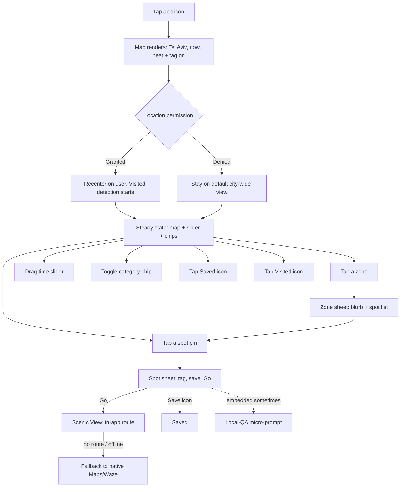
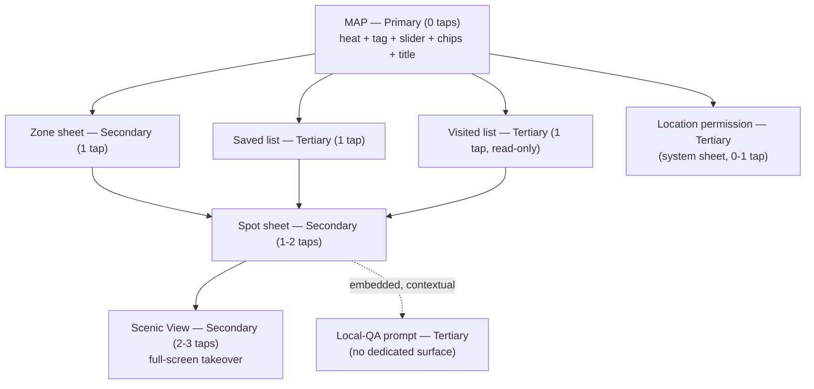

# Passenger V1 — UX Flows

**Owner:** designer (drafted for Aviran)
**Date:** 2026-07-27
**Status:** Draft — awaiting Aviran's read
**Source:** `strategy/passenger-strategy.md` (2026-07-23) + `strategy/decisions.md` (locked 2026-07-22, amended 2026-07-26)
**Document type:** cross-feature UX flows reference. This is not a per-feature design spec — it doesn't carry a PRD-traceability table or a high-fidelity mockup link, because no PRD exists yet to trace against (`prds/INDEX.md` is empty). Once `product` writes the six V1 PRDs this doc predicts, each gets its own spec under `design/<phase-slug>/` that does carry those.

---

## Before you read this: a source conflict

The task brief for this doc summarized the strategy as: three vibe tags (Local / Mix / Tourist), a spot tap that hands off to native Maps/Waze, and Scenic View + Live Events as Phase 2 candidates. **None of those three match the committed `passenger-strategy.md` and `decisions.md` I read to write this.** The actual file says: five vibe tags (super local · very local · mixed · touristy · tourist trap, decision #6), Scenic View is in-app routing shipping in **V1** (not a hand-off, not Phase 2), and Live Events is a **V1 core** overlay on the slider (decision #14), not parked.

I built this doc against the committed file, not the brief's summary — that file is named the source of truth, `decisions.md` corroborates it independently, and trusting a paraphrase over the file is exactly the failure mode `BOARD.md`'s scope gate exists to prevent. Flagged again in full at Open Question 1. If the brief's version is actually a newer decision that hasn't been written back into `passenger-strategy.md` yet, that file needs updating before this doc is final — not the other way around.

---

## 1. The frame

Passenger is one map. You open the app and you're looking at Tel Aviv, right now — how packed everywhere is, and whether each place feels local or touristy. You drag a slider to see the next 12 hours, tap a neighborhood to read about it, tap a place to get walked there by a route that favors interesting streets over the fastest one. You save places, and the app quietly remembers where you've actually been. Occasionally it asks you, in passing, whether a place felt local — because that's how the map gets smarter. There is no feed, no profile, no search bar, nothing to scroll. Every screen is either the map, or something the map handed you.

---

## 2. The hierarchy

**Cost is measured in taps from cold open** (app icon tap = 0).

### Primary — permanently on the map, unavoidable

| Item | What it is | Why Primary | Cost |
|---|---|---|---|
| The map | Tel Aviv, MapKit, always the base layer | It's the whole product — strategy: "one map, and the whole product lives on it" | 0 |
| Heat layer | Crowd-density fill, stepped bands (no gradients — decision #17) | On by default, the first thing you see | 0 |
| Tag layer | Localness accent per zone/spot | On by default, orthogonal to heat, never blended — strategy's core differentiator | 0 |
| "Tel Aviv, right now" title | Fading ambient label on cold open | Decision #8, verbatim | 0 |
| Time slider | Now → +12h control, bottom-third (thumb zone) | **My call, flagged.** The brief's own examples group this under Secondary. I disagree: it's permanently visible, never dismissed, and it reshapes the primary view — that's Primary-chrome behavior, not a sheet you invoke. Aviran can overrule this one line. | 0 to see, 1 drag to change |
| Category chips (Food & drinks / Things to do) | Persistent filter toggle | **Same call as above, same flag.** Always-visible chrome, not an invoked sheet. | 0 to see, 1 tap to change |
| Location/"near me" button | Recenter affordance | Persistent icon, part of map chrome | 0 to see, 1 tap to use |

### Secondary — invoked from the map, deliberately placed

| Item | What it is | Why Secondary | Cost |
|---|---|---|---|
| Zone sheet | Neighborhood blurb + tagged spot list | Requires a tap on a zone; bottom sheet, map stays visible behind it | 1 tap |
| Spot sheet | Name, category, vibe tag, save icon, "Go" CTA | One level under a zone sheet, or reachable directly from a close-zoom map pin | 1–2 taps |
| Scenic View | Full-screen in-app routing that favors interesting streets over the fastest one (strategy, not a hand-off) | Takes over the screen, so it's a step further than a sheet, but it's still invoked from a spot, not a top-level surface | 2–3 taps |

### Tertiary — opt-in, low-frequency, doesn't block the core loop

| Item | What it is | Why Tertiary | Cost |
|---|---|---|---|
| Saved places | List of places you bookmarked | Deliberately sought out, not part of the glance-and-go loop | 1 tap (floating icon) |
| Visited places | List of places the app detected you near | Same reasoning; also read-only in V1 — see flow 6 | 1 tap (floating icon) |
| Local-QA answering | Contextual micro-prompt asking if a spot is actually local | **My call, flagged.** It surfaces *inside* a Secondary surface (the spot sheet), but it carries no primary value to the person answering it — pure goodwill, skippable, no incentive layer until Phase 3's points system. I'm tiering it by importance-to-the-user, not by where it physically renders. | 0 extra taps to see (embedded), 1 tap to answer |
| Location permission | System permission sheet + in-app fallback copy if denied | One-time, OS-owned, not app chrome | 0 (auto-triggered) or 1 (via "near me") |
| Settings-ish surfaces | — | **None exist in V1.** No account, no preferences, no toggles beyond what's already Primary chrome. Nothing to gate here. | n/a |

---

## 3. Primary flow — cold open to action

### First launch ever

1. **Tap the app icon.** No splash screen, no onboarding carousel (`BOARD.md` scope gate: "No onboarding — the app opens straight to the map plus location permission").
2. **Map renders immediately** — Tel Aviv, default city-wide center **[design call: exact default coordinate is a build detail, not a UX one]**, heat layer for "now," tag accents visible, both categories shown combined, slider at "now" (leftmost), "Tel Aviv, right now" title fades in and out over ~2 seconds.
3. **Location permission prompts lazily** — the OS system sheet, not a custom in-app screen (decision #8: "no permission gate; lazy location"). It does not block map interaction; the user can start panning/tapping before responding to it.
   - **Granted:** map animates to the user's real location, a "you are here" marker appears, background Visited-detection starts silently (decision #16).
   - **Denied:** map stays at the default city-wide center. No recenter. The "near me" button stays visible but greyed; tapping it later shows inline copy pointing to Settings — iOS won't re-show the system dialog once denied, so this is the only path back.
4. **User is free to explore** — pan, zoom (pinch-to-zoom never suppressed), drag the slider, toggle a category, tap a zone or a spot. This is the steady state almost every session lives in.

### Every subsequent launch

1. **Tap the app icon.** Map renders reflecting whatever permission state iOS already recorded — no re-prompt.
2. If previously granted: map opens already centered on current location, no animate-in beat. If previously denied: opens at the same default city-wide center as first run.
3. **Slider always resets to "now."** **[design call]** Persisting a stale "+3h" position from last session would misrepresent live data the moment the app reopens — "now" is only ever valid at the instant you look at it.
4. Same steady state as first-launch step 4.

---

## 4. Secondary flows

### 4.1 Explore a zone
- **Entry:** tap inside a zone boundary, any zoom level where zone shapes render.
- **Steps:** bottom sheet slides up (~40–50% height, map stays visible above) with a hand-curated blurb and a scrollable list of tagged spots.
- **Exit:** swipe the sheet down, tap the visible map, or tap a spot row (→ flow 4.2).
- **Unhappy paths:** *No data yet* — empty-state illustration + "Nobody's mapped this corner of Tel Aviv yet," no forced CTA. *Offline* — sheet shows the last cached blurb/spots with a "last updated Xm ago, offline" label instead of failing blank.

### 4.2 Pick a spot and go
- **Entry:** tap a spot row in a zone sheet, or a spot pin directly at close zoom.
- **Steps:** spot sheet shows name, category, vibe tag, save icon, and a primary "Go" CTA. Tapping "Go" launches Scenic View full-screen — in-app route favoring interesting streets, with ETA and an always-visible fallback to open native Maps/Waze **[design call: the fallback is a Poka-Yoke escape hatch, not a downgrade — a brand-new routing engine shouldn't ever trap the user with no way out]**.
- **Exit:** back gesture from Scenic View returns to the spot sheet; dismissing from there returns to the zone sheet or map.
- **Unhappy paths:** *No route available* — "Can't build a scenic route right now" + direct fallback button, never a stall. *Offline* — "Go" disables with inline copy ("Routing needs a connection"), never a silent failure. *Location denied* — Scenic View can still show a static preview from the zone's center but can't do live turn-by-turn; copy says so.

### 4.3 Change the time
- **Entry:** drag the persistent slider.
- **Steps:** heat layer redraws live as the handle moves (feels instant, Doherty threshold); the tag layer does **not** move — localness isn't a function of the hour. Label above the slider updates ("Now" → "+3h"…).
- **Exit:** release the handle; position holds until moved again or the app restarts.
- **Unhappy paths:** *Nothing relevant at the chosen hour* — the heat simply reads quiet there; that's real information, not an error. *Offline* — slider still drags, redraws from last-cached synthetic data with the same offline indicator as 4.1.

### 4.4 Filter category
- **Entry:** tap a category chip.
- **Steps:** map/zone/spot data filters to that category; **[design call]** each chip is an independent on/off toggle defaulting to both-on, not a mutually-exclusive pair — with only two categories, Hick's Law doesn't care which mechanic, but independent toggles avoid an awkward "nothing selected" dead end.
- **Exit:** immediate, no confirmation.
- **Unhappy path:** filtered category is empty at the current zoom/zone/hour — same empty-state pattern as 4.1, scoped to "no [category] spots tagged here yet."

### 4.5 Save a place
- **Entry:** tap the save icon in a spot sheet.
- **Steps:** icon fills with ~100ms press feedback, brief inline confirmation ("Saved"), no navigation change.
- **Exit:** immediate; tapping again un-saves — undo over confirmation, no "are you sure."
- **Unhappy path:** offline — saves locally and syncs later; a save is too lightweight to gate on connectivity **[design call]**.

### 4.6 See visited places
- **Entry:** tap the Visited icon on the map chrome.
- **Steps:** sheet lists spots the app detected you physically near, most recent first; tapping a row reopens that spot's sheet.
- **Exit:** swipe down or back gesture to map.
- **Unhappy paths:** *Location denied* — permanently empty, explainer state ("Turn on location to build this automatically") + Settings deep-link, not a raw blank list. *Nothing detected yet* — plain empty state ("Nothing here yet — this fills in as you walk around Tel Aviv").
- **Flag:** per decision #16, Visited populates **automatically** from location (`CityGeofenceMonitor`) — there is no manual "mark as visited" button in V1. I designed this as a read-only list, not a mark-then-view flow, because that's what's actually locked. If a manual mark action is wanted on top of automatic detection, that's a scope addition, not something already decided.

### 4.7 Answer a local-QA question
- **Entry:** a micro-prompt embedded at the bottom of a spot sheet — surfaced sometimes, not every time (see Open Question 3), most reliably right after a spot lands in Visited (highest-intent moment to ask).
- **Steps:** plain-language question ("Does this feel like a local spot, or more of a tourist one?"), 2–3 tap targets matching the vibe vocabulary. Tapping one collapses the card into "Thanks — that's shared with other travelers." No modal, no interruption of the sheet underneath.
- **Exit:** answering or ignoring both just drop the card; never re-prompts the same user on the same spot.
- **Unhappy paths:** *Offline* — the card doesn't render at all rather than offering a submit that silently fails; the whole local-QA system runs on goodwill and a failed submission burns it for nothing. *Already answered* — never shows again for that spot/user pair.

### 4.8 Return to a saved place
- **Entry:** tap the Saved icon on map chrome.
- **Steps:** sheet lists saved spots; tapping a row jumps straight to that spot's sheet, skipping the zone sheet — deliberate, since you already chose this place.
- **Exit:** "Go" launches Scenic View same as 4.2; swipe/back returns to the Saved list, then map.
- **Unhappy path:** saved place has no current-hour data (archived, or a data gap) — sheet still opens with static info (name/category/blurb); the heat readout says "no live data right now" instead of blocking the sheet.

---

## 5. Navigation model

No nav bar, no tab bar, no feed. Three surface types only:

- **Map chrome** — always on screen, never dismissed: heat/tag layers, slider, category chips, fading title, near-me button, Saved/Visited icons.
- **Sheets** — partial-height, swipe-down or tap-outside to dismiss: zone sheet, spot sheet, Saved list, Visited list, the local-QA card (embedded inside the spot sheet, not its own sheet).
- **Full-screen takeover** — one surface only: Scenic View. Back gesture/X returns exactly one level up (to the spot sheet it was launched from).

**Depth rule: 3 levels, no more.** Map (0) → zone sheet (1) → spot sheet (2) → Scenic View (3) is the single deepest path in the product. Saved/Visited → spot sheet is only 2 levels because it skips the zone step deliberately (flow 4.8). Dismissing any sheet always returns exactly one level up — never straight to the map — so the user's sense of place never jumps. If a future feature would need a 4th level, that's a signal to flatten the flow, not add a level (Miller's Law: don't make anyone hold more than one sheet's worth of context in their head).

---

## 6. State & density of the map

**Zoom levels:**
- **City-wide** — Tel Aviv in full, heat as neighborhood-scale blobs, no individual pins.
- **Neighborhood** — zone boundaries visible, tag accents readable per zone, still no spot-level pins.
- **Close** — individual spot pins appear, each carrying its own vibe-tag badge; blurb/spot-list detail becomes reachable by tap.

**Slider hours:** heat is the only layer that's time-variant — it redraws per the hour selected, because crowd density genuinely changes hour to hour. The tag layer is time-invariant: a place's localness doesn't change by the hour, so it never moves when the slider does. This split is the direct, necessary consequence of the strategy's "two orthogonal layers, never blended" — I'm stating the mechanical implication, not inventing new behavior.

**The packed + touristy trap (the thing the strategy explicitly says the UI has to make legible without a blended score):**
- Heat and tag render on **different visual channels**, never the same one — heat is background fill intensity (stepped bands, decision #17, no gradients); tag is a badge/icon + text label sitting on top, independent of the fill's hue. This is the direct application of design-principles.md §3: "never rely on color alone... critical for Passenger's map."
- A zone or spot that is simultaneously **busy** (dark/warm fill) and **touristy or tourist-trap tagged** (its own badge) shows both signals at once, plainly, with no merged score to interpret. The "tourist trap" tag itself (decision #6) already exists as its own vocabulary entry for the worst version of this combination.
- The harder case: a **"very local" or "super local"** spot can still spike busy at one particular hour without being retagged — heat moves, tag doesn't, by design (see above). The UI must not let a temporary heat spike visually read as "this became touristy." **[design call]** Keep the tag badge's visual weight constant regardless of the fill intensity underneath it, so a busy-but-local spot reads as "busy AND local" — two separate, simultaneously true facts — rather than one blended impression.

---

## 7. Flow diagrams

### Primary flow

### Hierarchy / navigation tree

---

## 8. Where the parked features slot in

Only two things are actually parked per the committed strategy — Scenic View and Events are **not** among them; both are V1 (see the conflict note up top).

- **Proximity intelligence + arrival card (Phase 2):** enters as a new **Secondary** surface, but automatically triggered (geofence) rather than tap-invoked — a time-triggered variant of the spot sheet that appears when you're already en route to a suggestion. Extends the spot sheet; doesn't displace it.
- **AI local guide persona, audio-first, personalization (Phase 3):** this is a different product mode on the same engine, not a sheet off the map. It would need its own **Primary-adjacent entry point** — likely a second mode alongside the map — which is a real structural change, not an addition. Flag this clearly if Phase 3 ever gets scoped: it's the one candidate that breaks V1's "single primary surface" simplicity, not just extends it.
- **Shake-to-decide (Phase 3):** a gesture-triggered **Secondary** action, roughly parallel to the spot sheet — a random-suggestion overlay triggered by a device gesture instead of a tap. Purely additive, displaces nothing.
- **Auto-saved places (Phase 3):** extends flow 4.5 (Save a place) with a new automatic trigger (dwell time ≥20 min). No new surface — Saved (**Tertiary**) gains an automatic path alongside the manual one.
- **Points system (Phase 3):** adds a new **Tertiary** surface (points/rewards), and changes the character of flow 4.7 (Local-QA). Today it's goodwill-only and correctly tiered low/contextual; once points exist, answering has real incentive behind it and probably deserves more visual prominence than a quiet embedded card — worth re-tiering upward at that point, not before.

---

## 9. Open UX questions for Aviran

1. **The three-way conflict between this task's brief and the committed strategy doc** (vibe-tag count, spot-tap behavior, Events/Scenic-View phase placement — detailed at the top of this doc). I built against `passenger-strategy.md`/`decisions.md` since they're the named source of truth and agree with each other independently. **Recommendation:** if the brief's version is actually newer and correct, update `passenger-strategy.md` first — a flows doc and a strategy doc disagreeing silently is exactly the failure mode the 2026-07-26 reset happened over.

2. **Scenic View depth** — full in-app turn-by-turn, or a route preview that still hands off to native maps for the actual walking directions? The strategy itself flags this as unresolved and cost-sensitive. **Recommendation:** ship the lighter route-preview-then-handoff version for V1 given the "ship fast to real strangers" mandate; treat full in-app turn-by-turn as a Phase 2+ upgrade once the routing engine has proven itself. This is a joint call with the architect on build cost, not a pure UX call.

3. **Local-QA prompt cadence** — the strategy says the QA system exists but doesn't say how often or on what trigger it should ask. **Recommendation:** trigger primarily right after a spot lands in Visited (the highest-intent, already-there moment), plus occasionally on spot-sheet view for low-confidence tags only, capped at roughly once per session — protect the goodwill this system runs on rather than maximizing answer volume.

4. **Lazy location permission — exact trigger mechanism.** Decision #8 says "lazy," but not whether that means an automatic system prompt shortly after the map first renders, or only on the user's first tap of "near me." **Recommendation:** auto-prompt once, softly, a couple of seconds after the map first renders — matches most travel-app norms and gets Visited-tracking started as early as possible without blocking the first look at the map.

5. **Does the time slider ever look backward?** Strategy says "now → +12 hours," which I've taken as strictly forward-only. Worth confirming there's no case for showing "an hour ago" for context (e.g., "it was busier here 30 minutes ago") before this is locked into the build.
