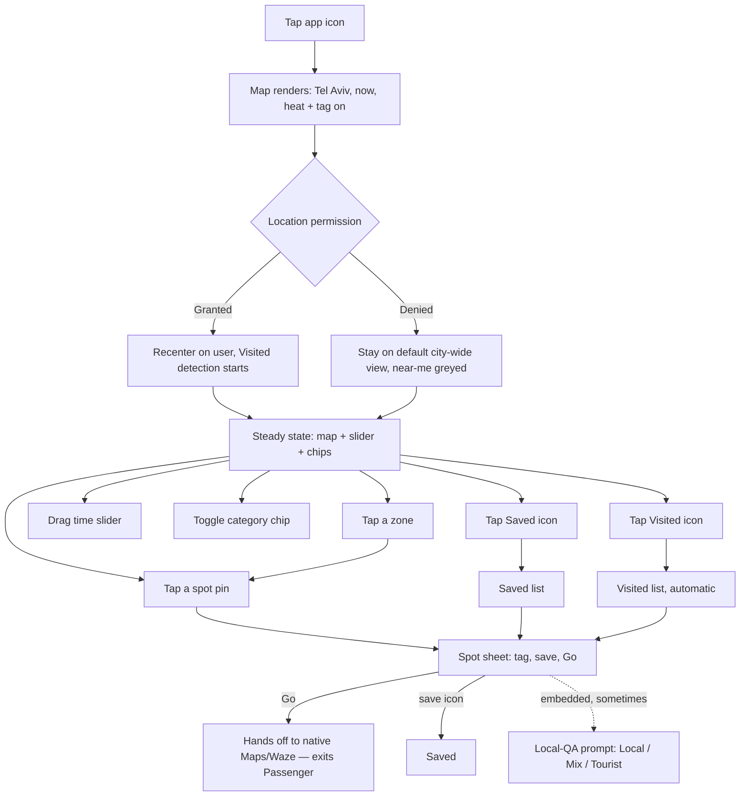
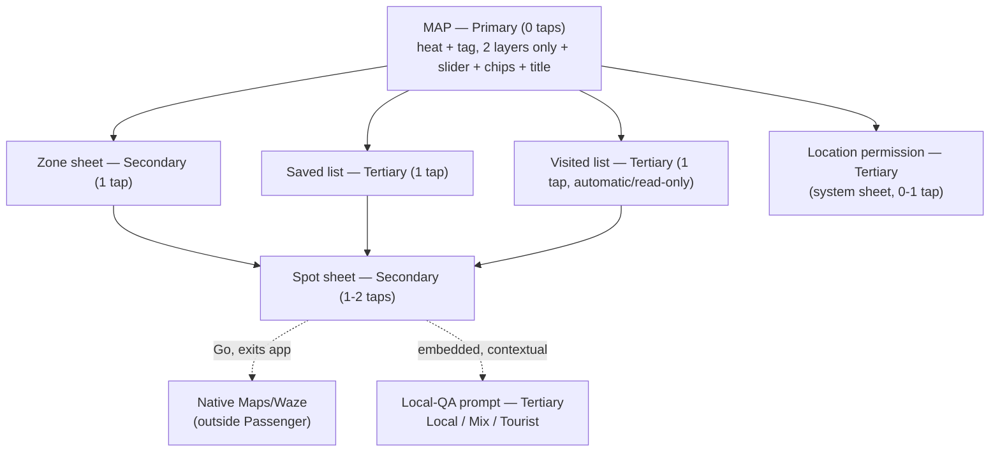

# Passenger V1 — UX Flows

**Owner:** designer (drafted for Aviran)
**Date:** 2026-07-27
**Status:** Draft — awaiting Aviran's read
**Source:** `strategy/passenger-strategy.md` (2026-07-27) + `strategy/decisions.md` (decisions 18–22, 2026-07-27)
**Document type:** cross-feature UX flows reference. This is not a per-feature design spec — it doesn't carry a PRD-traceability table or a high-fidelity mockup link, because no PRD exists yet to trace against (`prds/INDEX.md` is empty). Once `product` writes the six V1 PRDs this doc predicts, each gets its own spec under `design/<phase-slug>/` that does carry those.

---

## 1. The frame

Passenger is one map. You open the app and you're looking at Tel Aviv, right now — how packed everywhere is, and whether each place feels local or touristy. You drag a slider to see the next 12 hours, tap a neighborhood to read about it, tap a place and get handed off to Maps or Waze to actually walk there. You save places, and the app quietly remembers where you've actually been. Occasionally it asks you, in passing, whether a place felt local — because that's how the map gets smarter. There is no feed, no profile, no search bar, nothing to scroll. Every screen is either the map, or something the map handed you.

---

## 2. The hierarchy

**Cost is measured in taps from cold open** (app icon tap = 0).

### Primary — permanently on the map, unavoidable

| Item | What it is | Why Primary | Cost |
|---|---|---|---|
| The map | Tel Aviv, MapKit, always the base layer | It's the whole product — strategy: "one map, and the whole product lives on it" | 0 |
| Heat layer | Crowd-density fill, stepped bands (no gradients — decision #17) | On by default, the first thing you see | 0 |
| Tag layer | Localness accent per zone/spot, three plain-language values: **Local · Mix · Tourist** | On by default, orthogonal to heat, never blended. Heat + tag is the entire V1 map — two layers, exactly as the north star describes | 0 |
| "Tel Aviv, right now" title | Fading ambient label on cold open | Decision #8, verbatim | 0 |
| Time slider | Now → +12h control, bottom-third (thumb zone) | **My call, flagged.** Permanently visible, never dismissed, reshapes the primary view — Primary-chrome behavior, not a sheet you invoke. | 0 to see, 1 drag to change |
| Category chips (Food & drinks / Things to do) | Persistent filter toggle | **Same call as above, same flag.** Always-visible chrome, not an invoked sheet. | 0 to see, 1 tap to change |
| Location/"near me" button | Recenter affordance | Persistent icon, part of map chrome | 0 to see, 1 tap to use |

### Secondary — invoked from the map

Lighter than it might otherwise be: V1 hands off to native Maps/Waze at the moment of "go," rather than building its own routing screen, so there is no in-app takeover surface to place here.

| Item | What it is | Why Secondary | Cost |
|---|---|---|---|
| Zone sheet | Neighborhood blurb + tagged spot list | Requires a tap on a zone; bottom sheet, map stays visible behind it | 1 tap |
| Spot sheet | Name, category, vibe tag, save icon, "Go" button | One level under a zone sheet, or reachable directly from a close-zoom map pin. **"Go" hands off to native Maps/Waze — an exit from Passenger, not a screen inside it.** | 1–2 taps |

### Tertiary — opt-in, low-frequency, doesn't block the core loop

| Item | What it is | Why Tertiary | Cost |
|---|---|---|---|
| Saved places | List of places you bookmarked | Deliberately sought out, not part of the glance-and-go loop | 1 tap (floating icon) |
| Visited places | List of places the app detected you near | Same reasoning; also read-only in V1 — see Journey 4 | 1 tap (floating icon) |
| Local-QA answering | Contextual micro-prompt asking if a spot is actually local | **My call, flagged.** Surfaces *inside* a Secondary surface (the spot sheet), but carries no primary value to the person answering — pure goodwill, skippable, no incentive layer until Phase 3's points system. Tiered by importance-to-the-user, not by where it physically renders. | 0 extra taps to see (embedded), 1 tap to answer |
| Location permission | System permission sheet + in-app fallback copy if denied | One-time, OS-owned, not app chrome | 0 (auto-triggered) or 1 (via "near me") |
| Settings-ish surfaces | — | **None exist in V1.** No account, no preferences, no toggles beyond what's already Primary chrome. | n/a |

---

## 3. Primary flow — cold open to action

### First launch ever

1. **Tap the app icon.** No splash screen, no onboarding carousel (`BOARD.md` scope gate: "No onboarding — the app opens straight to the map plus location permission").
2. **Map renders immediately** — Tel Aviv, default city-wide center **[design call: exact default coordinate is a build detail, not a UX one]**, heat layer for "now," tag accents visible, both categories shown combined, slider at "now" (leftmost), "Tel Aviv, right now" title fades in and out over ~2 seconds.
3. **Location permission prompts lazily** — the OS system sheet, not a custom in-app screen (decision #8: "no permission gate; lazy location"). It does not block map interaction.
   - **Granted:** map animates to the user's real location, a "you are here" marker appears, background Visited-detection starts silently (decision #16).
   - **Denied:** map stays at the default city-wide center — full treatment in Journey 5.
4. **User is free to explore** — pan, zoom (pinch-to-zoom never suppressed), drag the slider, toggle a category, tap a zone or a spot. This is the steady state almost every session lives in.

### Every subsequent launch

1. **Tap the app icon.** Map renders reflecting whatever permission state iOS already recorded — no re-prompt.
2. If previously granted: map opens already centered on current location, no animate-in beat. If previously denied: opens at the same default city-wide center as first run.
3. **Slider always resets to "now."** **[design call]** Persisting a stale "+3h" position from last session would misrepresent live data the moment the app reopens — "now" is only ever valid at the instant you look at it.
4. Same steady state as first-launch step 4.

---

## 4. End-to-end journeys

Five journeys, chosen to partition V1's surface without duplicating it: two discovery contexts (tourist / resident, since they use the same map differently), one return-visit context, one feedback context, and one whole-journey pass under degraded conditions — because location-denied and offline don't touch one step, they touch nearly every step at once, which is worth walking end to end rather than scattering as footnotes. Every V1 interaction appears in at least one journey below; where an unhappy path is specific to a single step, it's attached right there rather than pulled into a separate list.

### Journey 1 — Just landed, knows nothing

*A tourist, first time opening the app, has just landed in Tel Aviv.*

1. Taps the app icon. Map renders immediately: Tel Aviv, default center, heat + tag on for "now," both categories shown, "Tel Aviv, right now" title fading in and out.
2. A few seconds in, the OS location-permission sheet appears without blocking the map underneath. She taps **Allow** — map animates to her real location, a "you are here" marker appears, Visited-detection starts silently in the background. *(The denied branch gets its full walk-through in Journey 5, not repeated here.)*
3. She taps the "Things to do" category chip to cut the clutter — the map instantly filters to that category only.
4. She taps a zone near her hotel. A bottom sheet slides up with a hand-curated blurb and a list of tagged spots.
   - **Unhappy path:** if this zone has no curated data yet, the sheet reads "Nobody's mapped this corner of Tel Aviv yet" instead of an empty list — she keeps browsing, nothing broke.
5. She taps a spot in the list — a rooftop bar tagged **Local**, in a zone where heat is already climbing for this hour. Spot sheet opens: name, category, vibe tag, save icon, "Go" button.
6. She taps **Go**. Passenger hands her straight to native Maps/Waze with the destination pre-filled — an exit, not a screen inside Passenger. She never sees an in-app route.
7. She walks there using Maps/Waze; Passenger is backgrounded. If the geofence monitor catches her arrival, it silently logs a Visited entry — she doesn't see this happen; it's the setup for Journey 4.
8. **Outcome:** standing in front of the bar. In-app cost: category chip + zone + spot + Go = 4 taps, plus whatever happens inside Maps/Waze.

### Journey 2 — Home and bored, planning tonight

*A Tel Aviv resident, opening the app on a random Tuesday evening, deciding where to go later.*

1. Taps the app icon — not his first launch, so no permission re-prompt. Map opens centered on his current location. Slider resets to "now," as it always does.
2. He drags the slider forward to roughly +3 hours. The heat layer redraws live as he drags; the tag layer doesn't move — a place's localness doesn't change because it's later.
   - **Unhappy path:** at +3h, one zone shows almost no heat at all — not an error, just real information (nothing relevant there at that hour), which is exactly what he needed to see.
3. He leaves both category chips on since he's not sure what he wants yet.
4. He taps a couple of zones back to back, comparing blurbs and tags, swiping each sheet down to bounce to the next.
5. He finds a bar tagged **Mix** worth going to later, opens its spot sheet, and taps the save icon — it fills with a quick animation, an inline "Saved" confirmation appears, and he stays put.
   - **Unhappy path:** his connection drops right as he taps save — it still saves locally and syncs once he's back online; a save is too lightweight to gate on connectivity.
6. **Outcome:** a saved place and a plan for later — nothing to hand off to yet. Journey 3 picks up from here.

### Journey 3 — Coming back to something saved

*Same resident, a few hours later, ready to actually go.*

1. Opens the app, taps the Saved icon.
2. Saved list opens; he taps the bar from Journey 2.
3. Tapping the row jumps straight to that spot's sheet, skipping the zone sheet entirely — he already chose this place.
4. The spot sheet re-reads current data: heat may have shifted since he saved it (different hour now); the vibe tag hasn't (tag doesn't move with time).
   - **Unhappy path:** if this saved spot has a gap in current-hour data, the sheet still opens with its static info (name, category, blurb), and the heat readout says "no live data right now" instead of blocking the sheet.
5. He taps **Go** — same hand-off exit as Journey 1, straight to native Maps/Waze.
6. **Outcome:** standing in front of the bar. Cost: Saved icon + saved row + Go = 3 taps — shorter than Journey 1 on purpose, since re-finding a place you already chose shouldn't cost as much as discovering one.

### Journey 4 — Giving something back

*Either the tourist from Journey 1 or the resident from Journey 3, sometime after actually visiting a place.*

1. Because location was granted and the geofence monitor detected her presence, the spot from Journey 1 has quietly appeared in her Visited list — no action was required to put it there (decision #16: Visited is automatic, not a manual "mark visited" button).
2. She opens the Visited icon out of curiosity.
   - **Unhappy path (nothing detected yet):** if she opens this before anything's been logged, it reads "Nothing here yet — this fills in as you walk around Tel Aviv" rather than a blank screen.
3. She taps the entry, which reopens that spot's sheet. Embedded at the bottom is a plain-language micro-prompt: "Does this feel like a local spot, or more of a tourist one?" with three tap targets — **Local / Mix / Tourist** — the same three words used everywhere else in the app.
   - This is the highest-intent moment to ask: she's already been there, and answering costs her nothing beyond a tap she was already making by opening the sheet.
4. She taps **Local**. The card collapses into a one-line "Thanks — that's shared with other travelers." No modal, no interruption.
   - **Unhappy path (offline):** the card doesn't render at all rather than offering a submit that silently fails — this system runs on goodwill alone in V1, and a failed submission burns that goodwill for nothing.
   - **Unhappy path (already answered):** if she'd already answered for this spot, the card never appears again.
5. **Outcome:** one data point fed back into the localness pipeline, at zero extra cost beyond a tap she was already making.

### Journey 5 — The degraded run

*Anyone, location denied and/or offline for the whole session.*

1. Cold open with location denied (or offline entirely). Map renders at the default Tel Aviv city-wide center — no recenter, no "you are here" marker.
2. The near-me button stays visible but greyed. Tapping it doesn't re-trigger the system permission dialog (iOS won't, once denied) — it shows inline copy pointing to Settings instead.
3. She browses anyway — the map is fully usable without location, just not personalized to where she's standing. She taps a zone; if the network is also down, the sheet shows the last cached blurb/spot list with a "last updated Xm ago, offline" label rather than failing blank.
4. She taps a spot and saves it — the save still completes locally and syncs once she's back online.
5. She checks the Visited list. It's permanently empty, with an explainer state ("Turn on location to build this automatically") and a Settings deep-link — Visited has no data source without location, ever, not just today.
6. She opens a spot sheet — the local-QA card never renders here, offline or not; it depends on both a live connection and a real, detected visit, neither of which this session can produce.
7. She taps **Go** anyway. The hand-off to native Maps/Waze still works even offline — it's just handing coordinates to another app, not requesting anything from Passenger's own servers.
8. **Outcome:** she can still browse, filter, read blurbs and tags, save places, and get routed out to a destination. What she loses entirely: personalization to her real location, a live Visited list, and any chance to answer a local-QA question. Nothing crashes and nothing lies to her about data being fresher than it is — that's the actual bar here, not full feature parity.

---

## 5. Navigation model

No nav bar, no tab bar, no feed. Two surface types:

- **Map chrome** — always on screen, never dismissed: heat/tag layers, slider, category chips, fading title, near-me button, Saved/Visited icons.
- **Sheets** — partial-height, swipe-down or tap-outside to dismiss: zone sheet, spot sheet, Saved list, Visited list, the local-QA card (embedded inside the spot sheet, not its own sheet).

**"Go" is not a surface at all.** It's a system hand-off to native Maps/Waze, which exits Passenger entirely. Returning to Passenger afterward (backgrounding/foregrounding) drops the user back wherever iOS left off — typically the spot sheet or the map — Passenger doesn't reconstruct any state for this, because it never built a screen to leave in the first place.

**Depth rule: 2 levels, no more, while inside the app.** Map (0) → zone sheet (1) → spot sheet (2) is the deepest path that stays inside Passenger. Saved/Visited (1) → spot sheet (2) reaches the same maximum by a shorter route, skipping the zone step because you already chose the place. Nothing in V1 needs a third in-app level — the one feature that would have required it, Scenic View, is Phase 2 (§8), and keeping it out of V1 is exactly what holds this rule at 2 instead of 3. Dismissing any sheet always returns exactly one level up.

---

## 6. State & density of the map

**Zoom levels:**
- **City-wide** — Tel Aviv in full, heat as neighborhood-scale blobs, no individual pins.
- **Neighborhood** — zone boundaries visible, tag accents readable per zone, still no spot-level pins.
- **Close** — individual spot pins appear, each carrying its own vibe-tag badge; blurb/spot-list detail becomes reachable by tap.

**Slider hours:** heat is the only layer that's time-variant — it redraws per the hour selected, because crowd density genuinely changes hour to hour. The tag layer is time-invariant: a place's localness doesn't change by the hour, so it never moves when the slider does.

**The packed + touristy trap — now more load-bearing, not less.** With three tags — Local, Mix, Tourist — there is no dedicated vocabulary entry for the worst-case combination anymore. A busy zone tagged Tourist has to read as something worth avoiding purely from heat and tag shown together — there is no fourth word doing that work for us. That makes the display treatment the whole signal, not a nice-to-have on top of a tag that already said it:

- Heat and tag still render on different visual channels, never the same one — heat as background fill intensity (stepped bands, no gradients), tag as a badge/icon + text label on top, independent of the fill's hue.
- **[design call]** When heat crosses a "busy" threshold on a zone or spot tagged **Tourist**, render a distinct warning-style badge on top of the normal tag badge — not new text, not a new tag, just an icon treatment that only appears when both conditions are true at once. This is computed at display time, not a stored field: the two layers stay orthogonal in the data model exactly as the strategy requires; only the rendering notices when they coincide.
- **[design call]** The reverse case deserves equal thought: busy + **Local** should never read as a warning — if anything it's the strongest possible endorsement ("busy because it's actually good"). No special badge needed there; the *absence* of the warning badge becomes legible precisely because the warning badge exists for the other case.
- The "very local but temporarily busy" case still holds (heat is time-variant, tag isn't): a Local-tagged spot spiking busy at 9pm should read as "busy AND local," two true facts, never as evidence it's turned touristy. The warning badge above only fires on Tourist-tagged busy spots, which keeps this distinction automatic rather than something the user has to reason through.

---

## 7. Flow diagrams

### Primary flow

### Hierarchy / navigation tree

---

## 8. Where the parked features slot in

Two things are parked as of this revision — Scenic View and Live Events both moved to Phase 2.

- **Scenic View (Phase 2)** replaces V1's "Go" hand-off with a full-screen in-app routing surface that favors interesting streets over the fastest path. This isn't just an addition — it changes what leaving the spot sheet *means*. In V1, tapping Go ends the in-app journey (an exit, nothing to reconstruct on return). With Scenic View, the user's journey continues inside Passenger during transit, which reopens two things V1 currently sidesteps entirely: what re-entering the spot/zone context looks like after arrival (V1 has no "you've arrived" moment, since the app was never watching), and the depth rule, which goes back to 3 levels (map → zone → spot → Scenic View) the moment this ships. Worth scoping alongside Phase 2's proximity intelligence (arrival card) — both concern the in-transit experience and would likely share build surface.
  - The earlier open question about Scenic View's depth (full in-app turn-by-turn vs. a route-preview-then-handoff) still applies whenever Phase 2 gets scoped — but it's no longer a V1 blocker, so it's dropped from §9's list below and flagged here instead, for whoever picks up Phase 2.
- **Live Events (Phase 2)** enters as a third overlay toggle on the map, alongside the category chips — Primary tier, additive chrome, since it extends the base map's visualization rather than opening a new surface. It displaces nothing in V1's structure: the two-layer hero view (heat + tag) doesn't need to change shape to gain a third toggle later, which is exactly why cutting Events from V1 costs nothing structurally now.
- **Proximity intelligence + arrival card (Phase 2):** a new **Secondary** surface, automatically triggered (geofence) rather than tap-invoked — a time-triggered variant of the spot sheet appearing when the user is already en route. Extends the spot sheet; doesn't displace it.
- **AI local guide persona, audio-first, personalization (Phase 3):** a different product mode on the same engine, not a sheet off the map. Would need its own **Primary-adjacent entry point** — a real structural change, not an addition. Flag clearly if Phase 3 ever gets scoped: it's the one candidate that breaks V1's "single primary surface" simplicity rather than extending it.
- **Shake-to-decide (Phase 3):** a gesture-triggered **Secondary** action, roughly parallel to the spot sheet — a random-suggestion overlay triggered by a device gesture instead of a tap. Purely additive.
- **Auto-saved places (Phase 3):** extends the "save a place" step (Journey 2) with a new automatic trigger (dwell time ≥20 min). No new surface — Saved (**Tertiary**) gains an automatic path alongside the manual one.
- **Points system (Phase 3):** adds a new **Tertiary** surface (points/rewards) and changes the character of the local-QA prompt (Journey 4). Today it's goodwill-only and correctly tiered low/contextual; once points exist, answering has real incentive behind it and probably deserves more visual prominence than a quiet embedded card — worth re-tiering upward at that point, not before.

---

## 9. Open UX questions for Aviran

1. **Local-QA prompt cadence** — the strategy says the QA system exists but doesn't say how often or on what trigger it should ask. **Recommendation:** trigger primarily right after a spot lands in Visited (the highest-intent, already-there moment), plus occasionally on spot-sheet view for low-confidence tags only, capped at roughly once per session — protect the goodwill this system runs on rather than maximizing answer volume.
2. **Lazy location permission — exact trigger mechanism.** Decision #8 says "lazy," but not whether that means an automatic system prompt shortly after the map first renders, or only on the user's first tap of "near me." **Recommendation:** auto-prompt once, softly, a couple of seconds after the map first renders — gets Visited-tracking started as early as possible without blocking the first look at the map.
3. **Does the time slider ever look backward?** Taken here as strictly forward-only, "now → +12 hours." Worth confirming there's no case for showing "an hour ago" for context before this is locked into the build.
4. **Visited detection during a hand-off.** V1's Visited list depends entirely on the geofence monitor catching a visit while Passenger is backgrounded — the user is inside Maps/Waze, not Passenger, at the exact moment they arrive. Does iOS reliably keep background location running through that hand-off and the walk that follows, or does exiting the app risk losing the one signal Visited depends on? **Recommendation:** confirm background-location behavior with the architect before treating Visited's automatic-only design (decision #16) as settled — if it's shaky, a lightweight manual backstop may be needed even though the current decision rules one out.
5. **Does the computed busy + Tourist warning badge (§6) need its own VoiceOver label?** It's a display-time computation, not a stored tag, so it won't inherit whatever label the tag badge already carries. **Recommendation:** give it an explicit label ("busy and touristy — worth a second look") rather than relying on VoiceOver to read heat and tag separately and expecting the combination to be inferred.
