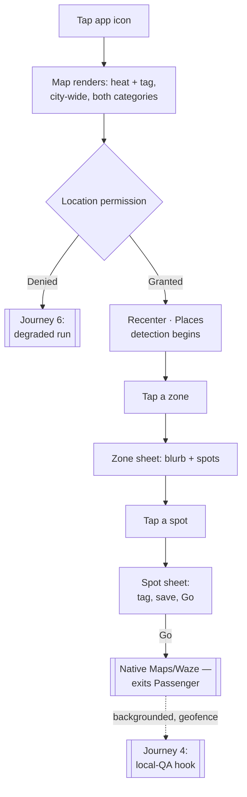
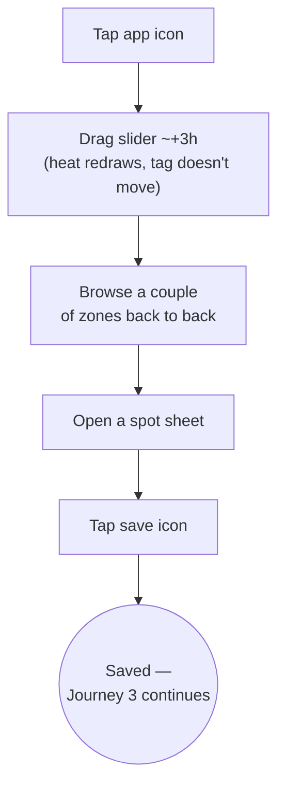
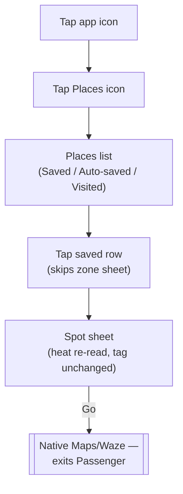
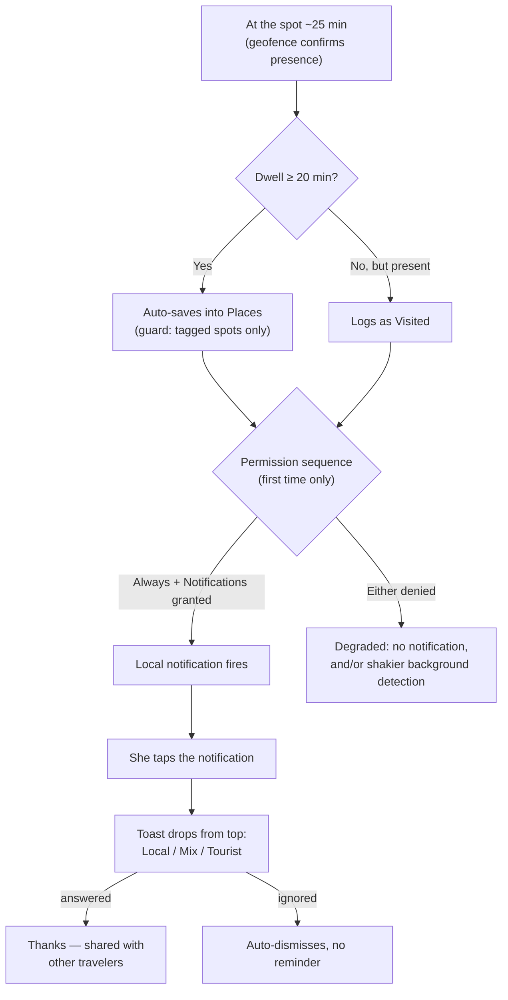
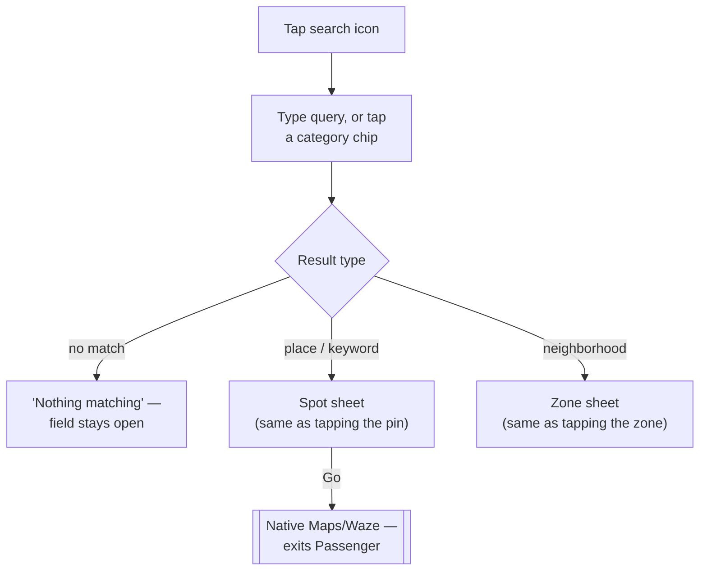
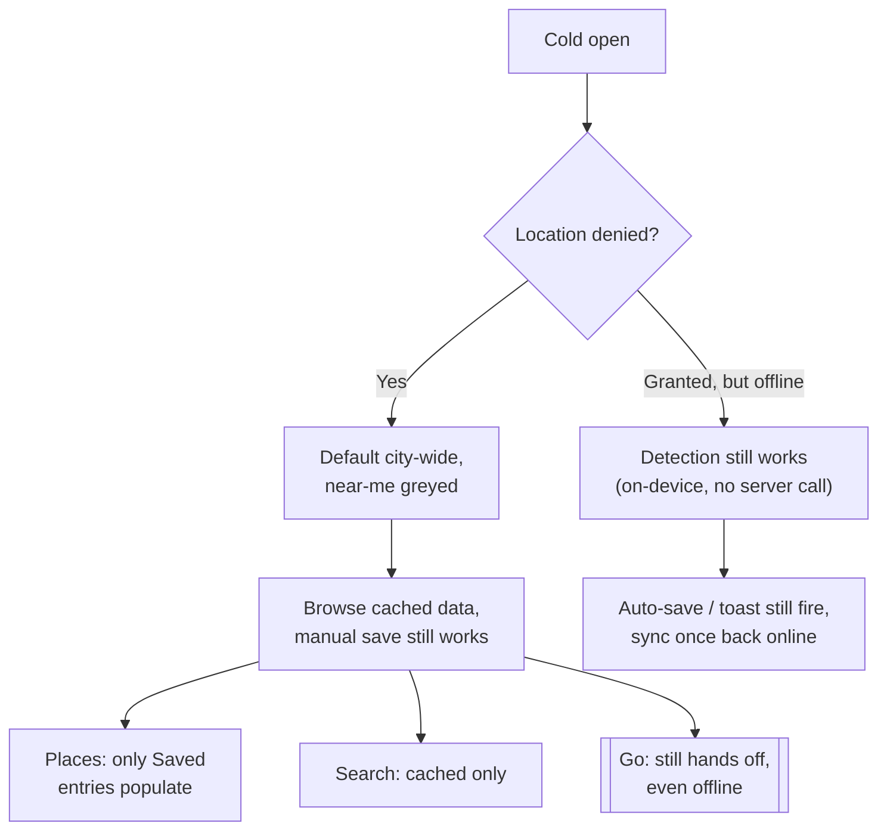
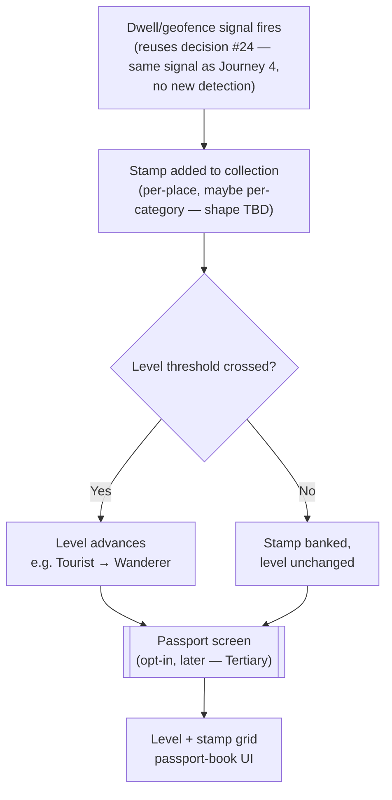
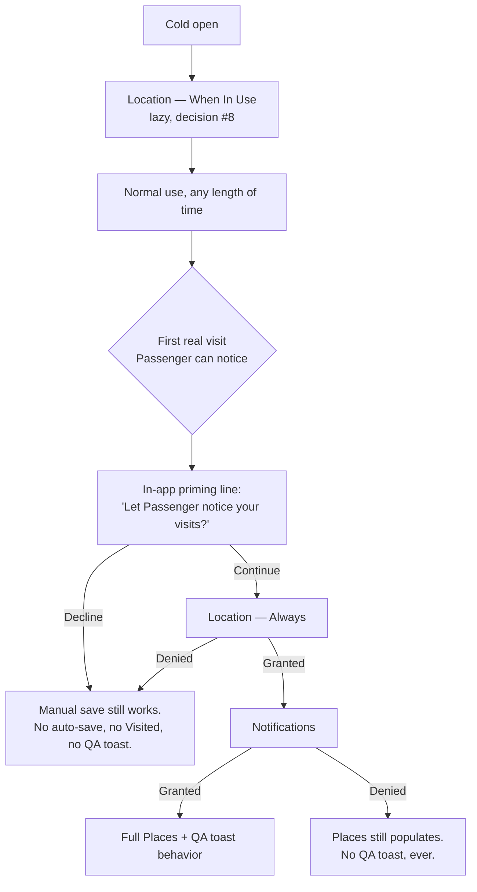
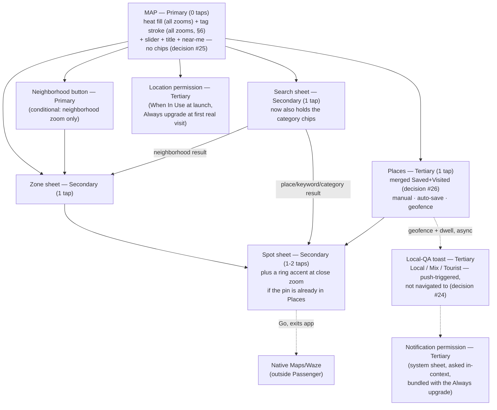

# Passenger V1 — UX Flows

**Owner:** designer (drafted for Aviran)
**Date:** 2026-07-28 (revised per Aviran's 5 numbered notes, live chat; stamp-collection/Passport Phase 2 preview added)
**Status:** Draft — awaiting Aviran's read
**Source:** `strategy/passenger-strategy.md` (2026-07-27) + `strategy/decisions.md` (decisions 18–26, 2026-07-27)
**Document type:** cross-feature UX flows reference. This is not a per-feature design spec — it doesn't carry a PRD-traceability table or a high-fidelity mockup link, because no PRD exists yet to trace against (`prds/INDEX.md` is empty). Once `product` writes the six V1 PRDs this doc predicts, each gets its own spec under `design/<phase-slug>/` that does carry those.

---

## 1. The frame

Passenger is one map. You open the app and you're looking at Tel Aviv, right now — how packed everywhere is, and whether each place feels local or touristy. You drag a slider to see the next 12 hours, tap a neighborhood to read about it, tap a place and get handed off to Maps or Waze to actually walk there. You save places — sometimes on purpose, sometimes because you lingered somewhere long enough that it saved itself — and the app quietly remembers where you've actually been. Occasionally it asks you, in passing, whether a place felt local — because that's how the map gets smarter. There is no feed, no profile, nothing to scroll. (A private, single-user **"Passport"** stats screen — level + stamp grid, parked Phase 2/3, §8 — is not an exception to this: nobody else ever sees it, no friend graph, no following. This line still holds for V1.) If you already know what you're after, search is one tap away — a sheet you open, not a box that's always staring back at you: a product whose whole pitch is "you don't need to ask" shouldn't put a question mark in front of you by default. Every screen is either the map, or something the map handed you.

---

## 2. The hierarchy

Four fields per component, per Aviran's ask — kept to a phrase each, not a paragraph: **what it is**, **Principle** (cite `design-principles.md` §, not re-derived taste), **UX intent** (the user goal), **Flow** (tier + tap cost from cold open, app icon = 0; folds in what used to be a separate Cost column).

### Primary — permanently on the map, unavoidable

Six things, one conditional: the map, heat, tag (zone granularity), the fading title, the slider, near-me — plus the neighborhood button, conditional. Category chips left this list last round (decision #25, moved to Secondary/search) — checked the rest of the doc, no stray mentions remain.

| Item | What it is | Principle | UX intent | Flow |
|---|---|---|---|---|
| The map | Tel Aviv, MapKit base layer | §1 Maslow precedence; §3 Sovereign posture | Answer "busy right now" in one glance | Primary · 0 taps |
| Heat layer | Crowd-density fill, stepped bands (decision #17) | §3 never color alone | Is it busy, before any tap | Primary · 0 taps |
| Tag layer | Tells the user if a place feels tourist or not — **Local · Mix · Tourist**, not a score | §3 never color alone; Tesler's Law | "Local or touristy" without asking | Primary · 0 taps. Rendering (§6) is a separate solution layer — Open Q12 |
| "Tel Aviv, right now" title | Fading ambient label, ~2s | §2 omit needless chrome; decision #8 | Orient, then get out of the way | Primary · 0 taps, cold-open only |
| Time slider | Now → +12h, bottom-third | §3 Thumb Zone; §2 Poka-Yoke | Preview later hours without leaving the map | Primary · 0 taps / 1 drag |
| Near-me button | Recenter, persistent icon | §2 Fitts's Law | One tap back to "where am I" | Primary · 0 taps / 1 tap |
| Neighborhood button | Names the dominant zone; second door to the zone sheet | §2 Fitts's Law | Reliable target beats a loose polygon edge | Primary, **conditional** · 0 taps at neighborhood zoom only / 1 tap |

~~Category chips~~ — **moved to Secondary, inside search (decision #25)**, overriding my own earlier flagged call. Not re-argued here.

### Secondary — invoked from the map

No in-app routing screen — V1 hands off to Maps/Waze — so nothing sits above these three.

| Item | What it is | Principle | UX intent | Flow |
|---|---|---|---|---|
| Zone sheet | Blurb + tagged spot list | Miller's Law (decision #12 bounds it); §3 Sovereign/Transient | Read a place without losing the map | Secondary · 1 tap, 3 doors → 1 destination |
| Spot sheet | Name, category, tag, save, "Go" | Hick's Law; Von Restorff (Go is the one filled action) | One decision: go or not | Secondary · 1–2 taps; **Go exits Passenger** |
| Search sheet | Query field + the two category chips (decision #25) | Hick's Law (2 chips); Fogg B=MAT | Serve "I know what I want" without a standing question mark | Secondary · 1 tap; dies with the sheet (§6) |

### Tertiary — opt-in, low-frequency, doesn't block the core loop

| Item | What it is | Principle | UX intent | Flow |
|---|---|---|---|---|
| **Places** (merges Saved/Visited, decision #26) | Manual save, auto-save (20+ min dwell, tagged spots only — guard), or geofence detection; each row shows provenance (**Saved / Auto-saved / Visited**). Naming/provenance my proposal, not confirmed — §9 | Miller's Law; Poka-Yoke (guard) | Easy return to a place cared about, without conflating deliberate and incidental | Tertiary · 1 tap (floating icon) |
| Local-QA answering | Post-visit toast (decision #24): notification → non-blocking toast, Local/Mix/Tourist | Von Restorff; Fogg B=MAT; §2 ask-once ethics | Real signal at the freshest moment, no obligation | Tertiary, push-triggered · 1 tap to open, 1 (or ignore) to answer |
| Location permission | System sheet + in-app fallback copy | §2 ask-once ethics; decision #8 | Access without gating the map | Tertiary · 0 (auto) or 1 (near-me) |
| Settings-ish surfaces | None exist in V1 | Tesler's Law, by omission | n/a | n/a |

**My take on the field shape (Aviran asked directly, §3.1):** four is right, I wouldn't add a fifth. Cost folded into Flow rather than kept separate — say the word and I'll split it back out. Didn't add a states/accessibility column — that's per-feature-spec and rendering-spec territory (§6, `map-rendering-spec.md`), not this doc's job.

**No row added for stamp collection / Passport.** These tables are V1-only, per this doc's own framing — and the feature is a parked Phase 2/3 candidate (strategy.md), not something being built now. If it ships, it would land **Tertiary**-shaped (opt-in, low-frequency, doesn't block the core loop), same tier as Places and Local-QA answering above. See §8 for the full treatment and §4 Journey 7 for a preview walkthrough.

---

## 3. Primary flow — cold open to action

### First launch ever

1. **Tap the app icon.** No splash screen, no onboarding carousel (`BOARD.md` scope gate: "No onboarding — the app opens straight to the map plus location permission").
2. **Map renders immediately** — Tel Aviv, default city-wide center **[design call: exact default coordinate is a build detail, not a UX one]**, heat layer for "now," tag accents visible, both categories always shown together since there's no category filter outside the search sheet (decision #25), slider at "now" (leftmost), "Tel Aviv, right now" title fades in and out over ~2 seconds.
3. **Location permission prompts lazily** — the OS system sheet, not a custom in-app screen (decision #8: "no permission gate; lazy location"). It does not block map interaction.
   - **Granted:** map animates to the user's real location, a "you are here" marker appears, and Places-detection can begin — though only in a limited, foreground-favoring way at this permission level; the reliable background version needs the Always upgrade described below, not yet asked for at this point.
   - **Denied:** map stays at the default city-wide center — full treatment in Journey 6.
4. **User is free to explore** — pan, zoom (pinch-to-zoom never suppressed), drag the slider, tap a zone or a spot, open search if she wants to narrow by category or find something specific. This is the steady state almost every session lives in.

### Every subsequent launch

1. **Tap the app icon.** Map renders reflecting whatever permission state iOS already recorded — no re-prompt.
2. If previously granted: map opens already centered on current location, no animate-in beat. If previously denied: opens at the same default city-wide center as first run.
3. **Slider always resets to "now."** **[design call]** Persisting a stale "+3h" position from last session would misrepresent live data the moment the app reopens — "now" is only ever valid at the instant you look at it.
4. Same steady state as first-launch step 4.

### Permission sequence — three asks across a session, not one gate at launch

Decision #8 keeps cold open permission-gate-free — still true, still just the one lazy When-In-Use location prompt above. But V1 now has three distinct system permissions to eventually ask for, not one: **Location — When In Use** (cold open, unchanged), **Location — Always** (needed for dwell-based auto-save and for background geofence detection to actually fire — Visited/Places population likely needed this all along; decision #26 is what finally makes it explicit rather than hand-waved as generic "location permission"), and **Notifications** (decision #24, the post-visit toast). Asking for all three near launch would be a permissions gauntlet the strategy never signed up for. **Proposed sequence, flagged hard for confirmation in §9:**

1. **Cold open:** Location — When In Use only, exactly as specified above. Nothing else.
2. **First real visit** — the first time the app can tell she's dwelling somewhere or has just arrived (in practice, likely the first time she's foregrounded near a tagged spot, since When-In-Use alone can't reliably notice in the background): a single **in-app priming line** first — plain language, something like *"Let Passenger notice your visits, even when it's closed?"* — not a system dialog yet. If she continues, **two system prompts fire back to back**, both explained by that one line rather than arriving as unrelated interruptions: Location — Always, then Notifications.
3. **If she declines the priming line, or denies either system prompt:** no repeated asking, ever — same "ask once, respect the answer" rule as everything else in this doc. Manual saves keep working regardless (they never depended on any of this). Auto-save, geofence-detected Places entries, and the local-QA notification simply don't happen for her — degraded, not broken, and not re-prompted.

This turns three scattered asks into two moments — one at launch, one contextual pair later — rather than three separate interruptions spread across her first session. **[design call, flagged]** This is a proposal, not a confirmed sequence; see §9.

---

## 4. End-to-end journeys

Six journeys, chosen to partition V1's surface without duplicating it: two discovery contexts (tourist / resident, since they use the same map differently), one return-visit context, one feedback context, one search-first context, and one whole-journey pass under degraded conditions. Search earns its own journey rather than folding into an existing one — every other journey starts with *reading* the map (a zone, a slider drag, a saved list); search is the one path that starts with already knowing what you want and skips the reading entirely. It sits right before the degraded run: a normal alternate entry point, followed by the stress-test pass that touches everything that came before it, search included. Every V1 interaction appears in at least one journey below; where an unhappy path is specific to a single step, it's attached right there rather than pulled into a separate list.

A seventh journey follows these six — a **Phase 2/3 preview**, not committed V1 scope, not counted among the six above.

### Journey 1 — Just landed, knows nothing

*A tourist, first time opening the app, has just landed in Tel Aviv.*

1. Taps the app icon. Map renders immediately: Tel Aviv, default center, heat + tag on for "now," both categories always shown together (decision #25 — there's no category filter on the map itself anymore), "Tel Aviv, right now" title fading in and out.
2. A few seconds in, the OS location-permission sheet appears without blocking the map underneath. She taps **Allow** — map animates to her real location, a "you are here" marker appears, and Places-detection can begin in its limited, When-In-Use form (the reliable background version waits on the Always upgrade, §3). *(The denied branch gets its full walk-through in Journey 6, not repeated here.)*
3. She taps a zone near her hotel, both categories mixed together in the list that opens. A bottom sheet slides up with a hand-curated blurb and a scrollable list of tagged spots — short enough (decision #12's bounded curation) that she doesn't need to narrow it by category to scan it.
   - **Unhappy path:** if this zone has no curated data yet, the sheet reads "Nobody's mapped this corner of Tel Aviv yet" instead of an empty list — she keeps browsing, nothing broke.
   - **Note on decision #25's real cost:** if she *did* want to narrow to just "Things to do" before browsing, that's no longer a single tap — she'd have to open search first and select the category there (Journey 5's territory), which costs more than the old always-visible chip did. This journey shows the cheaper, unfiltered default path instead, since that's now genuinely the lower-cost way to browse casually.
4. She taps a spot in the list — a rooftop bar tagged **Local**, in a zone where heat is already climbing for this hour. Spot sheet opens: name, category, vibe tag, save icon, "Go" button.
5. She taps **Go**. Passenger hands her straight to native Maps/Waze with the destination pre-filled — an exit, not a screen inside Passenger. She never sees an in-app route.
6. She walks there using Maps/Waze; Passenger is backgrounded. If the geofence monitor catches her arrival, Passenger fires a local notification — the local-QA ask from Journey 4 picks up from here, not repeated in this journey.
7. **Outcome:** standing in front of the bar. In-app cost: zone + spot + Go = 3 taps, plus whatever happens inside Maps/Waze — cheaper than before decision #25, precisely because there's no chip to tap on the way.

### Journey 2 — Home and bored, planning tonight

*A Tel Aviv resident, opening the app on a random Tuesday evening, deciding where to go later.*

1. Taps the app icon — not his first launch, so no permission re-prompt. Map opens centered on his current location. Slider resets to "now," as it always does.
2. He drags the slider forward to roughly +3 hours. The heat layer redraws live as he drags; the tag layer doesn't move — a place's localness doesn't change because it's later.
   - **Unhappy path:** at +3h, one zone shows almost no heat at all — not an error, just real information (nothing relevant there at that hour), which is exactly what he needed to see.
3. He's not sure what he wants yet, so he doesn't bother with search or its category chips — both categories just show together by default, which is exactly what he wants right now.
4. He taps a couple of zones back to back, comparing blurbs and tags, swiping each sheet down to bounce to the next.
5. He finds a bar tagged **Mix** worth going to later, opens its spot sheet, and taps the save icon — it fills with a quick animation, an inline "Saved" confirmation appears, and he stays put.
   - **Unhappy path:** his connection drops right as he taps save — it still saves locally and syncs once he's back online; a save is too lightweight to gate on connectivity.
6. **Outcome:** a saved place and a plan for later — nothing to hand off to yet. Journey 3 picks up from here.

### Journey 3 — Coming back to something saved

*Same resident, a few hours later, ready to actually go.*

1. Opens the app, taps the **Places** icon — one icon now, not two (decision #26 merges Saved and Visited).
2. The Places list opens. The bar he saved in Journey 2 sits in it, labeled **Saved** — but it's not the only thing there anymore: whatever else the app has quietly logged (a lunch spot that dwelled its way in, somewhere he merely passed near) shows up in the same list, each row carrying its own short provenance word so a deliberate choice doesn't read as identical to something that saved itself. He taps the bar.
3. Tapping the row jumps straight to that spot's sheet, skipping the zone sheet entirely — he already chose this place.
4. The spot sheet re-reads current data: heat may have shifted since he saved it (different hour now); the vibe tag hasn't (tag doesn't move with time).
   - **Unhappy path:** if this saved spot has a gap in current-hour data, the sheet still opens with its static info (name, category, blurb), and the heat readout says "no live data right now" instead of blocking the sheet.
5. He taps **Go** — same hand-off exit as Journey 1, straight to native Maps/Waze.
6. **Outcome:** standing in front of the bar. Cost: Places icon + row + Go = 3 taps — unchanged by the merge for this specific path; shorter than Journey 1 on purpose, since re-finding a place you already chose shouldn't cost as much as discovering one.

### Journey 4 — Giving something back

*Either the tourist from Journey 1 or the resident from Journey 3, sometime after actually visiting a place.*

**Rewritten twice now — decision #24 changed how the ask arrives, decision #26 changed what else happens at the same moment.** The old version had her opening the Visited list out of curiosity and finding the ask embedded in a sheet. That's gone. There is no spot-sheet version of this ask anymore, in any form — one ask mechanism, not two, per Aviran's explicit call. I'm not quietly keeping a fallback for the case where the notification gets missed; the coverage this trades away is real and named explicitly in §9 rather than solved by bolting a second mechanism back on.

1. She's at the bar from Journey 1 for a while — say, 25 minutes, a drink and something to eat. Two things happen on the strength of that alone, both automatic: the geofence confirms she's actually there (not just passing by), and because 25 minutes clears the dwell threshold, the bar **auto-saves itself into her Places list** — a distinct state from a plain "visited" entry, which is what a shorter stop would have logged instead (§9 connects this threshold to the one below).
   - **Guard, worth restating inline because it's load-bearing:** this only happens because the bar is already a tagged spot in Passenger's own places table. If she'd instead spent 25 minutes at her Airbnb or a friend's apartment, none of this fires — auto-save never touches an arbitrary coordinate, no matter how long anyone dwells there.
   - **(If she'd left after ten minutes instead)** the same geofence signal would have logged a plain **Visited** entry — present in the Places list, but without the more deliberate-feeling label auto-save or a manual save carries.
2. **Permission sequence, first time only** (§3): an in-app priming line, then two system prompts back to back — Location Always, then Notifications.
   - **Unhappy path (Always denied):** background detection degrades — Places may stop reliably picking up dwell/geofence signals while the app isn't open, though everything still works fine in the foreground. This is separate from the notification question below; denying Always doesn't by itself stop her from getting asked, it stops the app from reliably *noticing* in the first place.
   - **Unhappy path (Notifications denied):** no notification ever fires for her, for any future visit either. Places keeps populating regardless — that's location-driven, not notification-driven — but she never gets asked about any of it. This is a real coverage gap, not a small one; it's named directly in §9 rather than patched over with a second ask surface.
   - **[design call]** If Passenger happens to already be in the foreground at the exact moment the geofence fires (she's looking at the app when she arrives), the toast drops directly — there's no reason to route through a system notification she'd have to tap when she's already looking at the screen it would open.
3. She taps the notification. Passenger foregrounds (if it wasn't already) to whatever it was last showing — no deep link into the spot's own sheet, since the toast itself carries everything needed to answer. A toast drops from the **top** of the screen: "Does this feel like a local spot, or more of a tourist one?" — three tap targets, **Local / Mix / Tourist**, the same three words used everywhere else in the app. **Non-blocking, not modal:** it sits on top of whatever's underneath, dismissible by simply ignoring it, and auto-dismisses on its own after a few seconds if she doesn't touch it — consistent with every other "no modal, no interruption" moment in this doc, and with how an iOS banner already behaves.
4. She taps **Local**. The toast collapses into a one-line "Thanks — that's shared with other travelers" and disappears.
   - **Unhappy path (offline):** unlike the old embedded version, the toast still appears — it's three fixed words and a place name already known on-device, nothing about showing it needs a live connection. Her answer queues locally and syncs once she's back online, the same pattern already established for saving a place offline (Journey 2) rather than the old "don't render it at all" rule, which only made sense when the ask needed live spot data alongside it.
   - **Unhappy path (ignored):** she swipes the notification away, or lets the toast auto-dismiss. Nothing else happens — no re-prompt, no reminder, no second chance for this visit.
   - **Unhappy path (already answered):** if she's already answered for this spot, no notification fires for it a second time.
5. **Outcome:** one data point fed back into the localness pipeline, and the bar sits in her Places list labeled **Auto-saved** — at zero extra cost beyond a tap she was already going to make on a notification that arrived on its own.

### Journey 5 — I already know what I'm looking for

*A resident whose friend just texted "go to Port Said" — or anyone chasing a specific craving, not interested in browsing.*

1. Taps the search icon in map chrome. A sheet opens over the map with a single text field, plus the two category chips (Food & drinks / Things to do) — the only place either now lives (decision #25). No default suggestions needed to start.
2. Types "Port Said." Matches appear as she types. The same field matches three kinds of things: place names (this one), keywords ("hummus," "rooftop bar"), and neighborhoods ("Florentin"). Tapping a category chip instead of typing does the same thing a text query does — produces a result set that dims the map down to matching pins/zones, just scoped by category instead of by text.
   - **Unhappy path (no results):** "Nothing matching 'Port Said' right now" and the field stays open and editable — same empty-state convention used everywhere else (a line, not a dead end).
3. She taps the place-name result. The search sheet transitions directly into that spot's sheet — name, category, vibe tag, save icon, "Go" button. The tag and heat shown reflect the current slider hour, exactly as if she'd tapped the pin on the map; search filters into the same live data, it doesn't invent a separate result-only view.
   - **Unhappy path (result exists, no data at this hour):** heat reads "no live data right now" — the same treatment as a saved place with a data gap (Journey 3). Search doesn't get its own rule for this.
4. She taps **Go** — hands off to native Maps/Waze exactly like every other spot sheet. Search doesn't create a second kind of exit.
5. **Alternate ending — a neighborhood result:** if she'd typed "Florentin" instead, selecting it pans the map there and opens that zone's sheet — the same blurb-plus-spot-list surface as tapping the zone directly, just reached from a query instead of a glance.
   - **Unhappy path (neighborhood has no curated blurb yet):** same empty state as tapping an under-curated zone from the map ("Nobody's mapped this corner of Tel Aviv yet") — search surfaces the zone, it doesn't invent content for it.
6. **Unhappy path (offline):** search runs against whatever's already cached locally — matches are limited to that, and anything opened from a result carries the same "last updated Xm ago, offline" label used everywhere else.
7. **Outcome:** at the spot sheet (or zone sheet) in 2 taps from cold open — search icon plus one result — cheaper than either discovery journey, because there was no browsing to do.

### Journey 6 — The degraded run

*Anyone, location denied and/or offline for the whole session.*

1. Cold open with location denied (or offline entirely). Map renders at the default Tel Aviv city-wide center — no recenter, no "you are here" marker.
2. The near-me button stays visible but greyed. Tapping it doesn't re-trigger the system permission dialog (iOS won't, once denied) — it shows inline copy pointing to Settings instead.
3. She browses anyway — the map is fully usable without location, just not personalized to where she's standing. She taps a zone; if the network is also down, the sheet shows the last cached blurb/spot list with a "last updated Xm ago, offline" label rather than failing blank.
4. She taps a spot and **saves it manually** — completes locally, syncs once she's back online. Unaffected by location being denied: a manual save was never a location feature to begin with, and decision #26 doesn't change that.
5. She checks the **Places** list. The place she just manually saved is sitting right there, labeled **Saved** — but that's all that's in it, and all that ever will be without location: auto-save and geofence-detected visits both depend on the exact signal Visited always needed, so with location denied, two of the list's three feed paths stay permanently empty (explainer state: "Turn on location to build this automatically," Settings deep-link). The same location gap explains why the Journey 4 notification never fires either — nothing to detect, nothing to auto-save, nothing to ask about.
6. **If location was granted for part of this session but she's offline** (the "and/or" half of this journey), a visit can still be detected, a spot can still auto-save, and a notification can still fire — geofencing, dwell detection, and local notifications are all on-device, not server calls. The toast still drops when she opens it; answering queues locally and syncs once she's back online, same as the save flow in step 4.
7. She taps the search icon anyway — location denial doesn't touch it (search was never location-scoped to begin with), but offline shrinks it to whatever's cached, same as Journey 5's offline path.
8. She taps **Go** anyway. The hand-off to native Maps/Waze still works even offline — it's just handing coordinates to another app, not requesting anything from Passenger's own servers.
9. **Outcome:** she can still browse, search, read blurbs and tags, manually save places, and get routed out to a destination — manual save is the one Places feed path that never depends on location at all. If location was denied outright, she loses the other two feed paths and any chance to answer a local-QA question, since nothing was ever detected to ask about — but pure offline with location granted doesn't cost her any of that; everything still happens, it just syncs late. Nothing crashes and nothing lies to her about data being fresher than it is — that's the actual bar here, not full feature parity.

### Journey 7 — Collecting a stamp *(Phase 2/3 preview — not committed V1 scope, no PRD yet)*

*Either traveler from the journeys above, sometime after Journey 4's post-visit moment — a parked candidate (strategy.md, added 2026-07-28), previewed here so the structure exists once Phase 2 actually scopes it.*

1. She clears the same genuine-presence signal Journey 4 already walks through — geofence-verified dwell at a locally-recommended, already-tagged spot. **No new detection**: this is a second consumer of decision #24's existing signal, not a separate check. Anti-gaming comes free from the reuse — a stamp requires the same real-presence bar as the local-QA ask, never just opening the app.
   - **Whether this fires alongside Journey 4's local-QA toast, or as a separate moment, is unresolved** — a Phase 2 scoping question, not answered here.
2. A stamp for that place is added to her collection. **[open, per strategy.md]** Whether a stamp is per-place or per-category (a coffee stamp, a nightlife stamp) is a product/design call for when this gets scoped — not decided in this preview.
3. If her total stamp count crosses a threshold, her level advances one step on the seven-tier ladder — **Tourist** (default) → **Wanderer** → **Regular** → **Local** → **Insider** → **Native** → **Legend**. Thresholds are illustrative only, TBD. **[open]** Whether a level-up gets any in-the-moment surfacing (a celebratory beat) or stays silent until she next opens Passport is undesigned here.
4. **Later, opt-in:** she taps into the **Passport** screen — a new, private, single-user Tertiary surface (§2, §8). She sees her current level and a stamp-collection grid, passport-book UI. Nobody else ever sees this screen — no friend graph, no following, no social surface of any kind.
   - **Not designed here:** the Legend tier's floated "submit your own recommendations" unlock — strategy.md flags it as an open call (new user-write surface, moderation/abuse questions unresolved), not an assumed inclusion.
5. **Outcome:** a personal, private record of real visits turned into a collectible — same underlying signal Journey 4 already uses, at zero extra detection cost. This entire journey is a **preview of a parked candidate**, not build scope; treat every numbered beat above as illustrative until Phase 2 actually scopes the feature.

---

## 5. Navigation model

No nav bar, no tab bar, no feed. Three surface types:

- **Map chrome** — always on screen, never dismissed: heat/tag layers, slider, fading title, near-me button, Search icon, **Places icon (one icon now, not two — decision #26 merges Saved and Visited)**. Category chips no longer belong to this list (decision #25 — they live inside the search sheet now). The neighborhood button lives here too, with one difference from everything else in this list — it's conditionally present, only rendering at neighborhood zoom (§6), rather than visible from any state the way the rest of this list is.
- **Sheets** — partial-height, swipe-down or tap-outside to dismiss: zone sheet, spot sheet, search sheet (now including the category chips), **Places list (merged, decision #26)**.
- **The local-QA toast** — a new category, not a sheet. Top-anchored, non-blocking, and — unlike everything else in this list — never invoked by the user; it arrives on its own, dropped in response to a system notification tap (decision #24), and dismisses on its own too, either on answer or after a few seconds of being ignored. It doesn't sit "on top of the map" the way a sheet does — it can appear over whatever the app is currently showing, since it doesn't require any particular screen underneath it. See Journey 4.

**The zone sheet now has three doors, one destination.** Tapping a zone shape, tapping the neighborhood button, and selecting a neighborhood result from search all open the exact same zone sheet. None of them is a different surface or changes what depth costs — they're three ways of naming the same 1-tap trip, which is the point: the polygon tap was always there but easy to miss or mis-hit, so the button and search give it two more reliable front doors without inventing a second destination.

**"Go" is not a surface at all.** It's a system hand-off to native Maps/Waze, which exits Passenger entirely. Returning to Passenger afterward (backgrounding/foregrounding) drops the user back wherever iOS left off — typically the spot sheet or the map — Passenger doesn't reconstruct any state for this, because it never built a screen to leave in the first place.

**Depth rule: 2 levels, no more, while inside the app.** Map (0) → zone sheet (1) → spot sheet (2) is the deepest path that stays inside Passenger. Search holds at the same ceiling, but gets there two different ways depending on the result type — worth confirming rather than assuming, since it isn't the same shortcut in both directions:
- **Search (1) → spot sheet (2)**, for a place-name or keyword result, matches the Places pattern exactly: it skips the zone-tap step because the user already named what they want, whether by picking from a list (Places) or typing a query (search).
- **Search (1) → zone sheet (2)**, for a neighborhood result, isn't a shortcut at all — it reaches the *same* zone sheet a direct map tap would reach at level 1, just one level deeper, because the query itself occupies level 1 first. Either way, 2 stays the ceiling.

Nothing in V1 needs a third in-app level — the one feature that would have required it, Scenic View, is Phase 2 (§8), and keeping it out of V1 is exactly what holds this rule at 2 instead of 3. Dismissing any sheet always returns exactly one level up.

The local-QA toast (decision #24) sits outside this rule entirely, not as an exception to track but because it was never a navigational level to begin with — it isn't reached by descending from anywhere, and dismissing it doesn't return "up" to a prior screen, since it never displaced one.

---

## 6. State & density of the map

**Per note 2:** the requirement is plain — the user can tell tourist-vs-not, via Local/Mix/Tourist. Everything below is *my proposed solution* to that requirement, already through one feedback loop with Aviran (badge → stroke). Left as stated fact, not reopened as a question, since the rest of the doc is written against it — flagged in Open Q12 in case that reading is wrong.

**Revised this round.** Aviran's pushback, verbatim: *"how do you show tag layer on every location on the map? its gonna be too much information on one layer."* He was right — the previous version of this section badged every close-zoom pin, then stacked a warning badge on top of that. Worst case (Florentin at 8pm, dozens of pins) was heat fill plus a tag badge plus sometimes a warning badge, once per pin, all at once. That doesn't survive contact with a real dense neighborhood. Rewritten below around one governing fix: **tag gets the same progressive disclosure heat already has, instead of trying to render at every zoom simultaneously.**

**Revised again this round — the fix over-corrected, and the contradiction it created had to go.** Moving tag to neighborhood-zoom-only badges solved the density problem, but it left tag with zero rendering at city-wide zoom — the zoom cold open actually shows — while §2 kept claiming tag was "on by default, the first thing you see," 0 taps. Aviran caught it: that made cold open heat-only, which is the half of this product anyone already gets from Google Maps. The fix is a channel change, not a placement change — heat keeps the fill, tag moves to the zone's **outline stroke**, a channel nothing else was using. Full rendering detail lives in `design/map-rendering-spec.md`; this section states the resulting rule.

**Zoom levels, and where each layer actually lives:**

- **City-wide** — heat as neighborhood-scale blobs. **Tag now renders here too** — as a zone outline stroke, but only on **Local** zones; Mix and Tourist stay unstroked. No word labels yet (too fine to read at this scale), no pins.
- **Neighborhood** — zone boundaries visible, heat as zone-level stepped-band fill. Outline stroke on **Local or Tourist** zones (Mix still unstroked), **plus a word label** at the centroid spelling out the tag — the only zoom where the word appears. Still no spot pins.
- **Close** — individual spot pins appear. The zone's outline stroke persists at whatever boundary is still in view (no label at this zoom). **Pins themselves still carry no tag signal at all** — heat continues exactly as it rendered at neighborhood zoom, and pins exist only to mark a location and its category, plus a ring accent for anything already in the viewer's Places list (§6, decision #26). Tapping a pin opens the spot sheet, where the vibe tag renders as what it always was underneath the map: a word in a sheet, not a decoration competing with dozens of others for the same screen.

**[design call, mine]** Whether spot pins should carry tag at all, at any zoom, was left open for me to decide. I'm calling it **no, never** — not "no badge, but yes to a tag-colored pin shape instead." Aviran's complaint was about density of *signal*, not just density of *objects*: even a pin whose own shape and fill encode tag (no separate badge riding beside it) still asks the eye to individually parse every pin in a crowded block one at a time. The only fix that actually survives Florentin at 8pm is moving spot-level tag off the map surface entirely, onto the zone sheet's list, where it's a word read one row at a time instead of a field scanned all at once spatially. Decision #12 still keeps spot-level localness *data* — this only changes where it *renders*. If a future pass wants tag-per-pin back (e.g., a "show only Local spots" close-zoom mode as a deliberate feature), that's a new decision to make then, not a default to fall back into.

**[design call, mine]** Why city-wide only strokes Local, not Tourist too: extends the existing Mix-is-silent discipline one level further rather than carving out an exception. A handful of green pockets across the whole city is a glance; a fully outlined city in two colors is a map you have to parse. It also lines up with what "busy" even means at that scale — heat itself is only coarse blobs at city-wide, not the zone-level precision the busy+Tourist warning needs, so that warning has no coherent city-wide granularity to begin with. City-wide becomes a map of where to trust, matching the north star's actual question, not a map of every liability too.

**Slider hours:** unchanged by any of this — heat is the only time-variant layer, tag isn't, so a zone's tag stroke never moves when the slider does, regardless of which granularity it's currently rendering at.

**Mix renders nothing — no stroke, no label — at any granularity.** With three tags, Mix is the unmarked middle and almost certainly the most common single value — marking it would be pure clutter carrying zero information. A zone gets a stroke only for Local or Tourist; a blank zone reads as Mix. **[design call]** A zone with no curated data yet also renders blank, identically — the map surface doesn't try to distinguish "confidently Mix" from "not yet rated," and that's an accepted trade-off, not an oversight: tapping in always resolves which one it is, the same way every other empty state in this doc already resolves "no data here" on contact rather than pre-announcing it on the map.

**The packed + touristy trap — replace, don't stack.** A zone that's simultaneously busy and Tourist-tagged doesn't get two decorations — it gets **one stroke treatment, in a distinct warning form, replacing the plain Tourist stroke outright** (and the label reflects it, at neighborhood zoom). Never two elements competing for the same handful of square millimeters (design-principles.md §2, Von Restorff: only one "special" element per view). Busy + **Local** still never gets a warning treatment of any kind — the absence of a warning stays legible precisely because the warning exists for the other case, and that logic survives the move to zone granularity unchanged. The "very local but temporarily busy" case holds too: heat is time-variant, tag isn't, so a Local-tagged zone spiking busy at 9pm reads as "busy AND local," never as evidence it turned touristy.

**Personal places on the map (decision #26).** A place already in the viewer's Places list gets a ring accent on its pin at close zoom — binary (yours or not), not a three-way encoding of manual/auto/visited the way the list itself shows; that nuance stays list-only, on purpose, so the map doesn't reopen the exact density mistake tag-per-pin was. This is safe at a scale tag-per-pin never was because it's bounded by one person's own history, not by the city's spot count — full reasoning and the exact rendering rule are in `design/map-rendering-spec.md` §6.

**Pin clustering, pin anatomy, and the exact accessibility labels for all of this** are specified in the companion doc, not here — that level of rendering detail would bloat a flows document: [`design/map-rendering-spec.md`](./map-rendering-spec.md). What belongs in *this* doc is the structural fact that governs it: the busy+Tourist warning and the Mix-is-silent rule both live at the zone's stroke, not spot pins, which is what makes the rendering spec's job (clustering dozens of untagged pins, plus the odd personal one) simpler than the version of this problem the previous draft left behind.

**Search results and the map — a real design call, unaffected by the tag-density fix above.** Decision #23 settles that results carry heat/tag and honor the slider hour, but not what the map itself does visually while the search sheet is open. **[design call]** While results are showing (from a typed query or a tapped category chip — decision #25 makes these the same mechanic, see §2), the map underneath dims everything except the matching pins or zones — search filters what's visually prominent, not just what's technically attached to each result row, so "search filters the map, it doesn't bypass it" is true on screen, not only in the data. This is temporary: the moment a result is selected and the destination sheet opens, the dimming clears and the full unfiltered heat/tag view returns underneath.

**What a category selection does once the search sheet closes — resolving the old open question about category filtering, now that chips live only in search.** **[design call]** A category selection is scoped to that search session only. Dismissing the search sheet — whether or not a result was tapped — always drops the filter and returns the map to its full, unfiltered heat/tag view, both categories mixed. It never persists as a standing map-level filter. Reasoning: with chips no longer on the map, there's nowhere left to *show* that a filter is silently still active — a persisted-but-invisible filter is exactly the kind of hidden state a map whose whole premise is "legible at a glance" can't afford (design-principles.md's Sovereign/Transient framing: the map is Sovereign and must stay fully legible on its own; the search sheet is Transient, and its effects should die with it). Every fresh search-sheet open starts with both categories active by default, consistent with the doc's broader no-persistence pattern (the slider resets to "now" every launch; search itself defaults to no saved history, §9).

---

## 7. Flow diagrams

Per-journey diagrams now live inline in §4, next to each journey's plain-text walkthrough — not repeated here. The two below are structural, not journey-specific: the permission *policy* (§3) and the full navigation tree (§5).

### Permission sequence (§3) — two moments, not three scattered asks

### Hierarchy / navigation tree

---

## 8. Where the parked features slot in

Two things are parked as of this revision — Scenic View and Live Events both moved to Phase 2. Full end-to-end flows for both, worked out ahead of time so the structure doesn't need to be re-derived when Phase 2 actually starts, live in [`design/phase-2-flows.md`](./phase-2-flows.md) — kept as a separate doc on purpose, not folded in here, since this doc is what the scope gate depends on staying clean.

- **Scenic View (Phase 2)** replaces V1's "Go" hand-off with a full-screen in-app routing surface that favors interesting streets over the fastest path. This isn't just an addition — it changes what leaving the spot sheet *means*. In V1, tapping Go ends the in-app journey (an exit, nothing to reconstruct on return). With Scenic View, the user's journey continues inside Passenger during transit, which reopens two things V1 currently sidesteps entirely: what re-entering the spot/zone context looks like after arrival (V1 has no "you've arrived" moment, since the app was never watching), and the depth rule, which goes back to 3 levels (map → zone → spot → Scenic View) the moment this ships. Worth scoping alongside Phase 2's proximity intelligence (arrival card) — both concern the in-transit experience and would likely share build surface.
  - The earlier open question about Scenic View's depth (full in-app turn-by-turn vs. a route-preview-then-handoff) still applies whenever Phase 2 gets scoped — but it's no longer a V1 blocker, so it's dropped from §9's list below and flagged here instead, for whoever picks up Phase 2.
- **Live Events (Phase 2)** enters as a third overlay toggle on the map — Primary tier, additive chrome, since it extends the base map's visualization rather than opening a new surface. It displaces nothing in V1's structure: the two-layer hero view (heat + tag) doesn't need to change shape to gain a third toggle later, which is exactly why cutting Events from V1 costs nothing structurally now. (Category chips are no longer a map-chrome neighbor it would sit beside — decision #25 moved them into the search sheet — but that doesn't change where Events itself would land.)
- **Stamp collection & status levels — "Passport" screen (Phase 2, added 2026-07-28, founder-direct):** a collectible-per-place record (possibly per category — a coffee stamp, a nightlife stamp; exact shape TBD) that accumulates toward a seven-tier status ladder: **Tourist** (default, 0) → **Wanderer** → **Regular** → **Local** → **Insider** → **Native** → **Legend**, generic and global, no per-city flavor yet. **Phase placement confirmed by Aviran, 2026-07-28** (strategy.md) — a committed Phase 2 item, not a parked candidate awaiting a placement call. **This is the Phase 3 "points system," not a second mechanic — also confirmed by Aviran, 2026-07-28.** The two were previously written up separately (this bullet, and a standalone "Points system (Phase 3)" item below) with an open question about whether they were the same thing; they're the same thing, and the points-system framing (rewards for answering local-QA questions, visiting new places, and more) folds into this entry — see the struck-through bullet below. **Reuses decision #24's geofence-verified presence signal as a second consumer — no new detection.** Anti-gaming comes free from that reuse: a stamp requires the same genuine-presence signal as local-QA, never app-open alone. Surfaces as a new **Tertiary** screen — level + stamp-collection grid, passport-book UI, opt-in, low-frequency, doesn't block the core loop. Displaces nothing structurally in V1 — it's a wholly new surface, not a rework of an existing one. **Not called "profile":** the requested surface collided directly with this doc's §1 frame ("no profile") and the standing scope-gate's literal "no profiles" prohibition (`BOARD.md`, `CLAUDE.md`) — shipping it as a private, single-user **"Passport"** instead avoids the tripwire word without changing the ask. **Naming confirmed by Aviran, 2026-07-28** (strategy.md) — no longer an open assumption. Legend's floated "submit your own recommendations" unlock is **not designed here** — open call per strategy.md (new user-write surface, moderation/abuse questions unresolved). Preview journey: §4 Journey 7.
- **Proximity intelligence + arrival card (Phase 2):** a new **Secondary** surface, automatically triggered (geofence) rather than tap-invoked — a time-triggered variant of the spot sheet appearing when the user is already en route. Extends the spot sheet; doesn't displace it.
- **AI local guide persona, audio-first, personalization (Phase 3):** a different product mode on the same engine, not a sheet off the map. Would need its own **Primary-adjacent entry point** — a real structural change, not an addition. Flag clearly if Phase 3 ever gets scoped: it's the one candidate that breaks V1's "single primary surface" simplicity rather than extending it.
- **Shake-to-decide (Phase 3):** a gesture-triggered **Secondary** action, roughly parallel to the spot sheet — a random-suggestion overlay triggered by a device gesture instead of a tap. Purely additive.
- ~~**Auto-saved places (Phase 3)**~~ — **pulled forward into V1 by decision #26.** No longer parked: it's one of the three feed paths into the merged Places list (§2 Tertiary, Journey 4). Left here only as a marker that this row used to exist — removing it silently would make this doc's own history harder to audit than leaving a strikethrough.
- ~~**Points system (Phase 3)**~~ — **unified into the Phase 2 stamp collection & status levels bullet, above** (Aviran, 2026-07-28). Not a separate Phase 3 item; same mechanic, moved up a phase. Left here only as a marker that this row used to exist — removing it silently would make this doc's own history harder to audit than leaving a strikethrough. The re-tiering question this row used to raise (once real incentive exists behind the local-QA ask, does the toast in Journey 4 deserve more visual weight than a quiet, ignorable one) still applies once Phase 2 scopes the stamp system — worth reconsidering at that point, not before.

---

## 9. Open UX questions for Aviran

1. **Local-QA notification cadence — revisited for a push mechanic, where the tolerance is much lower than it was for an embedded card.** My old recommendation ("roughly once per session") doesn't translate — a notification isn't session-bound, and firing one on every single detected visit will burn goodwill fast. **Recommendation:** cap at one local-QA notification per day, full stop, regardless of how many visits are detected that day, and only trigger it for visits that clear a minimum dwell-time threshold (someone who passed by isn't someone who visited). Decision #26 now gives auto-save an explicit number — 20 minutes — for a related-but-not-identical purpose (worth saving vs. worth asking about). **Refined recommendation:** default to reusing the same 20-minute threshold for both rather than maintaining two separate numbers with no obvious reason to differ; Q9 below is where to push back if asking should have a stricter bar than saving.
2. **Lazy location permission — exact trigger mechanism.** Decision #8 says "lazy," but not whether that means an automatic system prompt shortly after the map first renders, or only on the user's first tap of "near me." **Recommendation:** auto-prompt once, softly, a couple of seconds after the map first renders — gets Places-tracking started (in its limited When-In-Use form) as early as possible without blocking the first look at the map.
3. **Does the time slider ever look backward?** Taken here as strictly forward-only, "now → +12 hours." Worth confirming there's no case for showing "an hour ago" for context before this is locked into the build.
4. **Background-location reliability — now load-bearing for three things, not one, and it needs the "Always" authorization level specifically, not "When In Use."** Places population (manual aside), the dwell-based auto-save trigger, and the local-QA notification all depend on the geofence/dwell monitor running while Passenger is backgrounded — the user is inside Maps/Waze, or just has the app closed, at the exact moment any of these needs to fire. Does iOS reliably keep Always-level background location running through a Maps/Waze hand-off and the walk that follows, or does backgrounding risk losing the signal all three features depend on? **Recommendation:** confirm this with the architect before treating any of Places' automatic paths (decision #26), the notification trigger (decision #24), or the old Visited-only design (decision #16, now superseded) as settled — if Always-level tracking is shaky in practice, all three need a fallback conversation, not just one of them.
5. **Does the computed busy + Tourist warning stroke (§6, zone-level) need its own VoiceOver label?** It's a display-time computation, not a stored tag, so it won't inherit whatever label the plain Tourist stroke already carries. **Recommendation:** give it an explicit label ("busy and touristy — worth a second look") rather than relying on VoiceOver to read heat and tag separately and expecting the combination to be inferred. This now has a second, sharper edge to it: §6's Mix-is-silent rule means a sighted user reads "no stroke" as Mix, but VoiceOver can't read an absence — full detail and resolution in `design/map-rendering-spec.md`'s accessibility section, kept coherent with this question rather than answered twice.
6. **Does the search sheet keep recent searches?** There's no account and no persistence story anywhere else in V1 — the time slider itself resets to "now" every launch on purpose, and category selections now die with the sheet too (§6). **Recommendation:** default to no persisted history across launches, matching that pattern; a session-only recent list (cleared on relaunch) is a reasonable middle ground if a completely blank field on every open feels too cold, but that's worth Aviran's read since locals searching the same handful of things repeatedly is a real, recurring use case this would help.
7. **What does the neighborhood button do when the viewport straddles two zones roughly evenly** — at the boundary between Florentin and Neve Tzedek, say, with no single dominant neighborhood in view? **Recommendation:** don't guess at a winner. Hide the button entirely below some clear-dominance threshold (e.g., one zone needs to cover meaningfully more than half the visible viewport) rather than risk sending someone into the wrong neighborhood's sheet with false confidence — tapping either zone shape directly still works regardless, so nothing is lost by having the button stay quiet in the ambiguous case.
8. **Notification-permission-denied is a real, named coverage gap, not a small one.** With no spot-sheet fallback (decision #24 replaces, doesn't supplement), a user who denies notification permission — or who consistently ignores/dismisses the notification — never gets asked about any visit, ever, in V1. This directly compounds the strategy's own named risk ("V1 has to get real signal on goodwill alone... if that doesn't produce enough answers, the algorithm has nothing to check itself against"). **Recommendation:** accept this trade for now — a second ask mechanism to plug the gap reintroduces exactly the complexity decision #24 just removed — but track the notification opt-in rate as a real launch metric, not an afterthought; if it's low, that's a signal to revisit this doc, not just a data point to note.
9. **Whether the local-QA notification should reuse decision #26's 20-minute auto-save threshold, or needs its own.** Q1's refined recommendation defaults to reusing it. The case for a separate, stricter number: a push notification is a bigger interruption than quietly adding a row to a list, so "worth asking about" could reasonably demand more than "worth saving." Needs data-engineer/architect input either way, not a pure UX call.
10. **Permission sequence — flagged hard, per the instruction that came with decision #26.** V1 now needs three system permissions (Location When-In-Use, Location Always, Notifications) for a product whose decision #8 explicitly rules out a permission gate at launch. §3 proposes a concrete ordering — one prompt at cold open, then a single in-app priming line before Always and Notifications fire back to back at the first real visit — but it's a proposal, not a confirmed sequence. **Recommendation:** confirm the proposed ordering, or replace it, before this becomes a build spec; don't let three unordered permission asks reach `ios-developer` by default.
11. **The merged Places list's name and provenance display — recorded open on decision #26, and I'm proposing rather than leaving blank.** Name: **"Places."** Provenance: a short word per row — **Saved / Auto-saved / Visited** — with manual save always winning the displayed label if it ever applies to a place, auto-save next, plain Visited last, so a place never shows two conflicting explanations for why it's in the list. **Recommendation:** confirm both, or overrule either — everything in §2, §4 (Journeys 3–4), and `design/map-rendering-spec.md` §6 is written against this proposal, so a change here is a find-and-replace, not a redesign.
12. **Does note 2 ("don't write solutions") reach past §2's tag-layer line into §6's rendering solution too?** Fixed the literal flagged text in §2 (plain requirement now, not "Localness accent"). Left §6's stroke/zoom solution as stated fact, not reopened — it already passed one feedback loop, and the nav model, both diagrams, and all six journeys are written against it. **Recommendation:** treat §6 as settled unless told otherwise; confirm which reading was intended.
13. **Stamp collection / Passport (§8, Journey 7) — one question still parked in `strategy/passenger-strategy.md`'s own Open questions, not re-litigated here:** per-city flavor names for the tier ladder (explicitly deferred cosmetic idea, not level-logic). Full text lives in strategy.md per the doc-ladder rule — not restated here. (Two other items that used to sit here are resolved, both by Aviran, 2026-07-28, both in strategy.md: the **"Passport"** surface name instead of "profile" — "profile" was a literal scope-gate tripwire, §8 above — is now confirmed; and stamp collection is confirmed as the *same mechanic* as Phase 3's former "points system," not two coexisting systems, per §8's bullet above.) **The one remaining open item on this feature, doc-level not strategy-level, is UX-only and unresolved:** whether a stamp/level-up fires alongside Journey 4's local-QA toast or as a separate moment, and whether a level-up gets any in-the-moment surfacing at all — see Journey 7 steps 1 and 3 (§4) for the exact open framing. No PRD should be written on this feature until that's settled.
